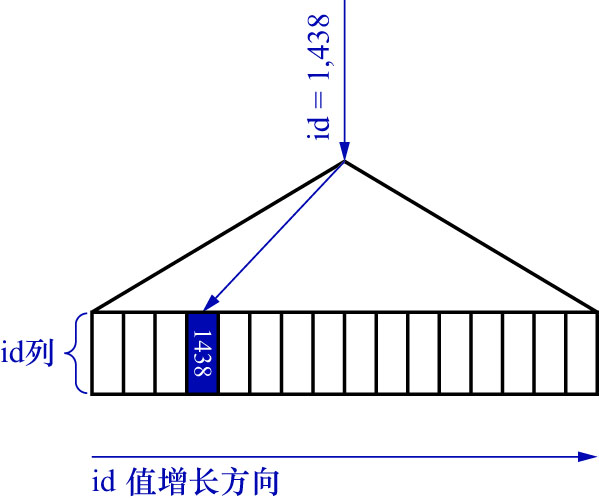
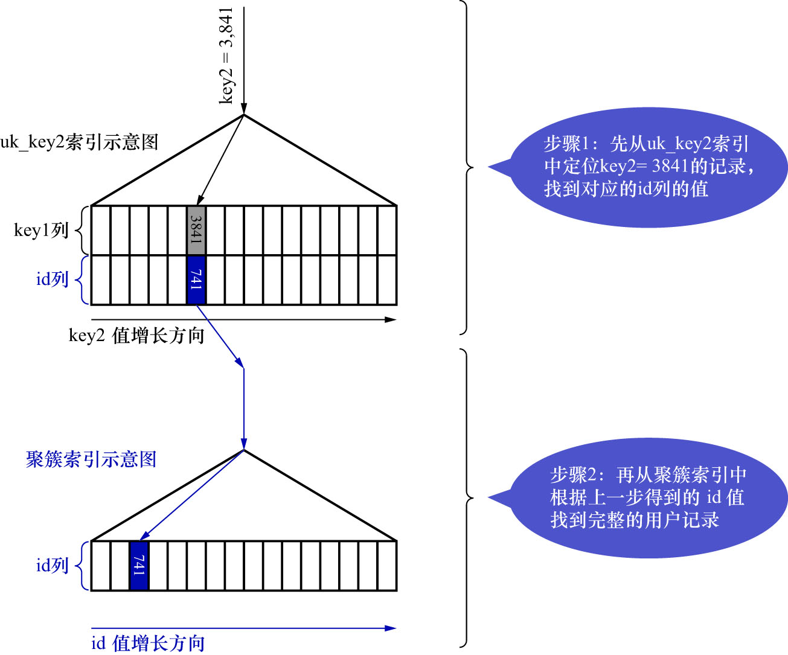

# 2. `const`

例:

现有查询语句如下:

```sql
SELECT *
FROM single_table
WHERE id = 1438;
```

MySQL会直接利用主键值在聚簇索引中定位对应的用户记录.如下图示:



该查询语句的执行计划如下:

```
mysql> DESC SELECT *
    -> FROM single_table
    -> WHERE id = 1438;
+----+-------------+--------------+------------+-------+---------------+---------+---------+-------+------+----------+-------+
| id | select_type | table        | partitions | type  | possible_keys | key     | key_len | ref   | rows | filtered | Extra |
+----+-------------+--------------+------------+-------+---------------+---------+---------+-------+------+----------+-------+
|  1 | SIMPLE      | single_table | NULL       | const | PRIMARY       | PRIMARY | 4       | const |    1 |   100.00 | NULL  |
+----+-------------+--------------+------------+-------+---------------+---------+---------+-------+------+----------+-------+
1 row in set, 1 warning (0.00 sec)
```

类似的,根据唯一二级索引列来定位1条记录的速度也是很快的.现有查询语句如下:

```sql
SELECT *
FROM single_table
WHERE key2 = 1681;
```

该查询语句的执行过程如下图示:



该查询的执行分2步:

- step1. 在`uk_key2`对应的B+树索引中,根据`key2`列与常数的**等值比较条件**,定位到**1条二级索引记录**
- step2. 然后再根据该记录的`id`值到聚簇索引中获取到完整的用户记录(即回表操作) 

该查询语句的执行计划如下:

```
mysql> DESC SELECT *
    -> FROM single_table
    -> WHERE key2 = 1681;
+----+-------------+--------------+------------+-------+---------------+---------+---------+-------+------+----------+-------+
| id | select_type | table        | partitions | type  | possible_keys | key     | key_len | ref   | rows | filtered | Extra |
+----+-------------+--------------+------------+-------+---------------+---------+---------+-------+------+----------+-------+
|  1 | SIMPLE      | single_table | NULL       | const | uk_key2       | uk_key2 | 5       | const |    1 |   100.00 | NULL  |
+----+-------------+--------------+------------+-------+---------------+---------+---------+-------+------+----------+-------+
1 row in set, 1 warning (0.00 sec)
```

- `const`: 通过主键或者唯一二级索引列来定位**1条记录**的访问方法
  - 该访问方法之所以被命名为`const`,意思是该访问方法常数级别的,代价是可以忽略不计的
  - 该访问方法只能在主键列或者唯一二级索引列和一个常数进行**等值比较**时才有效
  - 若主键或者唯一二级索引由多个列构成,则索引中的每个列都需要与常数进行**等值比较**,该访问方法才有效
    - 因为只有该索引中全部列都采用等值比较时,才能定位**唯一的1条记录**
  - 可以认为该访问方法扫描的是**聚簇索引或二级索引中的1个点**

对于唯一二级索引来说,查询该列为NULL值的情况比较特殊,比如这个查询语句:

```sql
SELECT *
FROM single_table
WHERE key2 IS NULL;
```

因为唯一二级索引列并不限制NULL值的数量,所以该查询语句可能访问到多条记录.也就是说该查询语句无法使用`const`访问方法来执行

该查询语句的执行计划如下:

```
mysql> DESC SELECT *
    -> FROM single_table
    -> WHERE key2 IS NULL;
+----+-------------+--------------+------------+------+---------------+---------+---------+-------+------+----------+-----------------------+
| id | select_type | table        | partitions | type | possible_keys | key     | key_len | ref   | rows | filtered | Extra                 |
+----+-------------+--------------+------------+------+---------------+---------+---------+-------+------+----------+-----------------------+
|  1 | SIMPLE      | single_table | NULL       | ref  | uk_key2       | uk_key2 | 5       | const |    1 |   100.00 | Using index condition |
+----+-------------+--------------+------------+------+---------------+---------+---------+-------+------+----------+-----------------------+
1 row in set, 1 warning (0.00 sec)
```

可以看到`type`列的值变成了`ref`,而不是`const`.
