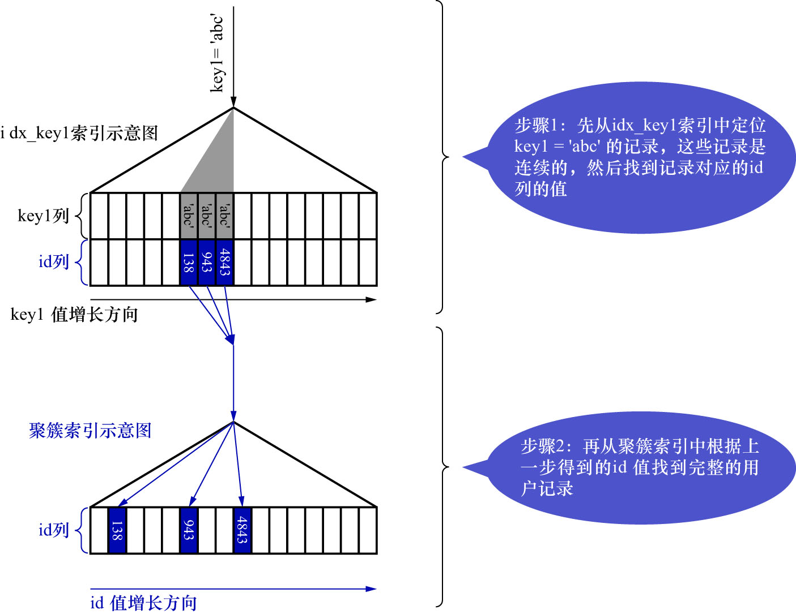

# 3. `ref`

现有一查询语句,该查询语句**对某个普通的二级索引列与常数进行等值比较**,查询语句如下:

```sql
SELECT *
FROM single_table
WHERE key1 = 'abc';
```

对于该查询,当然可以选择全表扫描的方式来执行.但是也可以先使用二级索引`idx_key1`来执行.此时对应的扫描区间为`key1 ∈ ['abc', 'abc']`,
这是一个单点扫描区间.先定位到满足条件`key1 = 'abc'`的第1条二级索引记录,然后沿着该记录所在的单向链表向后扫描,
直到某条二级索引记录不满足条件`key1 = 'abc'`为止.由于查询列表为`*`,所以针对获取到的每条二级索引记录,都需要根据该记录的`id`值执行回表操作,
到聚簇索引中查找完整的用户记录后,再发送给客户端.

由于普通二级索引并不限制索引列值的唯一性,所以位于扫描区间`key1 ∈ ['abc', 'abc']`中的二级索引记录可能有多条,
此时使用二级索引执行查询的代价就取决于该扫描区间中的记录条数.若该扫描区间中的记录较少,则回表的代价还是比较低的.
这种访问方法即为`ref`.

- `ref`: "搜索条件为**二级索引列与常数进行等值比较,形成的扫描区间为单点扫描区间**,采用二级索引来执行查询"的访问方法称为`ref`
  - 可以认为该访问方法扫描的是**二级索引的1个区间**

该查询语句的执行过程如下图示:



注: 采用二级索引执行查询时,每获取到1条二级索引记录,就会立刻对该二级索引记录进行回表操作,而不是将所有二级索引记录的主键值都收集起来,
然后统一执行回表操作.这里图中的步骤1和步骤2只是为了更直观的区分扫描二级索引和回表操作,实际上这两个步骤是交替进行的.

从图中可以看出,对于普通的二级索引来说,通过索引列进行等值比较后可能匹配到**多条连续的记录**,
而不是像主键或者唯一二级索引那样最多只能匹配1条记录,所以`ref`访问方法比`const`在性能上稍微差了一点点.
另外,需要注意以下2种情况:

- 二级索引列值为NULL的情况

    在二级索引列允许存储NULL值时,无论是普通二级索引,还是唯一二级索引,它们的索引列都不限制NULL值的数量,
    所以当查询语句中有`key IS NULL`形式的搜索条件时,该查询语句最多只能使用`ref`访问方法,而不能使用`const`访问方法.
    例子在刚才已经看过了.

- 联合索引

    对于联合索引(即:索引列包含多个列的二级索引)来说,**只要最左边连续的索引列是与常数的等值比较**,就可能采用`ref`访问方法.
    因为**本质上这种查询最终形成的区间还是二级索引中的单点扫描区间,只是这个单点扫描区间的条件是多列的**.

例如:

```sql
SELECT *
FROM single_table
WHERE key_part1 = 'god like';
```

其执行计划如下:

```
mysql> DESC SELECT *
    -> FROM single_table
    -> WHERE key_part1 = 'god like';
+----+-------------+--------------+------------+------+---------------+--------------+---------+-------+------+----------+-------+
| id | select_type | table        | partitions | type | possible_keys | key          | key_len | ref   | rows | filtered | Extra |
+----+-------------+--------------+------------+------+---------------+--------------+---------+-------+------+----------+-------+
|  1 | SIMPLE      | single_table | NULL       | ref  | idx_key_part  | idx_key_part | 403     | const |    1 |   100.00 | NULL  |
+----+-------------+--------------+------------+------+---------------+--------------+---------+-------+------+----------+-------+
1 row in set, 1 warning (0.03 sec)
```

```sql
SELECT *
FROM single_table
WHERE key_part1 = 'god like'
AND key_part2 = 'legendary';
```

```
mysql> DESC SELECT *
    -> FROM single_table
    -> WHERE key_part1 = 'god like'
    -> AND key_part2 = 'legendary';
+----+-------------+--------------+------------+------+---------------+--------------+---------+-------------+------+----------+-------+
| id | select_type | table        | partitions | type | possible_keys | key          | key_len | ref         | rows | filtered | Extra |
+----+-------------+--------------+------------+------+---------------+--------------+---------+-------------+------+----------+-------+
|  1 | SIMPLE      | single_table | NULL       | ref  | idx_key_part  | idx_key_part | 806     | const,const |    1 |   100.00 | NULL  |
+----+-------------+--------------+------------+------+---------------+--------------+---------+-------------+------+----------+-------+
1 row in set, 1 warning (0.00 sec)
```

```sql
SELECT *
FROM single_table
WHERE key_part1 = 'god like'
AND key_part2 = 'legendary'
AND key_part3 = 'penta kill';
```

```
mysql> DESC SELECT *
    -> FROM single_table
    -> WHERE key_part1 = 'god like'
    -> AND key_part2 = 'legendary'
    -> AND key_part3 = 'penta kill';
+----+-------------+--------------+------------+------+---------------+--------------+---------+-------------------+------+----------+-------+
| id | select_type | table        | partitions | type | possible_keys | key          | key_len | ref               | rows | filtered | Extra |
+----+-------------+--------------+------------+------+---------------+--------------+---------+-------------------+------+----------+-------+
|  1 | SIMPLE      | single_table | NULL       | ref  | idx_key_part  | idx_key_part | 1209    | const,const,const |    1 |   100.00 | NULL  |
+----+-------------+--------------+------------+------+---------------+--------------+---------+-------------------+------+----------+-------+
1 row in set, 1 warning (0.00 sec)
```

在上述3个查询语句中,都可以使用`ref`访问方法来执行查询,因为它们的最左边连续的索引列都是与常数进行等值比较的.

如果最左边的连续索引列不全是等值比较的话,它的访问方法就不能称为`ref`了,例如:

```sql
SELECT *
FROM single_table
WHERE key_part1 = 'god like'
AND key_part2 > 'legendary';
```

```
mysql> DESC SELECT *
    -> FROM single_table
    -> WHERE key_part1 = 'god like'
    -> AND key_part2 > 'legendary';
+----+-------------+--------------+------------+-------+---------------+--------------+---------+------+------+----------+-----------------------+
| id | select_type | table        | partitions | type  | possible_keys | key          | key_len | ref  | rows | filtered | Extra                 |
+----+-------------+--------------+------------+-------+---------------+--------------+---------+------+------+----------+-----------------------+
|  1 | SIMPLE      | single_table | NULL       | range | idx_key_part  | idx_key_part | 806     | NULL |    1 |   100.00 | Using index condition |
+----+-------------+--------------+------------+-------+---------------+--------------+---------+------+------+----------+-----------------------+
1 row in set, 1 warning (0.00 sec)
```
