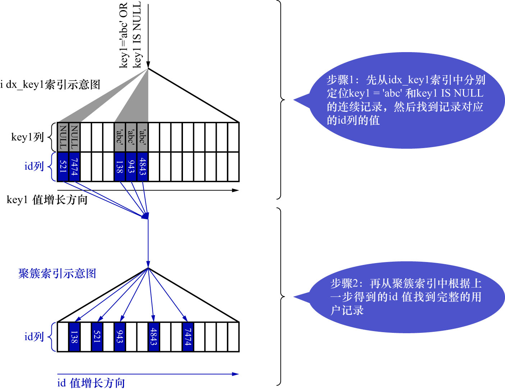

# 4. `ref_or_null`

- `ref_or_null`: `ref`访问方法扫描的是**二级索引的1个区间**,而`ref_or_null`访问方法扫描的是**二级索引的2个区间**:
  - `ref`访问方法的扫描区间
  - `key IS NULL`的扫描区间
  - 这种访问方法通常出现在二级索引列允许存储NULL值时,查询条件中有`key IS NULL`的情况

例如:
  
```sql
SELECT *
FROM single_demo
WHERE key1 = 'abc'
OR key1 IS NULL;
```

当使用二级索引而不是全表扫描的方式执行该查询时,对应的扫描区间为`key1 ∈ [NULL, NULL] ∪ key1 ∈ [abc, abc]`,此时执行这种类型的查询所
使用的访问方法就称为`ref_or_null`.如下图示:



可以认为,`ref_or_null`访问方法只是比`ref`访问方法多扫描了一些值为NULL的二级索引记录.

注: 值为NULL的记录会被放在索引的最左边
