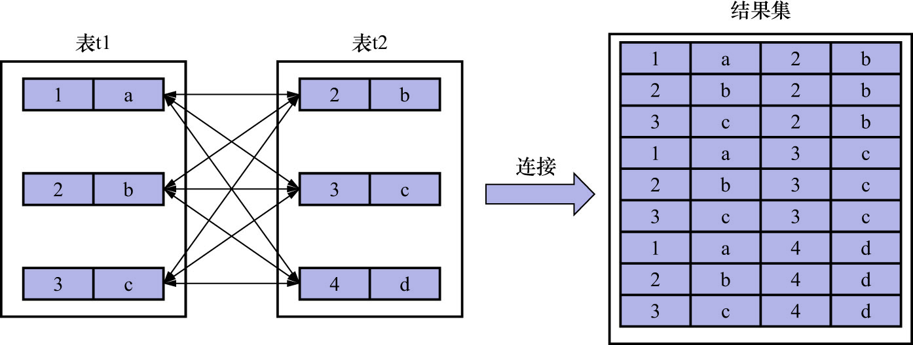

# 1. 连接的本质

现有2个表如下:

```
mysql> CREATE TABLE t1 (m1 int, n1 char(1));
Query OK, 0 rows affected (0.01 sec)
```

```
mysql> CREATE TABLE t2 (m2 int, n2 char(1));
Query OK, 0 rows affected (0.03 sec)
```

分别为这2个表填充数据如下:

```
mysql> INSERT INTO t1 VALUES (1, 'a'), (2, 'b'), (3, 'c');
Query OK, 3 rows affected (0.02 sec)
Records: 3  Duplicates: 0  Warnings: 0
```

```
mysql> INSERT INTO t2 VALUES (2, 'b'), (3, 'c'), (4, 'd');
Query OK, 3 rows affected (0.01 sec)
Records: 3  Duplicates: 0  Warnings: 0
```

这2个表都有2个列:

- `INT`类型的列
- `CHAR(1)`类型的列

填充好数据的两个表如下:

```
mysql> SELECT * FROM t1;
+------+------+
| m1   | n1   |
+------+------+
|    1 | a    |
|    2 | b    |
|    3 | c    |
+------+------+
3 rows in set (0.00 sec)
```

```
mysql> SELECT * FROM t2;
+------+------+
| m2   | n2   |
+------+------+
|    2 | b    |
|    3 | c    |
|    4 | d    |
+------+------+
3 rows in set (0.01 sec)
```

本质上来说,**连接就是把各个连接表中的记录都取出来进行依次匹配,并把匹配后的的组合发送给客户端**.

把`t1`和`t2`2个表连接起来的过程如下图示:



- 连接查询: 把若干张表中的记录连起来组成一个新的更大的记录,这种查询过程称为连接查询.
- 笛卡尔积: 若连接查询的结果集中包含每张表的每条记录,则这样的结果集称为笛卡尔积.

上图中,把`t1`表中的记录和`t2`的表中记录连起来的过程,就是连接查询.图中的结果集就是笛卡尔积.
因为表`t1`中有3条记录,表`t2`中也有3条记录,所以这两个表连接之后的笛卡尔积就有`3 * 3 = 9`行记录.

在MySQL中,连接查询的语法也很随意,只要在FROM语句后边跟多个表名即可.例如:

```
mysql> SELECT * FROM t1, t2;
+------+------+------+------+
| m1   | n1   | m2   | n2   |
+------+------+------+------+
|    3 | c    |    2 | b    |
|    2 | b    |    2 | b    |
|    1 | a    |    2 | b    |
|    3 | c    |    3 | c    |
|    2 | b    |    3 | c    |
|    1 | a    |    3 | c    |
|    3 | c    |    4 | d    |
|    2 | b    |    4 | d    |
|    1 | a    |    4 | d    |
+------+------+------+------+
9 rows in set (0.00 sec)
```
