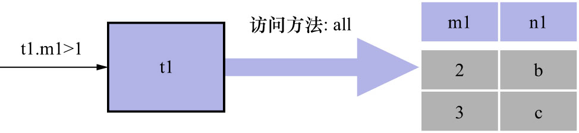
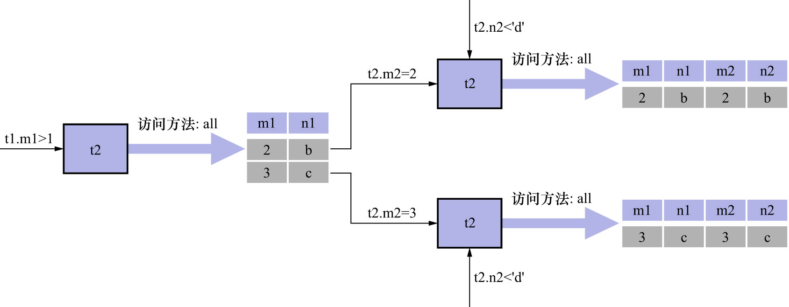

# 2. 连接过程简介

如果愿意,可以连接任意数量张表.但是如果不附加任何限制条件,这些表连接起来产生的笛卡尔积是非常巨大的.
比如,3个100行记录的表连接起来产生的笛卡尔积就有`100 * 100 * 100 = 1,000,000`行数据.
所以在连接时过滤掉特定的记录组合是有必要的.在连接查询中的过滤条件可以分成2种:

- 涉及单表的条件

    这种只涉及单表的过滤条件在上一章出现过很多次了,也被称为搜索条件.比如:

    - `t1.m1 > 1`是只针对`t1`表的过滤条件
    - `t2.n2 < 'd'`是只针对`t2`表的过滤条件

- 涉及两表的条件

    比如:

    - `t1.m1 = t2.m2`
    - `t1.n1 > t2.n2`

    稍后会仔细分析这种过滤条件是如何使用的.

看一下携带过滤条件的连接查询的大致执行过程.现有查询语句如下:

```sql
SELECT *
FROM t1, t2
WHERE
    t1.m1 > 1
AND 
    t1.m1 = t2.m2
AND 
    t2.n2 < 'd';
```

该连接查询的大致执行过程如下:

- 步骤1: **先确定第1个需要查询的表,该表称为驱动表**

    在单表中执行查询语句,只需选取代价最小的访问方法执行单表查询语句即可(即:从`const`/`ref`/`ref_or_null`/`range`/`index`/`all`
    这些执行方法中,选取代价最小的访问方法去执行查询).
    
    此处假设使用`t1`表作为驱动表,那么就需要到`t1`表中查找满足条件`t1.m1 > 1`的记录.因为表中的数据太少,且没有在该表上建立二级索引,
    所以此处查询`t1`表的访问方法设定为`all`,也就是采用全表扫描的方式执行单表查询.查询过程如下图示:
    
    

    如图所示,`t1`表中符合条件`t1.m1 > 1`的记录有2条.

- 步骤2: **步骤1中从驱动表每获取到1条记录,都需要到`t2`表中查找匹配的记录**

    这里说的匹配的记录,指的是符合过滤条件的记录.因为是根据`t1`表中的记录去找`t2`表中的记录,所以`t2`表也可以被称为被驱动表.
    步骤1从驱动表中得到了2条记录,所以需要查询2次`t2`表.此时就要用到这个涉及2个表的列的过滤条件`t1.m1 = t2.m2`了:
  
    对于从`t1`表中查询得到的第1条记录,即`t1.m1 = 2`时,过滤条件`t1.m1 = t2.m2`就等价于`t2.m2 = 2`.所以此时`t2`表相当于有了2个过滤条件:

    - `t2.m2 = 2`
    - `t2.n2 < 'd'`

    然后在`t2`表中根据这2个条件执行单表查询即可.

    对于从`t1`表中查询得到的第2条记录,即`t1.m1 = 3`时,过滤条件`t1.m1 = t2.m2`就等价于`t2.m2 = 2`.所以此时`t3`表相当于有了2个过滤条件:

    - `t2.m2 = 3`
    - `t2.n2 < 'd'`

    然后在`t2`表中根据这2个条件执行单表查询即可.

    这2次查询`t2`表的访问方法也都设定为`all`,也就是采用全表扫描的方式执行单表查询.

整个连接查询的执行过程如下图示:



也就是说,整个连接查询最后的结果只有2条符合过滤条件的记录:

```
mysql> SELECT *
    -> FROM t1, t2
    -> WHERE
    ->     t1.m1 > 1
    -> AND 
    ->     t1.m1 = t2.m2
    -> AND 
    ->     t2.n2 < 'd';
+------+------+------+------+
| m1   | n1   | m2   | n2   |
+------+------+------+------+
|    2 | b    |    2 | b    |
|    3 | c    |    3 | c    |
+------+------+------+------+
2 rows in set (0.00 sec)
```

从上述2个步骤可以看出来,该连接查询共需要查询1次`t1`表和2次`t2`表(当然这是在特定的过滤条件下的结果).如果把过滤条件`t1.m1 > 1`去掉,
那么从`t1`表中查出的记录数量为3,这就表示需要查询3次`t2`表了.即:**在两表的连接查询中,驱动表只需要访问1次,被驱动表可能被访问多次**.

- 驱动表: 在连接查询中,驱动表是指第1个需要查询的表
- 被驱动表: 在连接查询中,被用来匹配驱动表中每一行的记录的表.即: 对驱动表的每一行进行匹配时,要去执行"被连接"的那个表
- 在连接查询中,驱动表只需要访问1次,被驱动表可能被访问多次

注: 

在连接查询的过程中,并不是将所有满足条件的驱动表记录先查询出来并放到一个地方,再查去驱动表中查询的.(可以想一下,
若满足条件的驱动表记录非常多,那么就会占用非常多的内存空间,甚至可能会导致内存溢出).而是获得1条驱动表记录,就立即到
被驱动表中寻找匹配的记录.
