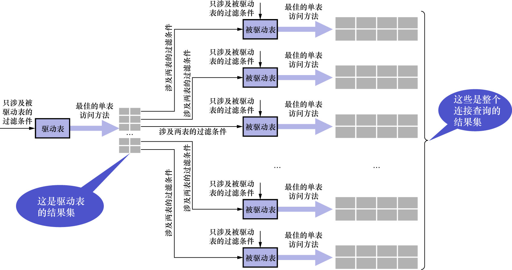

# 1. 嵌套循环连接

前边说过,对于2表连接来说,驱动表只会被访问1遍,但被驱动表却要被访问到好多遍:具体访问几遍取决于对驱动表执行单表查询后的结果集中的记录条数.
对于内连接来说,选取哪个表为驱动表都无所谓;而外连接的驱动表是固定的:

- 左连接的驱动表就是左边的那个表
- 右连接的驱动表就是右边的那个表

上边已经大致介绍过`t1`表和`t2`表执行内连接查询的大致过程,这里再复习一遍:

- 步骤1: 选取驱动表,使用与驱动表相关的过滤条件,选取代价最低的单表访问方法来执行对驱动表的单表查询
- 步骤2: 对步骤1中查询驱动表得到的结果集中每一条记录,都分别到被驱动表中查找匹配的记录

过程如下图示:



如果有3个表进行连接,则步骤2中得到的结果集就像是新的驱动表,然后第3个表就成为了被驱动表,然后重复上面的过程即可.
也就是步骤2中得到的结果集中的每一条记录都需要到`t3`表中查找有没有匹配的记录.用伪代码表示一下这个过程如下:

```
for each row in t1 satisfying condition about t1 {
    
    for each row in t2 satisfying condition about t2 {
    
        for each row in t3 satisfying condition about t3 {
            
            send to client;
            
        }
        
    }
    
}
```

这个过程就像是一个嵌套的循环.

- 嵌套循环连接(Nested-Loop Join): 一种连接执行方式,在该连接执行方式中:
  - **驱动表只访问一次**
  - **但被驱动表却可能被多次访问**
  - **访问次数取决于对驱动表执行单表查询后的结果集中的有多少条记录**
  - 这是最简单也是最笨拙的一种连接查询算法

注意: 对于嵌套循环连接算法来说,每当从驱动表中得到1条记录时,就根据这条记录立即到驱动表中查询1次.若得到了匹配的记录,
则把组合后的记录发送给客户端,然后再到驱动表中获取下一条记录;这个过程将重复进行.在之前的图中画的"结果集"只是一个抽象的概念,
不要错误地以为是把驱动表中所有的记录都先查出来放到某个地方(比如内存或磁盘中),然后再遍历这些记录.
