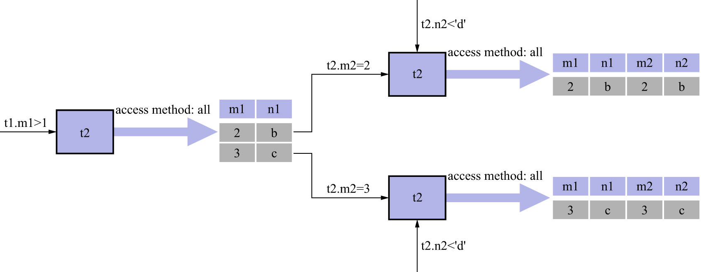

# 2. 使用索引加快连接速度

在嵌套循环连接中可能需要访问多次被驱动表,如果访问被驱动表的方式都是全表扫描的话,那得要扫描很多次.
但是,**查询`t2`表其实就相当于一次单表查询,是可以利用索引来加快查询速度的**.
回顾最开始介绍的`t1`表和`t2`表进行内连接的例子:

```sql
SELECT *
FROM t1, t2
WHERE
    t1.m1 > 1
AND 
    t1.m1 = t2.m2
AND 
    t2.n2 < 'd';
```

该连接查询使用嵌套循环连接算法执行,该连接查询执行的过程如下图示:



查询驱动表`t1` `后的结果集中有2条记录,嵌套循环连接算法需要对被驱动表查询2次:

- 当`t1.m1 = 2`时,查询1遍`t2`表,对`t2`表的查询语句相当于:

```sql
SELECT *
FROM t2
WHERE
    t2.m2 = 2
AND
    t2.n2 < 'd';
```

- 当`t1.m1 = 3`时,再查询1遍`t2`表,对`t2`表的查询语句相当于:

```sql
SELECT *
FROM t2
WHERE
    t2.m2 = 3
AND
    t2.n2 < 'd';
```

可以看到,在原连接查询中,涉及2个表的过滤条件`t1.m1 = t2.m2`,在针对`t2`表进行查询时,关于`t1`表的条件就已经确定了,
所以只需要单单优化针对`t2`表的查询即可.上述2个对`t2`表的查询语句中利用到的是`m2`列和`n2`列,可以进行如下尝试:

- 在`m2`列上建立索引

    因为对`m2`列的条件是等值查找,比如`t2.m2 = 2`/`t2.m2 = 3`等,所以可能使用到`ref`的访问方法.
    假设使用`ref`的访问方法来执行对`t2`表的查询,则需要回表之后再判断是否满足条件`t2.n2 < 'd'`.
    
    有个比较特殊的情况:假设`m2`列是`t2`表的主键,或不允许存储NULL值的唯一二级索引列,那么使用条件`t2.m2 = 常数值`从`t2`表中查找记录时,
    代价就是常数级别的.上一章讲过,在单表中使用主键值或唯一二级索引列的值进行等值查找的方式为`const`.而**在连接查询中,对被驱动表使用主键值
    或不允许存储NULL值的唯一二级索引进行等值查找,使用的访问方法就称为`eq_ref`**.

- 在`n2`列上建立索引

    对于`n2`列,涉及到的条件为`t2.n2 < 'd'`,可能使用到`range`访问方法.假设使用`range`访问方法对`t2`表进行查,
    则需要回表之后再判断是否满足条件`m2 = 2`或`m2 = 3`(该条件取决于驱动表中的记录).
    
- `m2`和`n2`列上都存在索引

    从这2个索引中挑1个代价更低的索引来查询`t2`表.

另外,连接查询的查询列表和过滤条件中,有时可能只涉及被驱动表的部分列,而这些列都是某个二级索引的一部分.在这种情况下即使
不能使用`eq_ref`/`ref`/`ref_or_null`/`range`这些访问方法来查询被驱动表,也可以使用`index`访问方法(即扫描某个索引的全部数据)
来查询被驱动表.所以建议在真实工作中最好不要使用`*`作为查询列表,而是把真正用到的列作为查询列表.
