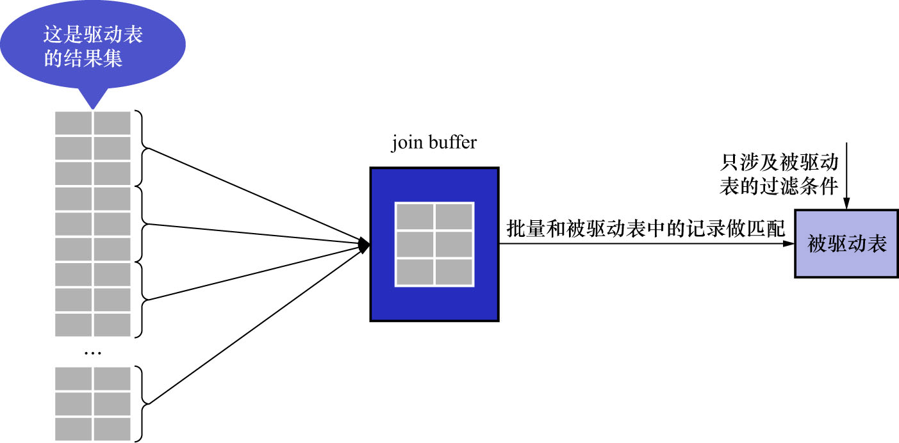

# 3. 基于块的嵌套循环连接

现实生活中的表不像`t1`表/`t2`表这样只有3条记录,成千上万条记录都是少的,几百万.几千万甚至几亿条记录的表都是很常见的.
现在假设不能使用索引加快被驱动表的查询过程,所以对于驱动表结果集中的每1条记录,都需要对被驱动表进行全表扫描.
这样在对被驱动表进行全表扫描时,可能表前面的记录还在内存中,而后面的记录还在磁盘上.而等到扫描表中后面的记录时,
有可能由于内存不足,需要把表前面的记录从内存中释放掉,给现在正在扫描的记录腾出空间.前边强调过,
**在采用嵌套循环连接算法的2表连接过程中,被驱动表是要被访问好多次的**.如果这个被驱动表中的数据特别多而且不能使用索引进行访问,
那就相当于要从磁盘上读这个表很多次,这个I/O的代价就非常大了.所以要想办法,**尽量减少访问被驱动表的次数**.

驱动表结果集中有多少条记录,就可能把被驱动表从磁盘加载到内存中多少次.能否在**把被驱动表中的记录加载到内存时,
一次性地与驱动表结果集中的多条记录进行匹配?这样就可以大大减少重复从磁盘上加载被驱动表的代价了**.MySQL的设计者提出了一个名为
Join Buffer(连接缓冲区)的概念.**Join Buffer就是执行连接查询前,申请的一块固定大小的内存**.

- 先把若干条驱动表结果集中的记录装在这个Join Buffer中
- 然后开始扫描被驱动表
  - **每1条被驱动表的记录一次性地与Join Buffer中的多条驱动表记录进行匹配**

由于匹配的过程都是在内存中完成的,所以这样可以显著减少被驱动表的I/O代价.使用Join Buffer的过程如下图所示:

最好的情况是Join Buffer足够大,大到能容纳驱动表结果集中的所有记录,这样只需要访问1次被驱动表就可以完成连接操作了.

- 基于块的嵌套连接(Block Nested-Loop Join)算法:加入了Join Buffer的嵌套循环连接算法

Join Buffer的大小可以通过启动参数或者系统变量`join_buffer_size`进行配置,默认大小为`262,144Bytes`(即: 256KB),
最小可以设置为`128 Bytes`.当然,在优化对被驱动表的查询时,最好是为被驱动表加上高效率的索引.如果实在不能使用索引,
且机器的内存也比较大,则可尝试调大`join_buffer_size`的值来对连接查询进行优化.

注意: **Join Buffer中并不会存放驱动表记录的所有列,只有查询列表中的列和过滤条件中的列才会被放到Join Buffer中**.
所以这里再次提醒: 不要把`*`作为查询列表,只需要把关心的列放到查询列表即可;这样可以在Join Buffer中放置更多记录.
