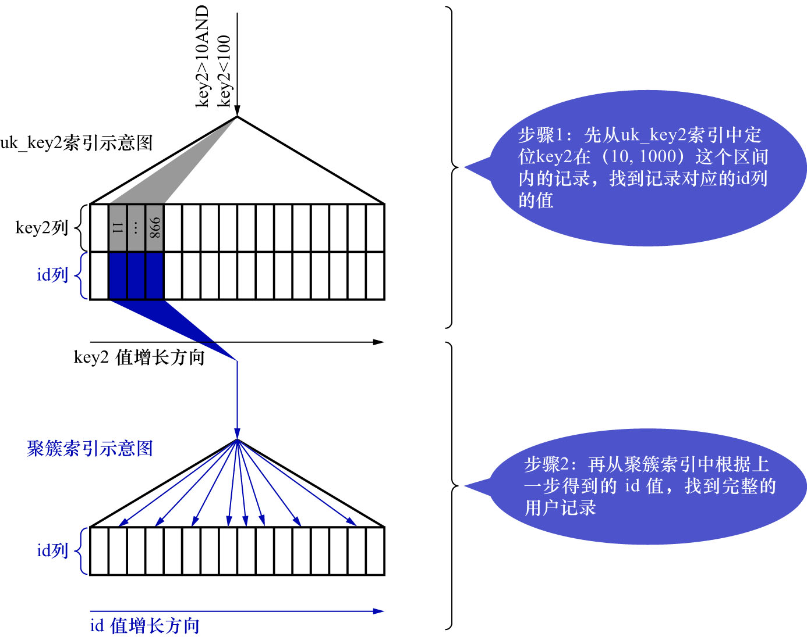
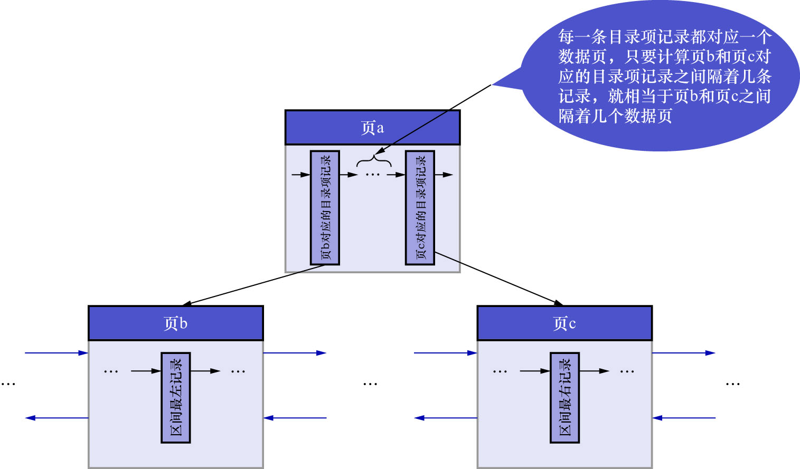

# 1. 使用`uk_key2`执行查询的成本分析

这里再贴一下查询语句:

```sql
SELECT *
FROM single_table
WHERE
    key1 IN ('a', 'b', 'c')
AND
    key2 > 10
AND
    key2 < 1000
AND
    key3 > key2
AND
    key_part1 LIKE '%hello%'
AND
    common_field = '123';
```

`uk_key2`对应的搜索条件为:`key2 > 10 AND key2 < 1000`,也就是说对应的扫描区间为`key2 ∈ (10, 1000)`,
使用`uk_key2`执行查询的示意图如下:



对于使用`二级索引 + 回表`方式的查询,MySQL的设计者计算这种查询的成本时,依赖2方面的数据:

- 扫描区间数量
- 需要回表的记录数

- 扫描区间的数量

    无论某个扫描区间的二级索引到底占用了多少页面,查询优化器粗暴地认为**读取索引的1个扫描区间的I/O成本与读取1个页面是相同的**.
    本例中使用`uk_key2`的扫描区间只有1个:`key2 ∈ (10, 1000)`,所以相当于访问该扫描区间的二级索引付出的I/O成本为:
    
    ```
    1 * 1.0 = 1.0
    ```
    
    其中:

    - 1: 扫描区间的数量
    - 1.0: 读取1个页面的成本常数(查询优化器认为读取索引的1个扫描区间的I/O成本与读取1个页面是相同的)
    - 注: 书中这里没有加微调值`1.1`,我猜测是为了简化

- 需要回表的记录数

    查询优化器需要计算二级索引的某个扫描区间到底包含多少条记录,在本例中就是要计算`uk_key2`在
    扫描区间`key2 ∈ (10, 1000)`中包含多少二级索引记录,计算过程如下:

    - 步骤1

        先根据条件`key2 > 10`访问`uk_key2`对应的 B+ 树索引,找到满足条件`key2 > 10`的第1条记录(该记录被称为区间最左记录).前文说过,
        在B+数树中定位1条记录的过程是很快的,是常数级别的,所以这个过程的性能消耗是可以忽略不计的.

    - 步骤2

        然后再根据条件`key2 < 1000`继续从`uk_key2`对应的B+树索引中找出满足条件`key2 < 1000`的第1条记录(该记录被称为区间最右记录).
        这个过程的性能消耗也可以忽略不计的

    - 步骤3

        - 若区间最左记录和区间最右记录相隔不太远,就可以精确统计出满足条件`key2 > 10 AND key2 < 1000`的二级索引记录条数
          - 在MySQL5.7.22中,只要相隔不大于10个页面即可
          - 注: 数据页中的`Page Header`部分中,有一个名为`PAGE_N_RECS`的属性
            - 该属性表示在该页面中有多少条记录
            - 因此,若区间最左记录和区间最右记录相隔不太远,则直接遍历这些页面,累加这些页面的`PAGE_N_RECS`属性值,即可计算出满足条件`key2 > 10 AND key2 < 1000`的二级索引记录条数
        - 否则只沿着区间最左记录向右读10个页面,计算每个页面平均包含多少记录.然后按照:`平均值 * 区间最左记录和区间最右记录之间的页面数量`作为满足条件`key2 > 10 AND key2 < 1000`的二级索引记录条数

        那么问题又来了,如何估计区间最左记录和区间最右记录之间有多少个页面呢?解决这个问题还得回到B+树索引的结构中来.
        如下图示:

        

        如上图示,假设区间最左记录在页`b`中,区间最右记录在页`c`中,那么要计算区间最左记录和区间最右记录之间的页面数量,
        就相当于计算页`b`和页`c`之间有多少个页面.而非叶子节点页`a`中的每1条目录项记录都对应1个数据页,所以计算页`b`和页`c`之间有多少个页面,
        就相当于计算它们父节点(也就是页a)中对应的目录项记录之间隔着多少条记录.在1个页面中统计2条记录之间有多少条记录的成本就相当低了.
    
        还有个问题:若页`b`和页`c`之间的页面很多,以至于页`b`和页`c`对应的目录项记录都不在一个页面中该怎么办?
        继续递归即可.也就是再统计页`b`和页`c`对应的目录项记录所在页之间有多少个页面(即:找这2个目录项记录所在页面的父节点,
        统计父节点页面中的2条目录项记录之间有多少条记录).之前我们说过1个B+树有4层高就已经算很高了,所以这个统计过程也不是很耗费性能.

        知道了如何统计二级索引某个扫描区间的记录数之后,就需要回到现实问题中来.根据上述算法测得`uk_key2`在
        扫描区间`key2 ∈ (10, 1000)`之间大约有95条记录(注: 这里使用的书中的数值,因为每个人随机出来的10000条数据都不一样).
        读取这95条二级索引记录需要付出的CPU成本为: `95 * 0.2 + 0.01 = 19.01`.其中:

        - 95: 二级索引记录数
        - 0.2: 访问1条记录所需的成本常数
        - 0.01: 微调值

在通过二级索引获取到记录之后,还需要干2件事:

- 根据这些记录的主键值到聚簇索引中执行回表操作
- 回表操作后得到完整的用户记录,然后再检测其他搜索条件是否成立

- 根据这些记录的主键值到聚簇索引中执行回表操作

    这里需要注意,MySQL的设计者在评估回表操作的I/O成本时,依旧很豪放:**他们认为每1次回表操作都相当于访问1个页面,也就是说二级索引扫描
    区间有多少记录,就需要进行多少次回表操作,也就是需要进行多少次页面I/O**.前面统计了使用二级索引`uk_key2`执行查询时,
    预计有95条二级索引记录需要进行回表操作,所以回表操作带来的I/O成本为: `95 * 1.0 = 95.0`.其中:

    - 95: 预估的二级索引记录数
    - 1.0: 读取1个页面的成本常数(查询优化器认为1次回表操作相当于访问1个页面)
    - 注: 书中这里没有加微调值`1.1`,我猜测是为了简化

- 回表操作后得到完整的用户记录,然后再检测其他搜索条件是否成立

    回表操作的本质就是通过二级索引记录的主键值到聚簇索引中找到完整的用户记录,然后再检测除条件`key2 > 10 AND key2 < 1000`外的
    搜索条件是否成立.因为通过扫描区间获取到二级索引记录共95条,也就对应着聚簇索引中95条完整的用户记录,读取并检测这些完整的用户记录是否
    符合其余的搜索条件的CPU成本为: `95 * 0.2 = 19.0`.其中:

    - 95: 完整的用户记录数
    - 0.2: 访问1条记录所需的成本常数
    - 注: 这里没有加微调值`0.01`,我猜测是为了简化

所以本例中使用`uk_key2`执行查询的成本为:

- I/O成本: `1.0 * 1.0 + 95 * 1.0 = 96.0`.其中:

    - `1 * 1.0`: 扫描区间的I/O成本
      - 1: 扫描区间的数量
      - 1.0: 读取1个页面的成本常数(查询优化器认为读取索引的1个扫描区间的I/O成本与读取1个页面是相同的)
    - `95 * 1.0`: 回表操作的I/O成本
      - 95: 预估的二级索引记录数,即回表次数
      - 1.0: 读取1个页面的成本常数(查询优化器认为1次回表操作相当于访问1个页面)
    - 注: 这里在计算扫描区间的I/O成本和回表操作的I/O成本时,都没有加微调值`1.1`,我猜测是为了简化

- CPU成本: `95 * 0.2 + 0.01 + 95 * 0.2 = 19.01 + 19.0 = 38.01`.其中:

    - `95 * 0.2 + 0.01`: 访问二级索引记录的CPU成本
      - 95: 二级索引记录数
      - 0.2: 访问1条记录所需的成本常数
      - `0.01`: 微调值
    - `95 * 0.2`: 读取并检测回表操作后聚簇索引记录的CPU成本
      - 95: 完整的用户记录数
      - 0.2: 访问1条记录所需的成本常数
    - 注: 这里在计算访问二级索引的CPU成本时,加了微调值`0.01`;但是在计算访问并检测聚簇索引记录的CPU成本时,没有加微调值`0.01`,我猜测是为了简化

综上所述,使用`uk_key2`执行查询的总成本为:`96.0 + 38.01 = 134.01`

注意: 若阅读MySQL5.7.22版本的源代码,会发现MySQL的设计者在最初比较使用索引`uk_key2`与使用全表扫描的成本时,在计算使用索引`uk_key2`的成本
的过程中,并没有把读取并检测回表操作后得到的聚簇索引记录的CPU成本计算在内(也就是上文中`95 * 0.2 + 0.01 + 95 * 0.2`部分中,
`+`后边的`95 * 0.2`).按照这样的算法比较完成本之后,若使用索引`uk_key2`的成本较低,则会再计算一遍使用索引`uk_key2`的成本.这一次计算时,
会把读取并检测回表操作后得到的聚簇索引记录的CPU成本计算在内.后续在分析使用索引`idx_key1`的查询成本时,也是同样的步骤.
由于简化后的过程就已经很复杂了,所以采用了一种更理解的方式来描述这个计算过程.
