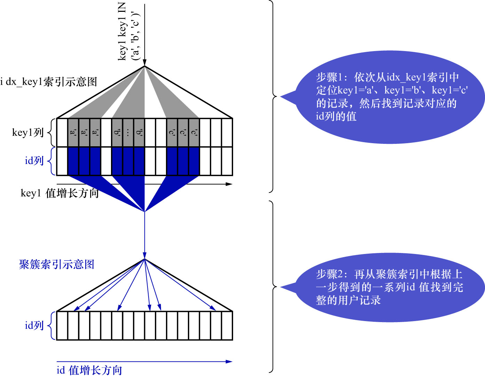

# 2. 使用`idx_key1`执行查询的成本分析

这里再贴一下查询语句:

```sql
SELECT *
FROM single_table
WHERE
    key1 IN ('a', 'b', 'c')
AND
    key2 > 10
AND
    key2 < 1000
AND
    key3 > key2
AND
    key_part1 LIKE '%hello%'
AND
    common_field = '123';
```

`idx_key1`对应的搜索条件为:`key1 IN ('a', 'b', 'c')`,也就是说相当于3个单点区间:

- `key1 ∈ ['a', 'a']`
- `key1 ∈ ['b', 'b']`
- `key1 ∈ ['c', 'c']`

使用`idx_key1`执行查询的示意图如下:



与使用`uk_key2`的情况类似,使用`idx_key1`执行该查询,也是使用`二级索引 + 回表`方式来执行的.

对于使用`二级索引 + 回表`方式的查询,依旧是依赖2方面的数据:

- 扫描区间数量
- 需要回表的记录数

- 扫描区间的数量

    使用`idx_key1`执行查询时,很显然有3个单点扫描区间,所以访问这3个扫描区间的二级索引付出的I/O成本就是:

    ```
    3 * 1.0 = 3.0
    ```

    其中:

    - 3: 扫描区间的数量
    - 1.0: 读取1个页面的成本常数(查询优化器认为读取索引的1个扫描区间的I/O成本与读取1个页面是相同的)
    - 注: 书中这里没有加微调值`1.1`,我猜测是为了简化

- 需要回表的记录数

    由于在使用`idx_key1`时存在3个单点扫描区间,所以每个单点扫描区间都需要查找1遍对应的二级索引记录数:

    - 查找单点扫描区间`key1 ∈ ['a', 'a']`对应的二级索引记录数
        
        计算单点扫描区间对应的二级索引记录数与计算范围扫描区间对应的二级索引记录数是一样的,都是先找到区间最左记录和区间最右记录,
        然后再计算它们之间的记录数.具体算法之前说过了,这里就不重复了.最后计算得到单点扫描区间`key1 ∈ ['a', 'a']`对应的二级索引记录数是35.
        
    - 查找单点扫描区间`key1 ∈ ['b', 'b']`对应的二级索引记录数
        
        与上同理,计算得到本单点扫描区间对应的记录数是44.
        
    - 查找单点扫描区间`key1 ∈ ['c', 'c']`对应的二级索引记录数
        
        与上同理,计算得到本单点扫描区间对应的记录数是39.
        
    所以,这三个单点区间总共需要回表的记录数为: `35 + 44 + 39 = 118`.
    读取这些二级索引记录的CPU成本为:`118 * 0.2 + 0.01 = 23.61`,其中:

    - 118: 需要回表的记录数
    - 0.2: 读取1条二级索引记录的CPU成本
    - 0.01: 微调值

在通过二级索引获取到记录之后,还需要干2件事:

- 根据这些记录的主键值到聚簇索引中执行回表操作
- 回表操作后得到完整的用户记录,然后再检测其他搜索条件是否成立

- 根据这些记录的主键值到聚簇索引中执行回表操作

    预计有118条二级索引记录需要进行回表操作,所以回表操作带来的I/O成本为: `118 * 1.0 = 118.0`.其中:

    - 118: 预估的二级索引记录数
    - 1.0: 读取1个页面的成本常数(查询优化器认为1次回表操作相当于访问1个页面)
    - 注: 书中这里没有加微调值`1.1`,我猜测是为了简化

- 回表操作后得到完整的用户记录,然后再检测其他搜索条件是否成立

    因为通过扫描区间获取到二级索引记录共118条,也就对应着聚簇索引中118条完整的用户记录,读取并检测这些完整的用户记录是否
    符合其余的搜索条件的CPU成本为: `118 * 0.2 = 23.6`.其中:

    - 118: 完整的用户记录数
    - 0.2: 访问1条记录所需的成本常数
    - 注: 这里没有加微调值`0.01`,我猜测是为了简化

所以本例中使用`idx_key1`执行查询的成本为:

- I/O成本: `3 * 1.0 + 118 * 1.0 = 121.0`.其中:

    - `3 * 1.0`: 扫描区间的I/O成本
        - 3: 扫描区间的数量
        - 1.0: 读取1个页面的成本常数(查询优化器认为读取索引的1个扫描区间的I/O成本与读取1个页面是相同的)
        - 注: 这里在计算扫描区间的I/O成本时,没有加微调值`1.1`,我猜测是为了简化
    - `118 * 1.0`: 回表操作的I/O成本
        - 118: 二级索引记录数,即回表次数
        - 1.0: 读取1个页面的成本常数(查询优化器认为1次回表操作相当于访问1个页面)
        - 注: 这里在计算回表操作的I/O成本时,没有加微调值`1.1`,我猜测是为了简化

- CPU成本: `118 * 0.2 + 0.01 + 118 * 0.2 = 23.61 + 23.6 = 47.21`.其中:

    - `118 * 0.2 + 0.01`: 访问二级索引记录的CPU成本
        - 118: 二级索引记录数
        - 0.2: 访问1条记录所需的成本常数
        - `0.01`: 微调值
    - `118 * 0.2`: 读取并检测回表操作后聚簇索引记录的CPU成本
        - 118: 完整的用户记录数
        - 0.2: 访问1条记录所需的成本常数
    - 注: 这里在计算访问二级索引的CPU成本时,加了微调值`0.01`;但是在计算访问并检测聚簇索引记录的CPU成本时,没有加微调值`0.01`,我猜测是为了简化

综上所述,使用`idx_key1`执行查询的总成本为: `121.0 + 47.21 = 168.21`
