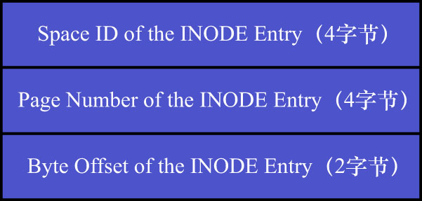
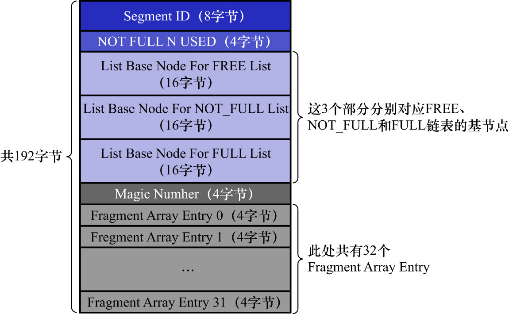
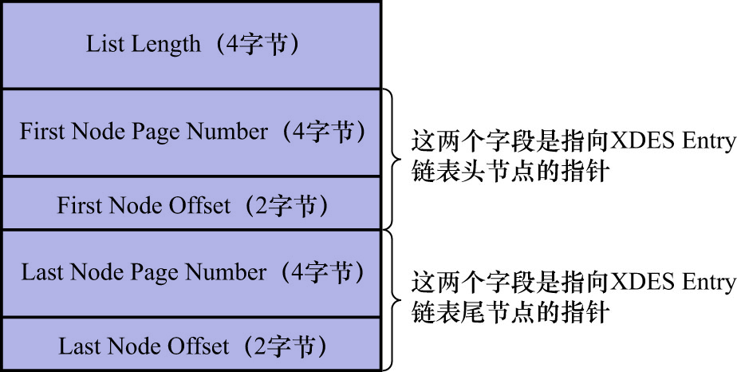

# 2. `clustered_index_size`和`sum_of_other_index_sizes`统计项的收集

注: 本部分需要使用到InnoDB的表空间相关知识,这部分内容之前讲过,如果不记得了,可以参考[MySQL系统表空间示意图](https://github.com/rayallen20/howDoesMySQLWork/blob/main/%E7%AC%AC9%E7%AB%A0%20%E5%AD%98%E6%94%BE%E9%A1%B5%E9%9D%A2%E7%9A%84%E5%A4%A7%E6%B1%A0%E5%AD%90--InnoDB%E7%9A%84%E8%A1%A8%E7%A9%BA%E9%97%B4/4.%20%E6%80%BB%E7%BB%93/MySQL%E7%B3%BB%E7%BB%9F%E8%A1%A8%E7%A9%BA%E9%97%B4%E7%A4%BA%E6%84%8F%E5%9B%BE.jpg)

1个索引占用2个segment,每个segment由一些零散的页面以及一些完整的extent构成.

- `clustered_index_size`表示聚簇索引占用的页面数量
- `sum_of_other_index_sizes`表示其他索引总共占用的页面数量

在收集这2个统计项的数据时,需要统计各个索引对应的叶子节点segment和非叶子节点segment分别占用的页面数量.
统计1个segment占用的页面数量的步骤如下:

- 步骤1. 从数据字典里找到表的各个索引对应的根页面位置

    系统表`SYS_INDEXES`中存储了哥哥索引对应的根页面信息.

    MySQL8.X中,该表对用户的展示为:数据库`information_schema`的`INNODB_INDEXES`表

    ```
    mysql> SELECT * FROM information_schema.INNODB_INDEXES;
    +----------+-----------------+----------+------+----------+---------+-------+-----------------+
    | INDEX_ID | NAME            | TABLE_ID | TYPE | N_FIELDS | PAGE_NO | SPACE | MERGE_THRESHOLD |
    +----------+-----------------+----------+------+----------+---------+-------+-----------------+
    |      152 | PRIMARY         |     1062 |    3 |        6 |       4 |     1 |              50 |
    |      153 | PRIMARY         |     1063 |    3 |        6 |       4 |     2 |              50 |
    |      154 | c               |     1063 |    0 |        2 |       5 |     2 |              50 |
    |      155 | d               |     1063 |    0 |        2 |       6 |     2 |              50 |
    |      158 | PRIMARY         |     1065 |    3 |        6 |       4 |     4 |              50 |
    |      159 | c               |     1065 |    0 |        2 |       5 |     4 |              50 |
    |      162 | GEN_CLUST_INDEX |     1068 |    1 |        4 |       4 |     7 |              50 |
    |      161 | GEN_CLUST_INDEX |     1067 |    1 |        4 |       4 |     6 |              50 |
    |      165 | GEN_CLUST_INDEX |     1071 |    1 |        7 |       4 |    10 |              50 |
    |      166 | GEN_CLUST_INDEX |     1072 |    1 |        4 |       4 |    11 |              50 |
    |      167 | PRIMARY         |     1073 |    3 |        5 |       4 |    12 |              50 |
    |      168 | PRIMARY         |     1074 |    3 |        5 |       4 |    13 |              50 |
    |      174 | PRIMARY         |     1076 |    3 |       10 |       4 |    15 |              50 |
    |      175 | uk_key2         |     1076 |    2 |        2 |       5 |    15 |              50 |
    |      177 | idx_key3        |     1076 |    0 |        2 |       7 |    15 |              50 |
    |      178 | idx_key_part    |     1076 |    0 |        4 |       8 |    15 |              50 |
    |      180 | idx_key1        |     1076 |    0 |        2 |       6 |    15 |              50 |
    |      181 | PRIMARY         |     1077 |    3 |        3 |       4 |    16 |              50 |
    |      182 | GEN_CLUST_INDEX |     1078 |    1 |        5 |       4 |    17 |              50 |
    |      183 | GEN_CLUST_INDEX |     1079 |    1 |        5 |       4 |    18 |              50 |
    |      184 | PRIMARY         |     1080 |    3 |        5 |       4 |    19 |              50 |
    |      185 | PRIMARY         |     1081 |    3 |        5 |       4 |    20 |              50 |
    +----------+-----------------+----------+------+----------+---------+-------+-----------------+
    22 rows in set (0.01 sec)
    ```
    
    其中,`PAGE_NO`列表示该索引根页面所在的页面页号.

    [该表详情可参阅此处](https://github.com/rayallen20/howDoesMySQLWork/blob/main/%E7%AC%AC9%E7%AB%A0%20%E5%AD%98%E6%94%BE%E9%A1%B5%E9%9D%A2%E7%9A%84%E5%A4%A7%E6%B1%A0%E5%AD%90--InnoDB%E7%9A%84%E8%A1%A8%E7%A9%BA%E9%97%B4/3.%20%E7%B3%BB%E7%BB%9F%E8%A1%A8%E7%A9%BA%E9%97%B4/1.%20%E7%B3%BB%E7%BB%9F%E8%A1%A8%E7%A9%BA%E9%97%B4%E7%9A%84%E6%95%B4%E4%BD%93%E7%BB%93%E6%9E%84/1.%20InnoDB%E6%95%B0%E6%8D%AE%E5%AD%97%E5%85%B8/3.%20SYS_INDEXES%E8%A1%A8.md)

- 步骤2. 从根页面的`Page Header`中找到叶子节点segment和非叶子节点segment对应的`Segment Header`

    在每个索引的根页面的`Page Header`部分都有2个字段:

    - `PAGE_BTR_SEG_LEAF`: 表示B+树叶子节点segment的`Segment Header`信息
    - `PAGE_BTR_SEG_TOP`: 表示B+树非叶子节点segment的`Segment Header`信息

    `Segment Header`的结构示意图如下:

    

    [`Page Header`详情可参阅此处](https://github.com/rayallen20/howDoesMySQLWork/blob/main/%E7%AC%AC5%E7%AB%A0%20%E7%9B%9B%E6%94%BE%E8%AE%B0%E5%BD%95%E7%9A%84%E5%A4%A7%E7%9B%92%E5%AD%90--InnoDB%E6%95%B0%E6%8D%AE%E9%A1%B5%E7%BB%93%E6%9E%84/5.%20Page%20Header(%E9%A1%B5%E9%9D%A2%E5%A4%B4%E9%83%A8).md)

- 步骤3. 从叶子节点segment和非叶子节点segment的`Segment Header`中找到这2个segment对应的`INODE Entry`结构

    `INODE Entry`的结构示意图如下:
    
    

- 步骤4: 从segment对应的`INODE Entry`结构中可以找到该segment对应的:
    - 所有零散的页面地址
    - `FREE`链表的基节点
    - `NOT_FULL`链表的基节点
    - `FULL`链表的基节点
    
    链表基节点的结构示意图如下:

    

- 步骤5: 
    - 直接统计零散的页面有多少个
      - 即`Fragment Array Entry`的数量
    - 然后从`FREE`/`NOT_FULL`/`FULL`链表的基节点的`List Length`字段中读出该segment占用的extent的数量
        - 每个extent占用64个页
    - 即可统计出整个segment占用的页面数量

通过上面这5步,即可统计出索引对应的某个segment占用的页面数量.然后分别计算:

- 聚簇索引的叶子节点segment和非叶子节点segment占用的页面数,它们的和就是`clustered_index_size`的值
- 按照同样的方式,把其余索引占用的页面数都算出来,相加之后就是`sum_of_other_index_sizes`的值

注意: 当1个segment的数据在非常多时(超过32个页面),会以extent为单位来申请空间.
这里的问题是以extent为单位申请空间后,有一些页可能还没有使用到,但是在统计`clustered_index_size`和
`sum_of_other_index_sizes`时都把这些还没有使用到的页也算进去了,所以聚簇索引和其他索引实际占用的页面数可能比这两个
统计项的值要小一些.
