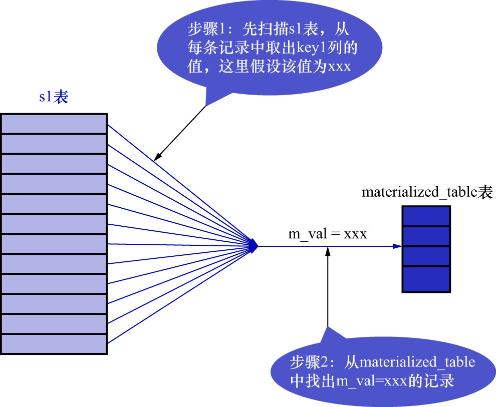
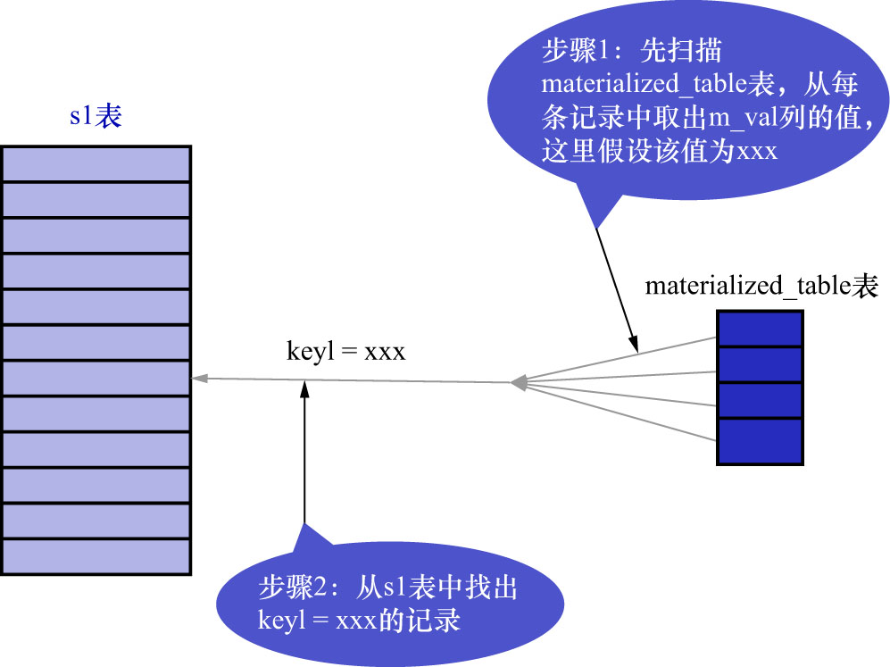

# 2. 物化表转连接

再来看之前的那个语句:

```sql
SELECT *
FROM s1
WHERE key1 IN (
    SELECT common_field
    FROM s2
    WHERE key3 = 'a'
);
```

当把子查询物化后,假设子查询物化表名为`materialized_table`,该物化表存储的子查询结果集的列为`m_val`,
那么整个查询可以从以下2种视角来看待:

- 从表`s1`的视角看待

    整个查询的过程为: 对于`s1`表中的每条记录来说,若该记录的`key1`列的值在子查询对应的物化表中,则该记录会被加入最终的结果集.如下图示:

    

- 从子查询物化表的视角看待

    整个查询的过程为: 对于子查询物化表的每个`m_val`列的值(这里假定某个列值为`m_val1`)来说,
    若能在`s1`表中找到`key1`列值等于`m_val1`列值的记录,则把这些记录(`s1`表中,`key1列值 = m_val1`的记录可能有多条)
    加入到最终的结果集.如下图示:

    

也就是说,其实该查询相当于,**表`s1`和子查询物化表`materialized_table`进行内连接**:

```sql
SELECT s1.*
FROM s1 INNER JOIN materialized_table
ON key1 = m_val;
```

转化成内连接之后,查询优化器可以评估不同连接顺序需要的成本是多少,然后选取成本最低的那种方式执行查询.
这里分析一下上述查询中使用外层查询的表`s1`和物化表`materialized_table`进行内连接的成本分别由哪几部分组成的.

- 若使用`s1`表作为驱动表,则总查询成本由以下几部分构成:
  - 物化子查询时需要的成本
  - 扫描驱动表(`s1`表)时的成本
    - 这里要扫描整个`s1`表,所以`s1`表的fanout值等于`s1`表中的记录数量
  - 扫描被驱动表`materialized_table`的成本
    - `s1`表中的记录数量 * 根据条件`m_val = xxx`对`materialized_table`表进行单表访问的成本
    - 前文说过,物化表中的记录是不重复的,且为物化表中的列建立了索引,所以这个步骤非常快(相当于每次访问都是`const`访问方法)

- 使用`materialized_table`表作为驱动表,则总查询成本由以下几部分构成:
  - 物化子查询时需要的成本
  - 扫描驱动表(`materialized_table`表)时的成本
    - 这里也是要扫描整个`materialized_table`表,所以`materialized_table`表的fanout值等于`materialized_table`表中的记录数量
  - 扫描被驱动表`s1`的成本
    - `materialized_table`表中的记录数量 * 根据条件`key1 = xxx`对`s1`表进行单表访问的成本
    - `s1`表的`key1`列上有索引,所以这个步骤的成本也非常低(相当于每次访问都是`ref`访问方法)

MySQL优化器会通过运算来选择成本更低的方案执行查询.
