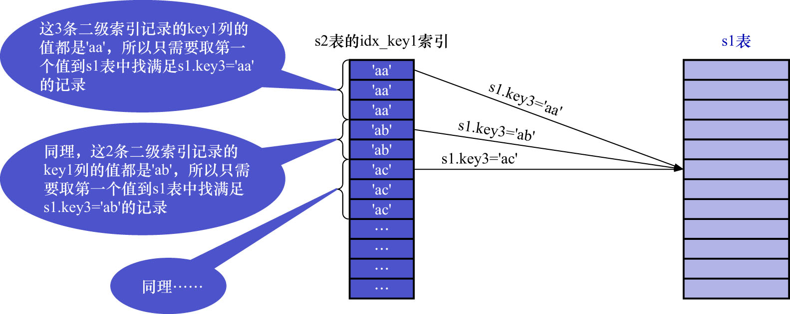

# 4. Loose Scan(松散扫描)

对于下面这个查询:

```sql
SELECT *
FROM s1
WHERE key3 IN (
    SELECT key1
    FROM s2
    WHERE
        key1 > 'a'
    AND
        key1 < 'b'
);
```

在子查询中,对于`s2`表的访问可以使用到`key1`列的索引,而子查询的查询列表处恰好就是`key1`列.
这样在将该查询转换为半连接查询后,**若将`s2`作为驱动表执行查询(注意这是使用`Loose Scan`的前提)**,则执行过程如下图示:



如图所示,在`s2`表的索引`idx_key1`中,值为`'aa'`的二级索引记录一共有3条,只需要取第1条的值到`s1`表中查找`s1.key3 = 'aa'`的记录,
若能在`s1`表中找到对应的记录,则把对应的记录加入到结果集.依此类推,其他值相同的二级索引记录,也只需要取第1条记录的值到`s1`表中找匹配的记录.
这种**虽然是扫描索引,但只取值(确切的说是索引列的值)相同的记录的第1条去做匹配操作的方式称为`Loose Scan`(松散扫描)**.
