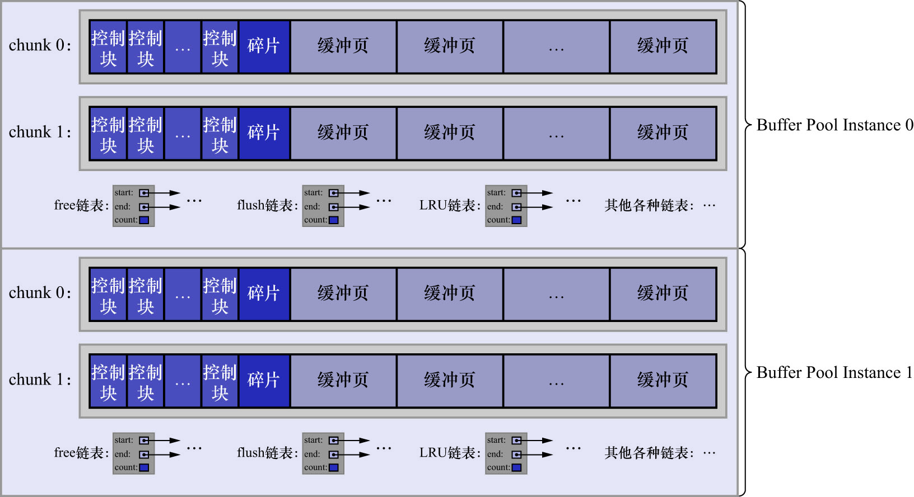

# 10. `innodb_buffer_pool_chunk_size`

在MySQL5.7.5之前,只能在服务器启动时通过配置启动项`innodb_buffer_pool_size`或配置文件的方式来调整`Buffer Pool`的大小,
在服务器运行过程中是不允许调整该值的.MySQL的设计者在5.7.5及之后的版本中,支持了在服务器运行过程中调整`Buffer Pool`大小的功能.
问题出现了:每当要重新调整`Buffer Pool`大小时,都需要重新向操作系统申请一块连续的内存空间,然后将旧的`Buffer Pool`中的内容
复制到这一块新空间中.这是极其耗时的操作.所以MySQL的设计者决定不再一次性为某个`Buffer Pool`实例向操作系统申请一大片连续的内存空间,
而是以一个`chunk`为单位向操作系统申请空间.也就是说1个`Buffer Pool`实例由若干个`chunk`组成,1个chunk表示一片连续的内存空间,其中
包含了若干缓冲页与其对应的控制块.如下图示:



该图描述的`Buffer Pool`由2个实例组成,每个实例中又包含2个`chunk`.

因为出现了`chunk`的概念,**在服务器运行期间调整`Buffer Pool`的大小时,以`chunk`为单位增加或者删除内存空间即可**,而不需要重新
向操作系统申请一片大的内存,然后进行缓冲页的复制.系统变量`innodb_buffer_pool_chunk_size`用于指定`chunk`的大小:

```
mysql> SHOW VARIABLES LIKE 'innodb_buffer_pool_chunk_size';
+-------------------------------+-----------+
| Variable_name                 | Value     |
+-------------------------------+-----------+
| innodb_buffer_pool_chunk_size | 134217728 |
+-------------------------------+-----------+
1 row in set (0.00 sec)
```

该变量默认值为134217728,单位为字节,即128MB.**该值只能在服务器启动时通过配置项指定,或通过配置文件设置.在服务器运行过程中不可修改**.

注: 为什么不允许在服务器运行过程中修改`innodb_buffer_pool_chunk_size`的值?

因为`innodb_buffer_pool_chunk_size`的值表示InnoDB向操作系统申请的一片连续的内存空间的大小,若在服务器运行过程中修改了该值,
就表示要重新向操作系统申请连续的内存空间,并且将原先的缓冲页和它们对应的控制块复制到这个新的内存空间中(每个`chunk`都进行一次该操作,
因为`chunk`的大小变了,所以每个`chunk`能存储的缓冲页和控制块的数量也会发生变化).

另外,`innodb_buffer_pool_chunk_size`的值并不包含缓冲页对应的控制块的内存空间大小,所以实际上InnoDB向操作系统申请连续内存空间时,
每个`chunk`的大小要比`innodb_buffer_pool_chunk_size`定义的值大一些(在DEBUG模式下约5%,因为控制块的大小约为缓冲页的5%).
