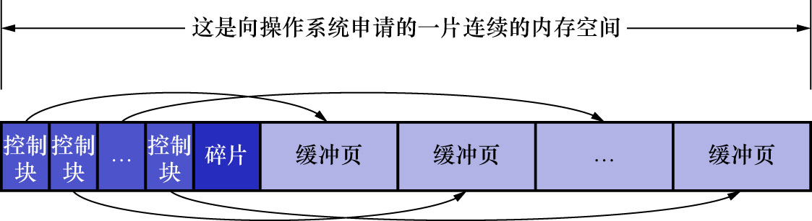

# 2. `Buffer Pool`内部组成

`Buffer Pool`对应的一片连续的内存,被划分为若干个页面,页面大小与InnoDB表空间使用的页面大小一样,默认为16KB.
为与磁盘中的页区分开,此处把`Buffer Pool`中的页称为缓冲页.为管理这些在`Buffer Pool`中的缓冲页,
InnoDB的设计者为每个缓冲页都创建了一些控制信息.这些控制信息包括:

- 页所属的表空间编号
- 页号
- 缓冲页在`Buffer Pool`中的地址
- 链表节点信息
- 等

除了这些信息外,还有一些别的控制信息,用到的时候再说.

每个缓冲页对应的控制信息占用的内存大小是相同的,每个页对应的控制信息占用的一块内存称为一个控制块.
**控制块和缓冲页是一一对应的**,它们都存放到`Buffer Pool`中.其中**控制块存放到`Buffer Pool`的前面,
缓冲页存放到`Buffer Pool`后面**.整个`Buffer Pool`对应的内存空间如下图示:

注: 这个结构其实有点像位图(bitmap)

这里解释一下图中的"碎片":

每一个控制块都对应一个缓冲页,在分配足够多的控制块和缓冲页后,可能剩余的空间不够一对控制块和缓冲页的大小,
那这部分空间自然也就用不到了.这个用不到的内存空间就被称为碎片.当然,如果把`Buffer Pool`的大小设置的刚刚好,也可能不会产生碎片.

注: 在DEBUG模式下,每个控制块大约占用缓冲页大小的5%(非DEBUG模式下会更小一点).在MySQL5.7.22这个版本的DEBUG模式下,
每个控制块控制块占用的大小是808字节.**系统变量`innodb_buffer_pool_size`设置的大小并不包含这部分控制块占用的内存空间大小**.
也就是说InnoDB在为`Buffer Pool`向操作系统申请连续的内存空间时,这片连续的内存空间的大小会比`innodb_buffer_pool_size`的值大5%左右.
