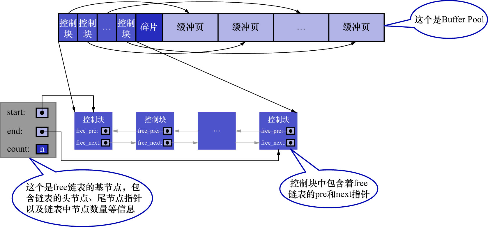

# 3. free链表的管理

当启动MySQL服务器时,需要完成对`Buffer Pool`的初始化过程,即:

- 先向操作系统申请`Buffer Pool`的内存空间
- 然后把它划分成若干对控制块和缓冲页

但是此时并没有真实的磁盘页被缓存到`Buffer Pool`中(因为还没有用到),之后随着程序的运行,会不断地有磁盘上的页被缓存到`Buffer Pool`中.

此时有一个问题: 从磁盘上读取一个页到`Buffer Pool`中时,该放到哪个缓冲页的位置呢?或者说如何区分`Buffer Pool`中哪些缓冲页是空闲的,
哪些已经被使用了呢?

需要在某个地方记录`Buffer Pool`中哪些缓冲页是可用的.此时缓冲页对应的控制块就有用了:可以把每个空闲的缓冲页对应的控制块作为1个节点,
放到一个链表中,该链表也可以称为free链表(或者说空闲链表).刚刚完成初始化的`Buffer Pool`中,所有的缓冲页都是空闲的,
所以每个缓冲页对应的控制块都会被加入到free链表中.假设该`Buffer Pool`中可容纳的缓冲页数量为`n`,则增加了free链表的效果如下图示:

注意: 这里所说的"放到一个链表中",就是如图所示的靠`free_pre`和`free_next`两个指针连接起来的链表.
在这个过程中,所有的控制块的地址都没有发生改变,只是它们的`free_pre`和`free_next`指针被设置成了指向链表中前后节点的地址.
在后续讲解的所有链表的所有操作中,控制块的地址都没有发生改变.

从图中可以看出,为管理free链表,故为该链表定义了一个基节点(即图中的`count`).其中包含:

- 链表的头节点地址
- 链表的尾节点地址
- 当前链表中节点的数量
- 等信息 

注意: **链表的基节点占用的内存空间并不包含在为`Buffer Pool`申请的一大片连续内存空间之内,而是单独申请的一块内存空间**.

注: 链表基节点占用的内存空间并不大,在MySQL5.7.22版本中,每个基节点只占用40字节.后边会介绍许多不同的链表,它们的
基节点和free链表的基节点的内存分配方式是完全相同的,都是一块单独申请的40字节的内存空间,并不包含在为`Buffer Pool`
申请的一大片连续内存空间之内.

有了free链表的定义之后,每当需要从磁盘中加载一个页到`Buffer Pool`中时:

- 从free链表中取一个空闲的缓冲页
- 然后把该缓冲页对应的控制块的信息填充好
  - 即:该页所在的表空间/页号之类的信息
- 然后把该缓冲页对应的free链表节点(也就是该缓冲页对应的控制块)从链表中移除
  - 也就是该控制块的前一个节点的`free_next`指针指向该控制块的后一个节点,该控制块的后一个节点的`free_pre`指针指向该控制块的前一个节点
  - 同时该控制块的`free_next`和`free_pre`指针都被设置为NULL
  - 表示该控制块不在链表中了

即表示该缓冲页已经被使用了.

注: "从链表中取一个缓冲页对应的控制块"这样的陈述有点繁琐,在后边的某些场景下,会将其简称为"从链表中取一个缓冲页",
这里心里要清楚,真正从链表中获取的是控制块,通过控制块就能访问到真正的页.同理,"遍历`Buffer Pool`中的缓冲页",其意思就是
"遍历`Buffer Pool`中各个缓冲页对应的控制块".
