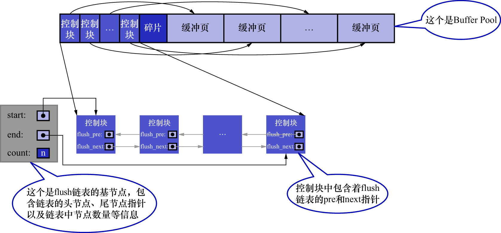

# 5. flush链表的管理

若修改了`Buffer Pool`中某个缓冲页的数据,则该页就与磁盘上的页不一致了,这样的缓冲页也被称为脏页(dirty page).
当然,可以每当修改完某个缓冲页时,立即将其刷新到磁盘中对应的页上.但是频繁地向磁盘中写数据,会严重影响程序的性能(毕竟磁盘很慢).
所以每次修改缓冲页后,并不着急立即把修改刷新到磁盘上,而是在未来的某个时间点进行刷新.至于这个刷新的时间点,后边会讲到,现在先不用管.

若不立即将修改刷新到磁盘,则之后再刷新时,如何确认`Buffer Pool`中哪些页是脏页,哪些页从来没被修改过?若把所有的缓冲页都同步到磁盘上,
假如`Buffer Pool`被设置的很大,那一次性同步内存中的大量数据到磁盘,会非常耗时.

因此,需要再创建一个存储脏页的链表,凡是被修改过的缓冲页,其对应的控制块,都会作为一个节点加入到该链表中.
由于该链表中的节点对应的缓冲页都是需要被刷新到磁盘上的,所以该链表被称为flush链表.
若`Buffer Pool`在某个时间点的脏页数量为`n`,则对应的flush链表如下图示:

注:

- 若一个缓冲页是空闲的,则该页必不可能是脏页(因为该缓冲页中根本没写入过数据)
- 若一个缓冲页是脏页,则它必然不是空闲的(因为脏页是被修改过的,证明该缓冲页中必然有数据)

即: 某个缓冲页对应的控制块,在同一时刻,不可能既是free链表的节点,又是flush链表的节点.
