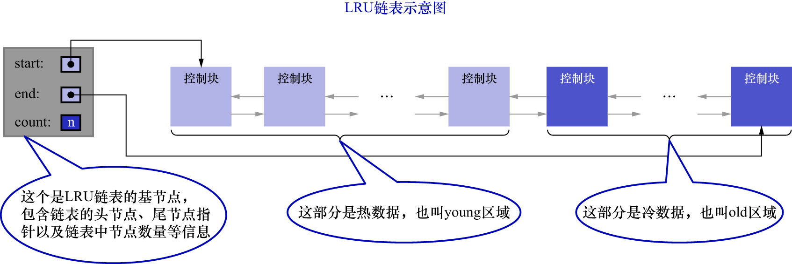

# 2. 划分区域的LRU链表的出现

因为有上述2种情况的存在,所以InnoDB的设计者把LRU链表按照一定比例分成2截:

- 一部分存储使用频率非常高的缓冲页;这一部分链表也叫做热数据,或者称为young区域
- 另一部分存储使用频率不是很高的缓冲页;所以这一部分链表也叫做冷数据,或者称为old区域

如下图示:



注意: **该方案是按照某个比例将LRU链表分成2部分,而不是某些节点固定位于young区域,某些节点固定位于old区域**.
随着程序的运行,某个节点所属的区域也可能发生变化(和前面的那些链表一样,也是通过修改节点的`pre`和`next`指针来实现,而非移动节点在内存中的位置).
系统变量`innodb_old_blocks_pct`用于确定old区域在LRU链表中所占的百分比.该变量的作用域为GLOBAL,默认值为37.

mysql> SHOW VARIABLES LIKE 'innodb_old_blocks_pct';
+-----------------------+-------+
| Variable_name         | Value |
+-----------------------+-------+
| innodb_old_blocks_pct | 37    |
+-----------------------+-------+
1 row in set (0.00 sec)

从结果可以看出,默认情况下old区域在LRU链表中所占的百分比为37%.也就是说old区域大约占LRU链表的3/8.
这个比例是可以设置的,例如修改配置文件:

```
root@mysql-master:~# vim /etc/mysql/mysql.conf.d/mysqld.cnf
root@mysql-master:~# cat /etc/mysql/mysql.conf.d/mysqld.cnf
```

```
...
[server]
# 设置InnoDB Buffer Pool的LRU链表中 old区域的占比为40%
innodb_old_blocks_pct = 40
...
```

重启服务后查看该系统变量:

```
mysql> SHOW VARIABLES LIKE 'innodb_old_blocks_pct';
+-----------------------+-------+
| Variable_name         | Value |
+-----------------------+-------+
| innodb_old_blocks_pct | 40    |
+-----------------------+-------+
1 row in set (0.02 sec)
```