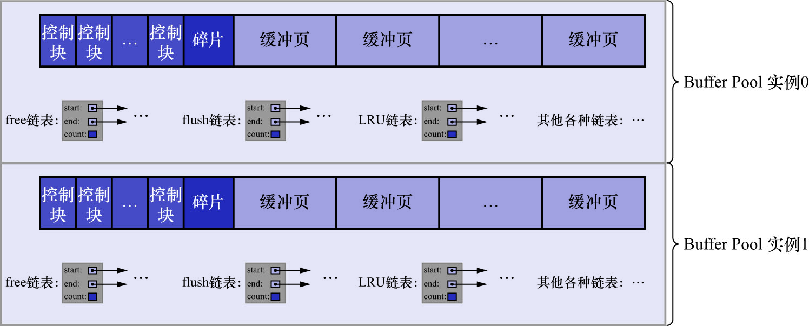

# 9. 多个`Buffer Pool`实例

前文说过,`Buffer Pool`本质是InnoDB向操作系统申请的一块连续的内存空间.在多线程环境下,访问`Buffer Pool`中的各种链表都需要加锁处理啥.
在`Buffer Pool`特别大且多线程并发访问特别高的情况下,单一的`Buffer Pool`可能会影响请求的处理速度.所以在`Buffer Pool`特别大时,
可以把它们拆分成若干个小的`Buffer Pool`,每个`Buffer Pool`都称为一个实例.实例之间是相互独立的:独立的去申请内存空间,独立的管理各种链表...
在多线程并发访问时并不会相互影响,从而提高并发处理能力.系统变量`innodb_buffer_pool_instances`用于控制`Buffer Pool`实例的个数.

```
mysql> SHOW VARIABLES LIKE 'innodb_buffer_pool_instances';
+------------------------------+-------+
| Variable_name                | Value |
+------------------------------+-------+
| innodb_buffer_pool_instances | 1     |
+------------------------------+-------+
1 row in set (0.00 sec)
```

该变量的作用域为`GLOBAL`级别,默认值为1.可通过配置文件修改:

```
root@mysql-master:~# vim /etc/mysql/mysql.conf.d/mysqld.cnf
root@mysql-master:~# cat /etc/mysql/mysql.conf.d/mysqld.cnf
```

```
[server]
# 定义Buffer Pool的数量
innodb_buffer_pool_instances = 2
```

重启服务后查看:

```
mysql> SHOW VARIABLES LIKE 'innodb_buffer_pool_instances';
+------------------------------+-------+
| Variable_name                | Value |
+------------------------------+-------+
| innodb_buffer_pool_instances | 1     |
+------------------------------+-------+
1 row in set (0.01 sec)
```

注意: 此时还没有变化,原因后续会讲到.

这样就表示要创建2个`Buffer Pool`实例,如下图示:



每个`Buffer Pool`实例实际占用的内存空间 = `innodb_buffer_pool_size` / `innodb_buffer_pool_instances`

即: `Buffer Pool的总大小 / 实例的个数 = 每个Buffer Pool实例占用的大小`.

并不是`Buffer Pool`实例创建的越多越好,分别管理各个`Buffer Pool`也是需要性能开销的.InnoDB的设计规定:
**当`innodb_buffer_pool_size`的值小于1GB时,设置多个实例是无效的**.
InnoDB会默认把`innodb_buffer_pool_instances`的值修改为1.
也就是说,在`Buffer Pool`的大小大于1GB时,设置多个`Buffer Pool`实例才有意义.

调整`Buffer Pool`的大小为8GB:

```
root@mysql-master:~# vim /etc/mysql/mysql.conf.d/mysqld.cnf
root@mysql-master:~# cat /etc/mysql/mysql.conf.d/mysqld.cnf
```

```
[server]
# 设置InnoDB Buffer Pool的大小为 8GB
innodb_buffer_pool_size = 8589934592

# 定义Buffer Pool的数量
innodb_buffer_pool_instances = 2
```

重启服务后查看:

```
mysql> SHOW VARIABLES LIKE 'innodb_buffer_pool_size';
+-------------------------+------------+
| Variable_name           | Value      |
+-------------------------+------------+
| innodb_buffer_pool_size | 8589934592 |
+-------------------------+------------+
1 row in set (0.01 sec)

mysql> SHOW VARIABLES LIKE 'innodb_buffer_pool_instances';
+------------------------------+-------+
| Variable_name                | Value |
+------------------------------+-------+
| innodb_buffer_pool_instances | 2     |
+------------------------------+-------+
1 row in set (0.01 sec)
```
