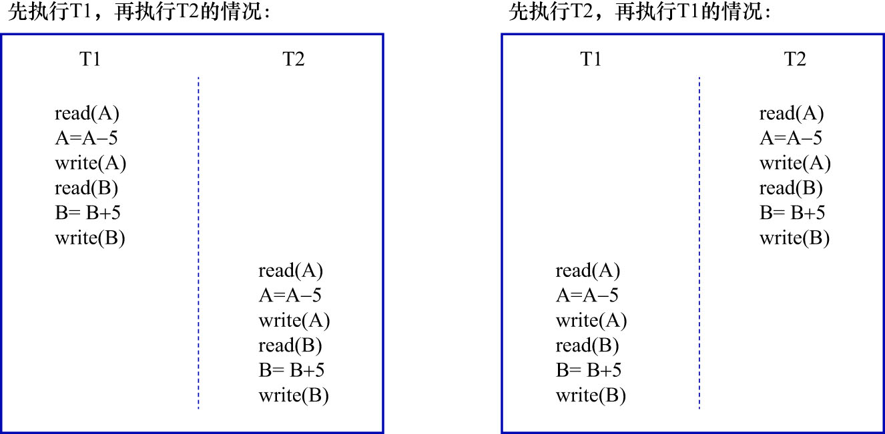
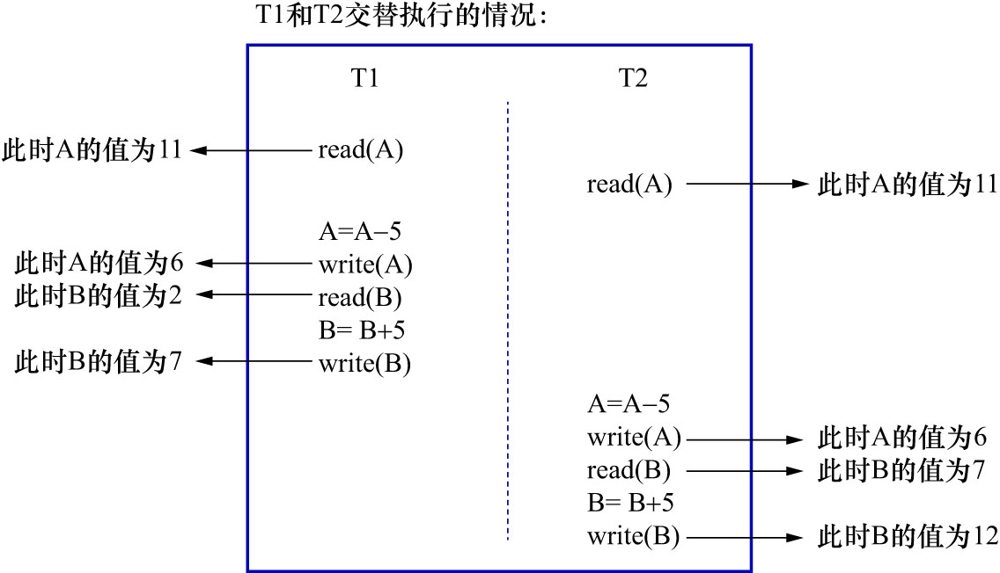

# 2. 隔离性(Isolation)

现实世界中,**两次状态转换应该是互不影响的**.比如,狗哥向猫爷同时进行的2次金额为5元的转账(假设可以在2个ATM机上同时操作).
那么最后狗哥的账户里肯定会少10元,猫爷的账户里肯定多了10元.但是对应到数据库世界中,事情又变的复杂了一些.为简化问题,粗略假设
狗哥向猫爷转账5元的过程是由以下几个步骤组成:

1. 读取狗哥账户的余额到变量`A`中: 简写为`read(A)`
2. 将狗哥账户的余额减去转账金额: 简写为`A = A - 5`
3. 将狗哥账户修改过的余额写到磁盘中: 简写为`write(A)`
4. 读取猫爷账户的余额到变量B: 简写为`read(B)`
5. 将猫爷账户的余额加上转账金额: 简写为`B = B + 5`
6. 将猫爷账户修改过的余额写到磁盘中: 简写为`write(B)`

这里将狗哥向猫爷同时进行的2次转账操作分别称为`T1`和`T2`.在现实世界中`T1`和`T2`是应该没有关系的,可以:

- 先执行**完**`T1`,再执行`T2`
- 或者先执行**完**`T2`再执行`T1`

注意: 现实世界中是要求**先执行完任意一次转账,再执行另一次转账的**.

对应的数据库操作如下图示:

但是,在真实的数据库中,`T1`和`T2`的操作可能交替执行,如下图示:

若按照上图中的执行顺序来进行2次转账,则最终狗哥的账户里还剩6元钱,相当于只扣了5元钱,但是猫爷的账户里却成了12元钱,相当于多了10元钱,
银行要亏死了.

所以对于现实世界中状态转换对应的某些数据库操作来说,不仅要保证这些操作以原子性的方式执行完成,而且还要
**保证其它的状态转换不会影响到本次状态转换,这个规则被称为隔离性**.这个场景下,数据库的设计者就需要采取一些措施:
让访问相同数据(上例中的`A`账户和`B`账户)的不同状态转换(上例中的`T1`和`T2`)对应的数据库操作的执行顺序有一定规律.
在本例中即为: 对`A`账户和`B`账户的访问需要确保顺序.在`T1`和`T2`中的任何一个操作执行期间,另一个操作不能访问`A`账户和`B`账户.
