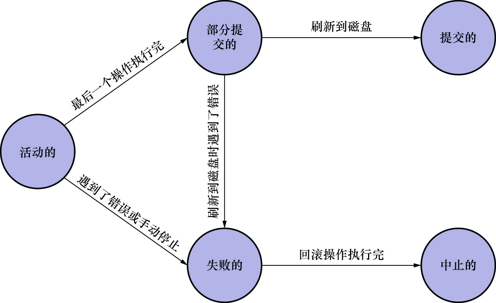

# 2. 事务的概念

ACID:

- 原子性(Atomicity)
- 隔离性(Isolation)
- 一致性(Consistency)
- 持久性(Durability)

事务(transaction):需要保证原子性/隔离性/一致性/持久性的1个或多个数据库操作称为一个事务

事务是一个抽象的概念,它其实对应着1个或多个数据库操作,数据库的设计者根据这些操作所执行的不同阶段把事务大致划分为如下5个状态:

- 活动状态(active)

    事务对应的数据库操作正在执行过程中时,称该事务处在活动状态

- 部分提交状态(partially committed)

    当事务中的最后一个操作执行完成,但由于操作都在内存中执行,所造成的影响并没有刷新到磁盘时,称该事务处在部分提交状态

- 失败状态(failed)

    当事务处在活动状态或部分提交状态时,可能遇到了某些错误,例如:

    - 数据库自身的错误
    - 操作系统错误
    - 直接断电

    而无法继续执行,或者人为停止了当前事务的执行,称该事务处在失败状态

- 中止状态(aborted)

    若事务在执行过程中变为失败状态,比如狗哥向猫爷转账的事务,当狗哥账户的钱被扣除,但是猫爷账户的钱没有增加时遇到了错误,
    因此导致该事务处在失败状态,则需要把已经修改的狗哥账户余额调整为未转账之前的金额.换句话说就是:**要撤销失败事务对当前数据库造成的影响**.
    这个撤销的过程用书面一点的话描述即为:**回滚**.当回滚操作执行完毕后,也就是数据库恢复到了执行事务之前的状态.称该事务处在中止状态.

- 提交状态(committed)

    当一个处在部分提交状态的事务将修改过的数据都刷新到磁盘中之后,就称该事务处在提交状态

从图中可以看出,**只有当事务处于提交状态或中止状态时,一个事务的生命周期才算是结束了**:

- 若事务处于提交状态,则该事务对数据库所做的修改将永久生效
- 若事务处于中止状态,该事务对数据库所做的所有修改都会被回滚到没有执行过该事务之前的状态
