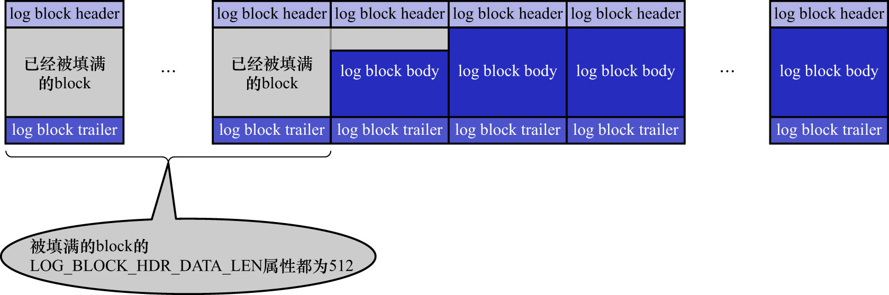

# 2. 确定恢复的终点

要确定恢复的终点,还要从[`block`的结构](https://github.com/rayallen20/howDoesMySQLWork/blob/main/%E7%AC%AC19%E7%AB%A0%20%E8%AF%B4%E8%BF%87%E7%9A%84%E8%AF%9D%E5%B0%B1%E4%B8%80%E5%AE%9A%E8%A6%81%E5%81%9A%E5%88%B0--redo%E6%97%A5%E5%BF%97/5.%20redo%E6%97%A5%E5%BF%97%E7%9A%84%E5%86%99%E5%85%A5%E8%BF%87%E7%A8%8B/1.%20redo%20log%20block.md)说起.
前文说过,`redo`日志是顺序写入的,写满了一个`block`之后会再往下一个`block`中写,如下图示:

普通`block`的`log block header`部分中,有一个名为`LOG_BLOCK_HDR_DATA_LEN`的属性,该属性值记录了当前`block`中使用了多少字节的空间.
对于被填满的`block`来说,该值永远为512.若该属性的值不为512,则该`block`就是本次恢复中需要扫描的最后一个`block`.

也就是说在因崩溃而恢复系统时,只需要从`checkpoint_lsn`在日志组中对应的偏移量(即`checkpoint_offset`)开始,
一直扫描`redo`日志文件中的`block`,直到某个`block`的`LOG_BLOCK_HDR_DATA_LEN`属性值不为512为止.
