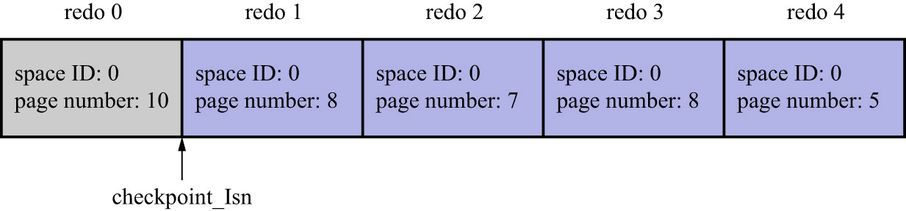
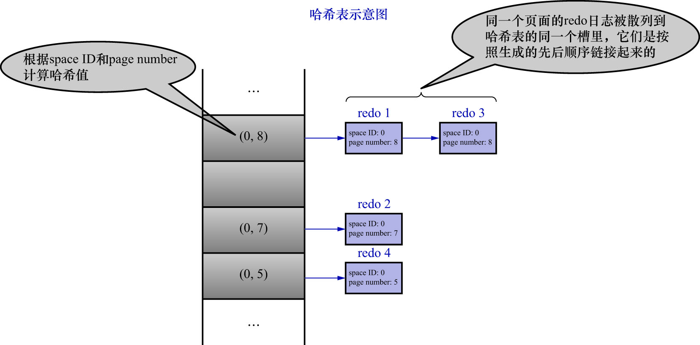

# 3. 怎么恢复

确定了需要扫描哪些`redo`日志来进行崩溃恢复后,接下来就是怎么进行恢复了.假设现在的`redo1日志文件中有5条`redo`日志,如下图示:

由于`redo 0的lsn值 < checkpoint_lsn`,所以恢复时可以不管`redo 0`.现在按照`redo`日志的顺序
依次扫描`checkpoint_lsn`之后的各条`redo`日志,按照日志中记载的内容将对应的页面恢复出来.这样做没什么问题,但是InnoDB的设计者
还是想了一些办法加快这个恢复过程:

- 使用哈希表

    根据[`redo`日志](https://github.com/rayallen20/howDoesMySQLWork/blob/main/%E7%AC%AC19%E7%AB%A0%20%E8%AF%B4%E8%BF%87%E7%9A%84%E8%AF%9D%E5%B0%B1%E4%B8%80%E5%AE%9A%E8%A6%81%E5%81%9A%E5%88%B0--redo%E6%97%A5%E5%BF%97/3.%20redo%E6%97%A5%E5%BF%97%E6%A0%BC%E5%BC%8F/0.%20%E5%89%8D%E8%A8%80.md)的`space ID`和`page number`属性计算出散列值,
    把`space ID`和`page number`相同的`redo`日志放到哈希表的同一个槽中.若有多个`space ID`和`page number`都相同的`redo`日志,
    则使用链表把这些`redo`日志连接起来(按生成的先后顺序连接),如下图示:
    
    
    
    之后遍历哈希表,因为对同一个页面进行修改的`redo`日志都放在了同一个槽中,所以可以一次性将一个页面修复好(避免了多次读取同一个页面,即避免很多读取页面的随机I/O),
    这样可以加快恢复速度.另外需要注意一点的是:同一个页面的`redo`日志是按生成时间顺序进行排序的,所以恢复时也要按这个顺序进行恢复.
    若不按生成时间顺序进行排序,那么可能出现错误.例如,原先的修改操作为:
    
    - 先插入一条记录
    - 再删除该条记录
    
    若恢复时不按照`redo`日志的生成顺序恢复,就可能会变成:
    
    - 先删除一条记录
    - 再插入一条记录
    
    这显然是错误的.

- 跳过已经刷新到磁盘中的页面

前面说过,对于`lsn值 < checkpoint_lsn`的`redo`日志,这些`redo`日志对应的脏页肯定都已经刷到磁盘中了.
但是对于`lsn >= checkpoint_lsn`的`redo`日志,这些`redo`日志对应的脏页不能确定是否已经刷到磁盘中.因为
在最近推进的一次`checkpoint`后,可能负责刷脏操作的后台线程又不断地从LRU链表和flush链表中将一些脏页刷出`Buffer Pool`.
对于这些`lsn >= checkpoint_lsn`的`redo`日志,若这些`redo`日志对应的脏页在崩溃发生时已经刷新到磁盘中,则在恢复时
就没有必要根据`redo`日志的内容修改该页面了.

在恢复时,如何确定某个`redo`日志对应的脏页,是否在崩溃发生时已经刷新到磁盘中了?这还得从页面的结构说起.前面说过,
每个页面都有一个名为[`File Header`](https://github.com/rayallen20/howDoesMySQLWork/blob/main/%E7%AC%AC5%E7%AB%A0%20%E7%9B%9B%E6%94%BE%E8%AE%B0%E5%BD%95%E7%9A%84%E5%A4%A7%E7%9B%92%E5%AD%90--InnoDB%E6%95%B0%E6%8D%AE%E9%A1%B5%E7%BB%93%E6%9E%84/6.%20File%20Header(%E6%96%87%E4%BB%B6%E5%A4%B4%E9%83%A8).md)的部分.在`File Header`中有一个名为`FIL_PAGE_LSN`的属性,该属性记载了
最近一次修改页面时对应的lsn值(其实就是页面控制块中的`newest_modification`值).若在推进了某次`checkpoint`之后,有脏页被刷新到磁盘中,
则**该页的`FIL_PAGE_LSN`表示的lsn值必然大于`checkpoint_lsn`的值**.凡是符合这种情况的页面就不需要根据
那些`redo日志的lsn值 < 该页的FIL_PAGE_LSN`的`redo`日志进行回复了,这进一步提升了崩溃恢复的速度.
