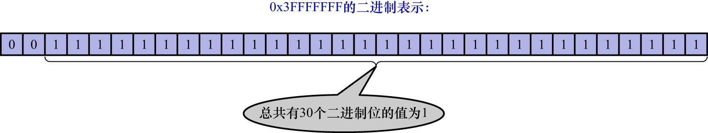

# 13. 遗漏的问题:`LOG_BLOCK_HDR_NO`是如何计算的

前文说过,对于实际存储`redo`日志的普通的[`log block`](https://github.com/rayallen20/howDoesMySQLWork/blob/main/%E7%AC%AC19%E7%AB%A0%20%E8%AF%B4%E8%BF%87%E7%9A%84%E8%AF%9D%E5%B0%B1%E4%B8%80%E5%AE%9A%E8%A6%81%E5%81%9A%E5%88%B0--redo%E6%97%A5%E5%BF%97/5.%20redo%E6%97%A5%E5%BF%97%E7%9A%84%E5%86%99%E5%85%A5%E8%BF%87%E7%A8%8B/1.%20redo%20log%20block.md)来说,
在`log block header`处有一个名为`LOG_BLOCK_HDR_NO`的属性.该属性表示一个唯一的编号,该属性的值在初次使用该`block`时进行分配,
与当时的系统lsn值有关.使用下边的公式计算该`block`的`LOG_BLOCK_HDR_NO`值:

```
( (lsn / 512) & 0x3FFFFFFF ) + 1
```

其中`&`表示按位与操作:

- `1 & 1 = 1`
- `1 & 0 = 0`
- `0 & 1 = 0`
- `0 & 0 = 0`


该公式中的`0x3FFFFFFF`可能让人困惑,该值的二进制表示如下图示:



从图中可以看出,`0x3FFFFFFF`对应的32位二进制数的前2个比特位的值为0,后30个的比特位的值都为1.在与运算中:

- 一个二进制位和0做与运算(`&`)的结果必然为0
- 一个二进制位和1做与运算(`&`)的结果必然为原值

让一个数和`0x3FFFFFFF`做与运算的意思就是:要将该值的前2个比特位的值置为0,这样该值就肯定小于或等于`0x3FFFFFFF`了.
也就是说,无论lsn多大,`(lsn / 512) & 0x3FFFFFFF`的值必然在`[0, 0x3FFFFFFF]`之间.而`0x3FFFFFFF + 1 = 0x40000000 = 2 ^ 30`,
`2 ^ 30`表示的恰好是1GB.也就是说系统最多能产生不重复的`LOG_BLOCK_HDR_NO`值最多有1G个.InnoDB的设计者规定:**`redo`日志文件组中
包含的所有文件大小总和不得超过512GB**.1个`block`的大小是512字节,也就是说`redo`日志文件组中包含的`block`最多为1G个,所以有1G个
不重复的编号值.

另外,`LOG_BLOCK_HDR_NO`值的第1个比特位比较特殊,称为`flush bit`:

- 若该值为1,则表示该`block`是在将`log buffer`中的`block`刷新到磁盘的某次操作中时,第1个被刷入的`block`
- 否则,按上述公式计算,该值为0

注: 本章全都是在讲如何让已经提交的事务(即事务产生的`redo`日志完全刷到磁盘上了)保持持久性.但是:

- 若一个事务执行到一半时服务器突然崩溃,且该事务执行过程中所写的`redo`日志也尚未刷新到磁盘(即还停留在`log buffer`中):

    这种情况下服务器崩溃就崩溃了,相当于该事务没有修改任何页面,恢复时也因为`redo`日志文件组中没有该事务的`redo`日志,所以也不可能恢复该事务所修改的页面.

- 若一个事务执行到一半时服务器突然崩溃,且该事务执行过程中所写的`redo`日志有一部分已经刷新到磁盘中:

    **那么在下次重启时,就会根据这些`redo`日志把页面恢复过来,但恢复这就造成了一个事务处于只执行了一半的状态**.这就违背了事务的原子性了.
    其实,这些只执行了一半的事务对页面所做的修改都会被撤销,这就是下一章要讲的`undo`日志的作用了.
