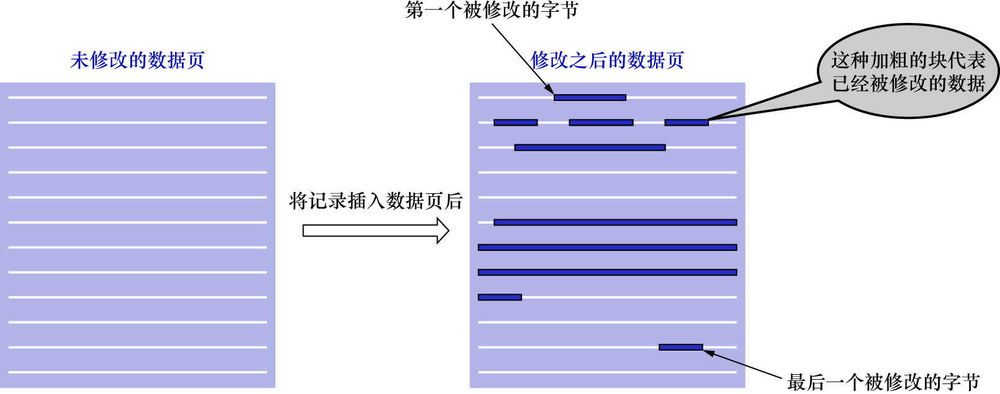
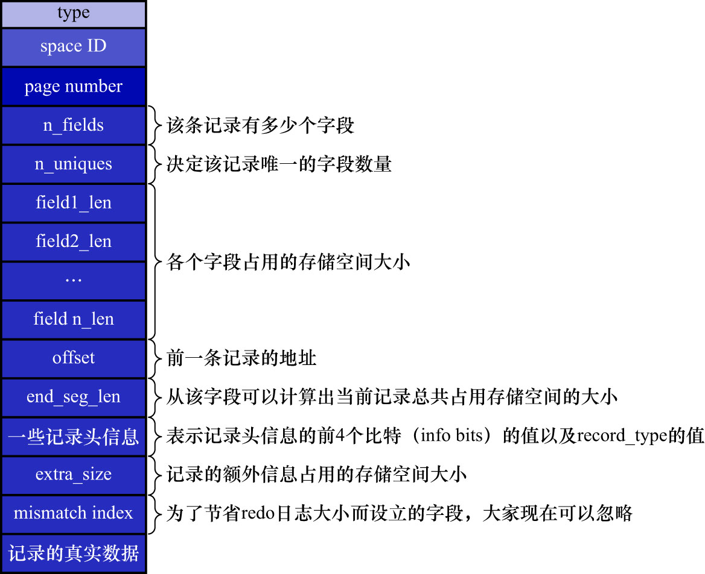

# 2. 复杂的`redo`日志类型

有时,在执行1条语句时会修改非常多的页面,包括系统数据页面和用户数据页面(用户数据指的就是聚簇索引和二级索引对应的B+树).
以1条`INSERT`语句为例,它除了向B+树的页面中插入数据外,也可能更新系统数据`Max Row ID`的值.不过对于用户来说,
平时更关心的是语句对B+树所做更新:

- 表中包含多少个索引,1条`INSERT`语句就可能更新多少棵B+树
- 针对某一棵B+树来说:
  - 既可能更新叶子节点页面
  - 也可能更新非叶子节点节点页面
  - 也可能创建新的页面
    - 在该记录插入的叶子节点的剩余空间比较少,不足以存放该记录时,会进行[页分裂](https://github.com/rayallen20/howDoesMySQLWork/blob/main/%E7%AC%AC6%E7%AB%A0%20%E5%BF%AB%E9%80%9F%E6%9F%A5%E8%AF%A2%E7%9A%84%E7%A7%98%E7%B1%8D--B%2B%E6%A0%91%E7%B4%A2%E5%BC%95/2.%20%E7%B4%A2%E5%BC%95/1.%20%E4%B8%80%E4%B8%AA%E7%AE%80%E5%8D%95%E7%9A%84%E7%B4%A2%E5%BC%95%E6%96%B9%E6%A1%88/1.%20%E4%B8%8B%E4%B8%80%E4%B8%AA%E6%95%B0%E6%8D%AE%E9%A1%B5%E4%B8%AD%E7%9A%84%E7%94%A8%E6%88%B7%E8%AE%B0%E5%BD%95%E7%9A%84%E4%B8%BB%E9%94%AE%E5%80%BC%E5%BF%85%E9%A1%BB%E5%A4%A7%E4%BA%8E%E4%B8%8A%E4%B8%80%E4%B8%AA%E9%A1%B5%E4%B8%AD%E7%94%A8%E6%88%B7%E8%AE%B0%E5%BD%95%E7%9A%84%E4%B8%BB%E9%94%AE%E5%80%BC.md),在非叶子节点页面中添加目录项记录

在语句执行过程中,`INSERT`语句对所有页面的修改都要保存到`redo`日志中.很明显这是个非常复杂的过程.比如,在将记录插入到聚簇索引中时:
若定位到的叶子节点的剩余空间足够存储该记录时,则只更新该叶子节点页面即可.这种场景下只记录1条`MLOG_WRITE_STRING`类型的`redo`日志,
表明"**在页面的某个偏移量处增加了哪些数据**"可以吗? 很明显是不行的,因为1个数据页中除了存储实际的记录之外,还有:

- [`File Header`](https://github.com/rayallen20/howDoesMySQLWork/blob/main/%E7%AC%AC5%E7%AB%A0%20%E7%9B%9B%E6%94%BE%E8%AE%B0%E5%BD%95%E7%9A%84%E5%A4%A7%E7%9B%92%E5%AD%90--InnoDB%E6%95%B0%E6%8D%AE%E9%A1%B5%E7%BB%93%E6%9E%84/6.%20File%20Header(%E6%96%87%E4%BB%B6%E5%A4%B4%E9%83%A8).md)
- [`Page Header`](https://github.com/rayallen20/howDoesMySQLWork/blob/main/%E7%AC%AC5%E7%AB%A0%20%E7%9B%9B%E6%94%BE%E8%AE%B0%E5%BD%95%E7%9A%84%E5%A4%A7%E7%9B%92%E5%AD%90--InnoDB%E6%95%B0%E6%8D%AE%E9%A1%B5%E7%BB%93%E6%9E%84/5.%20Page%20Header(%E9%A1%B5%E9%9D%A2%E5%A4%B4%E9%83%A8).md)
- [`Page Directory`](https://github.com/rayallen20/howDoesMySQLWork/blob/main/%E7%AC%AC5%E7%AB%A0%20%E7%9B%9B%E6%94%BE%E8%AE%B0%E5%BD%95%E7%9A%84%E5%A4%A7%E7%9B%92%E5%AD%90--InnoDB%E6%95%B0%E6%8D%AE%E9%A1%B5%E7%BB%93%E6%9E%84/4.%20Page%20Directory(%E9%A1%B5%E7%9B%AE%E5%BD%95).md)
- [等等部分](https://github.com/rayallen20/howDoesMySQLWork/tree/main/%E7%AC%AC5%E7%AB%A0%20%E7%9B%9B%E6%94%BE%E8%AE%B0%E5%BD%95%E7%9A%84%E5%A4%A7%E7%9B%92%E5%AD%90--InnoDB%E6%95%B0%E6%8D%AE%E9%A1%B5%E7%BB%93%E6%9E%84)

所以每向叶子节点表示的数据页中插入一条记录,都会有其他很多地方会跟着更新,比如:

- 可能更新[`Page Directory`](https://github.com/rayallen20/howDoesMySQLWork/blob/main/%E7%AC%AC5%E7%AB%A0%20%E7%9B%9B%E6%94%BE%E8%AE%B0%E5%BD%95%E7%9A%84%E5%A4%A7%E7%9B%92%E5%AD%90--InnoDB%E6%95%B0%E6%8D%AE%E9%A1%B5%E7%BB%93%E6%9E%84/4.%20Page%20Directory(%E9%A1%B5%E7%9B%AE%E5%BD%95).md)中的`Slot`信息
- [`Page Header`](https://github.com/rayallen20/howDoesMySQLWork/blob/main/%E7%AC%AC5%E7%AB%A0%20%E7%9B%9B%E6%94%BE%E8%AE%B0%E5%BD%95%E7%9A%84%E5%A4%A7%E7%9B%92%E5%AD%90--InnoDB%E6%95%B0%E6%8D%AE%E9%A1%B5%E7%BB%93%E6%9E%84/5.%20Page%20Header(%E9%A1%B5%E9%9D%A2%E5%A4%B4%E9%83%A8).md)中的各种页面统计信息,比如:
  - `PAGE_N_DIR_SLOTS`表示的槽数量可能会更改
  - `PAGE_HEAP_TOP`表示的还未使用的空间最小地址可能会更改
  - `PAGE_N_HEAP`表示的本页面中的记录数量可能会更改
  - 等各种信息都可能会被修改
- 数据页中的记录按照索引列从小到大的顺序组成一个单向链表,每插入一条记录,都需要更新上一条记录的记录头信息中的[`next_record`](https://github.com/rayallen20/howDoesMySQLWork/blob/f67756ef76cd4d4dcedeb4d7f782eb74d3a39bba/%E7%AC%AC5%E7%AB%A0%20%E7%9B%9B%E6%94%BE%E8%AE%B0%E5%BD%95%E7%9A%84%E5%A4%A7%E7%9B%92%E5%AD%90--InnoDB%E6%95%B0%E6%8D%AE%E9%A1%B5%E7%BB%93%E6%9E%84/3.%20%E8%AE%B0%E5%BD%95%E5%9C%A8%E9%A1%B5%E4%B8%AD%E7%9A%84%E5%AD%98%E5%82%A8/1.%20%E8%AE%B0%E5%BD%95%E5%A4%B4%E4%BF%A1%E6%81%AF/6.%20next_record.md)属性来维护这个单向链表

还有很多要更新的地方,这里就不详细展开了.

数据页修改的简易示意图如下:

说了这么多,就是想表达:**在把一条记录插入到一个页面时,需要更改的地方非常多**.这时若使用之前说的简单的物理`redo`日志来记录这些修改,
可以有2种解决方案:

- 方案1: 针对每个修改的地方,都记录1条`redo`日志

    也就是在上图中,有多少个加粗的块,就写多少条物理`redo`日志.按照这种方式记录`redo`日志的缺点显而易见:因为被修改的地方太多了,
    可能导致`redo`日志占用的空间要比整个页面占用的空间还多.

- 方案2: 将整个页面**第1个被修改的字节**到**最后1个修改的字节**之间所有的数据当成1条物理`redo`日志中的具体数据

    从上图中可以看出,第1个被修改的字节到最后一个修改的字节之间仍然有许多数据是没有被修改过的,
    把这些没有被修改过的数据也写入到`redo`日志中去也有些浪费空间.

在记录某个页面中做了哪些修改时,使用上述2种方案都比较浪费空间,所以InnoDB的者为了节约空间,提出了一些新的`redo`日志类型:

- `MLOG_REC_INSERT`(`type`字段对应的十进制数字为9): 表示**插入**一条使用**非紧凑行格式**的记录时的`redo`日志类型
- `MLOG_COMP_REC_INSERT`(`type`字段对应的十进制数字为38): 表示**插入**一条使用**紧凑行格式**的记录时的`redo`日志类型

    注:

    - [REDUNDANT行格式](https://github.com/rayallen20/howDoesMySQLWork/tree/main/%E7%AC%AC4%E7%AB%A0%20%E4%BB%8E%E4%B8%80%E6%9D%A1%E8%AE%B0%E5%BD%95%E8%AF%B4%E8%B5%B7--InnoDB%E8%AE%B0%E5%BD%95%E5%AD%98%E5%82%A8%E7%BB%93%E6%9E%84/3.%20InnoDB%E8%A1%8C%E6%A0%BC%E5%BC%8F/3.%20REDUNDANT%E8%A1%8C%E6%A0%BC%E5%BC%8F)是一种比较原始的行格式,它是非紧凑的
    - [COMPACT](https://github.com/rayallen20/howDoesMySQLWork/tree/main/%E7%AC%AC4%E7%AB%A0%20%E4%BB%8E%E4%B8%80%E6%9D%A1%E8%AE%B0%E5%BD%95%E8%AF%B4%E8%B5%B7--InnoDB%E8%AE%B0%E5%BD%95%E5%AD%98%E5%82%A8%E7%BB%93%E6%9E%84/3.%20InnoDB%E8%A1%8C%E6%A0%BC%E5%BC%8F/2.%20COMPACT%E8%A1%8C%E6%A0%BC%E5%BC%8F)/[DYNAMIC/COMPRESSED](https://github.com/rayallen20/howDoesMySQLWork/blob/main/%E7%AC%AC4%E7%AB%A0%20%E4%BB%8E%E4%B8%80%E6%9D%A1%E8%AE%B0%E5%BD%95%E8%AF%B4%E8%B5%B7--InnoDB%E8%AE%B0%E5%BD%95%E5%AD%98%E5%82%A8%E7%BB%93%E6%9E%84/3.%20InnoDB%E8%A1%8C%E6%A0%BC%E5%BC%8F/5.%20DYNAMIC%E5%92%8CCOMPRESSED%E8%A1%8C%E6%A0%BC%E5%BC%8F.md)行格式是较新的格式,它们是紧凑的(占用的存储空间更少)

- `MLOG_COMP_PAGE_CREATE`(`type`字段对应的十进制数字为58): 表示**创建**一个**存储紧凑行格式记录**的页面的`redo`日志类型
- `MLOG_COMP_REC_DELETE`(`type`字段对应的十进制数字为42):表示**删除**一条使用**紧凑行格式**记录的`redo`日志类型
- `MLOG_COMP_LIST_START_DELETE`(`type`字段对应的十进制数字为44): 表示从某条给定记录开始,**删除**页面中的**一系列使用紧凑行格式记录**的`redo`日志类型
  - 表示删除操作的起点
- `MLOG_COMP_LIST_END_DELETE`(`type`字段对应的十进制数字为43): 表示**删除**一系列记录,直到`MLOG_COMP_LIST_END_DELETE`类型的`redo`日志对应的记录为止
  - 与`MLOG_COMP_LIST_START_DELETE`类型的`redo`日志是对应的
  - 表示删除操作的终点

注: 前边在讲InnoDB数据页格式的时,重点强调过,数据页中的记录是按照索引列大小的顺序组成单向链表.有时会有这样的需求:
要删除索引列的值在某个区间内的所有记录.这种场景下,若每删除1条记录就写1条`redo`日志,效率可能会有点低.
`MLOG_COMP_LIST_START_DELETE`和`MLOG_COMP_LIST_END_DELETE`类型的`redo`日志可以很大程度上减少`redo`日志的条数.

- `MLOG_ZIP_PAGE_COMPRESS`(`type`字段对应的十进制数字为51): 表示压缩一个数据页的`redo`日志类型

还有很多种类型的`redo`日志,这里就不列举了,等用到时再说.

这些类型的`redo`日志既包含**物理层面**的含义,也包含**逻辑层面**的含义:

- 从物理层面看,这些日志都指明了:**对哪个表空间的哪个页进行修改**
- 从逻辑层面看,在系统崩溃后重启时,并不能直接根据这些日志里的记载,在页面内的某个偏移量处恢复某个数据
  - 而是**需要调用一些事先准备好的函数,执行完这些函数后,才可以将页面恢复成系统崩溃前的状态**

因此这种`redo`日志被称为**物理-逻辑日志**.

以`MLOG_COMP_REC_INSERT`类型(表示插入一条使用紧凑行格式的记录的`redo`日志类型)的`redo`日志为例,
来理解"逻辑层面"的含义.

`MLOG_COMP_REC_INSERT`类型的`redo`日志的结构如下图示(由于字段太多,竖着看效果会好一些):

`MLOG_COMP_REC_INSERT`类型的`redo`日志结构中,有以下几个地方要注意:

- `n_uniques`

    前面在讲索引的时候说过,在一个数据页中,无论是叶子节点还是非叶子节点,记录都是按照索引列的值,从小到大的顺序排序的.
    对于二级索引来说,当索引列的值相同时,记录还需要按照主键值进行排序.
    
    图中`n_uniques`的值的含义为:在一条记录中,用于确保记录的唯一性所需的字段值的数量.
    
    这样在插入一条记录时,就可以按照记录的前`n_uniques`个字段进行排序.
    
    - 对于聚簇索引来说,`n_uniques`的值为`主键的列数`
    - 对于其他二级索引来说,`n_uniques`的值为`索引列中包含的列数 + 主键列数`

    注意: 唯一二级索引的值可能为`NULL`,所以在唯一二级索引中,`n_uniques`的值仍然为`索引列中包含的列数 + 主键列数` 

- `field1_len - fieldn_len`

    表示该记录若干个字段占用存储空间的大小.
    
    注意: 这里无论字段的类型是固定长度类型(比如`INT`),还是可变长度类型(比如`VARCHAR(M)`),该字段占用的大小始终要写入`redo`日志中

- `offset`

    表示该记录的前一条记录在页面中的地址.这里之所以要在`redo`日志中记录前一条记录的地址,是因为每向数据页插入一条记录,
    都需要修改该页面中维护的记录链表.每条记录的记录头信息中都包含一个称为[`next_record`](https://github.com/rayallen20/howDoesMySQLWork/blob/f67756ef76cd4d4dcedeb4d7f782eb74d3a39bba/%E7%AC%AC5%E7%AB%A0%20%E7%9B%9B%E6%94%BE%E8%AE%B0%E5%BD%95%E7%9A%84%E5%A4%A7%E7%9B%92%E5%AD%90--InnoDB%E6%95%B0%E6%8D%AE%E9%A1%B5%E7%BB%93%E6%9E%84/3.%20%E8%AE%B0%E5%BD%95%E5%9C%A8%E9%A1%B5%E4%B8%AD%E7%9A%84%E5%AD%98%E5%82%A8/1.%20%E8%AE%B0%E5%BD%95%E5%A4%B4%E4%BF%A1%E6%81%AF/6.%20next_record.md)的属性,所以在插入新记录时,
    需要修改前一条记录的[`next_record`](https://github.com/rayallen20/howDoesMySQLWork/blob/f67756ef76cd4d4dcedeb4d7f782eb74d3a39bba/%E7%AC%AC5%E7%AB%A0%20%E7%9B%9B%E6%94%BE%E8%AE%B0%E5%BD%95%E7%9A%84%E5%A4%A7%E7%9B%92%E5%AD%90--InnoDB%E6%95%B0%E6%8D%AE%E9%A1%B5%E7%BB%93%E6%9E%84/3.%20%E8%AE%B0%E5%BD%95%E5%9C%A8%E9%A1%B5%E4%B8%AD%E7%9A%84%E5%AD%98%E5%82%A8/1.%20%E8%AE%B0%E5%BD%95%E5%A4%B4%E4%BF%A1%E6%81%AF/6.%20next_record.md)属性.

- `end_seg_len`

    一条记录由这2部分组成:

    - 额外信息
    - 真实数据

    这2个部分的总大小就是1条记录占用存储空间的总大小.

    `end_seg_len`: 通过该字段的值,可以**间接地计算**出一条记录占用存储空间的总大小
    
    之所以不直接存储一条记录占用存储空间的总大小,是因为写`redo`日志是一个非常频繁的操作,InnoDB的设计者希望尽可能地减小`redo`日志本身占用的
    存储空间大小,所以使用了一些算法来实现这个目标.`end_seg_len`这个字段就是为了节省`redo`日志的存储空间而提出的.至于该字段的具体使用方式
    这里就不展开讲了,因为比较复杂,且讲明白这个过程的意义也不大.

- `mismatch_index`

    该值也是为了节省`redo`日志的大小而设立的,此处可以忽略

很显然,`MLOG_COMP_REC_INSERT`类型的`redo`日志中,并没有记录:

- `PAGE_N_DIR_SLOTS`(槽数量)
- `PAGE_HEAP_TOP`(该页面中还未使用的空间最小地址)
- `PAGE_N_HEAP`(该页面中的记录数量)
- 等

的值被修改成了什么,而只是记录了"**在本页面中插入1条记录所有必备的要素**".之后系统因崩溃而重启后,
服务器会调用**向某个页面插入一条记录的相关函数**,而`redo`日志中的那些数据,就作为调用该函数所需的参数.在调用完该函数后,
页面中的:

- `PAGE_N_DIR_SLOTS`(槽数量)
- `PAGE_HEAP_TOP`(该页面中还未使用的空间最小地址)
- `PAGE_N_HEAP`(该页面中的记录数量)
- 等

的值就都被恢复到系统崩溃前的状态了.这就是"`redo`日志包含逻辑层面"的含义.

简单理解: `redo`日志中只记录了与数据相关的信息(`redo`日志的物理含义),至于该操作对页面其他元数据造成的修改,由某些"计算过程(函数)"来负责.
而这些"计算过程",就是`redo`日志的**逻辑**含义.可以认为`redo`日志是一些操作页面的函数的参数.

这里需要再补充一点: 这种物理-逻辑日志,在执行过程中,是有可能产生其他类型的`redo`日志的.比如,在插入一条记录时,
可能会导致数据页分裂,这时就会产生`MLOG_COMP_PAGE_CREATE`类型的`redo`日志,表示创建一个存储紧凑行格式记录的页面的`redo`日志类型.
