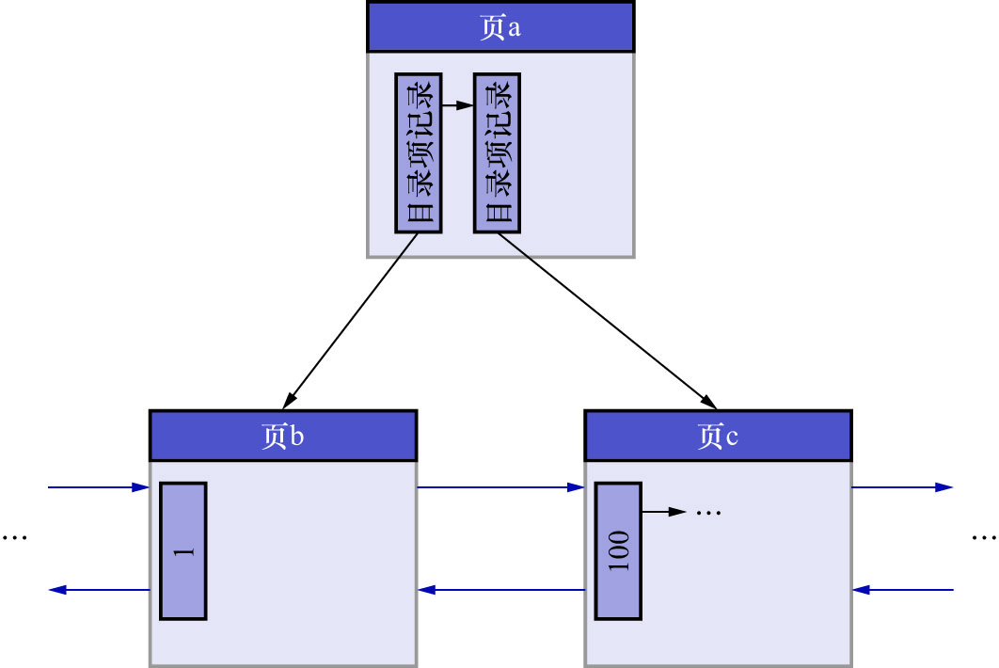

# 2. 乐观插入的过程

情况1: 该数据页剩余的空闲空间充足,可以容纳这条待插入记录

这种情况下事情很简单,直接把记录插入到该数据页中,记录一条`MLOG_COMP_REC_INSERT`类型的`redo`日志即可.
这种情况被称为**乐观插入**.

假如某个索引对应的B+树如下图示:

现在要插入一条键值为10的记录,很显然这条记录应该被插入到页b中,由于页b现在有足够的空间容纳这条记录,所以直接将该记录插入到页b中即可.
如下图示:

