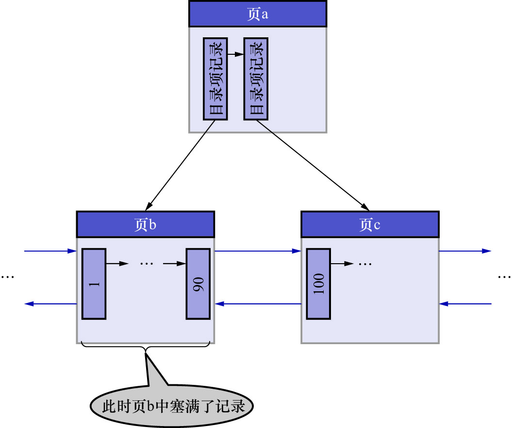
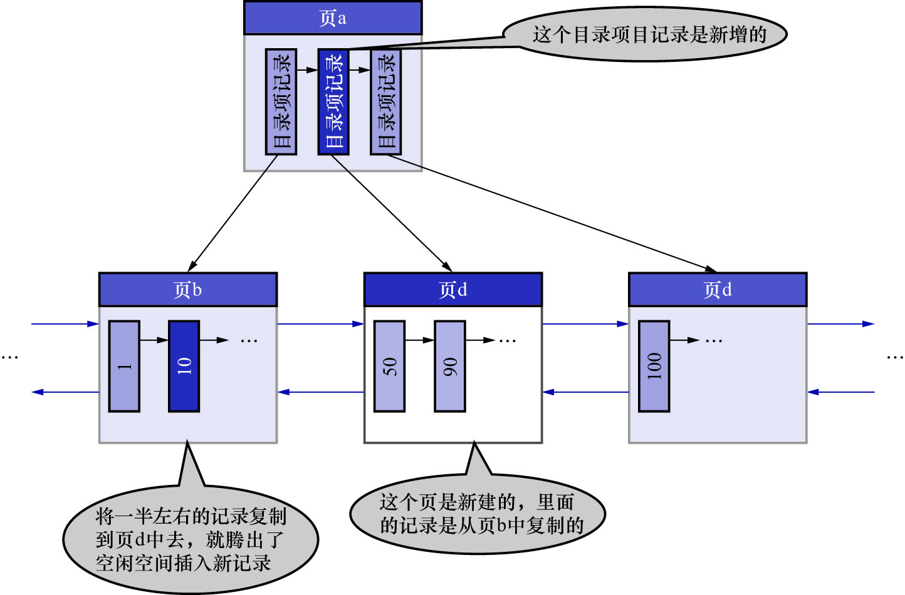

# 3. 悲观插入的过程

情况2: 该数据页剩余的空闲空间不足,无法容纳这条待插入记录

遇到这种情况时,要进行[页分裂操作](https://github.com/rayallen20/howDoesMySQLWork/blob/451a4986a09f0edcb3b08bd23a57a2a4f876bbe7/%E7%AC%AC6%E7%AB%A0%20%E5%BF%AB%E9%80%9F%E6%9F%A5%E8%AF%A2%E7%9A%84%E7%A7%98%E7%B1%8D--B%2B%E6%A0%91%E7%B4%A2%E5%BC%95/2.%20%E7%B4%A2%E5%BC%95/1.%20%E4%B8%80%E4%B8%AA%E7%AE%80%E5%8D%95%E7%9A%84%E7%B4%A2%E5%BC%95%E6%96%B9%E6%A1%88/1.%20%E4%B8%8B%E4%B8%80%E4%B8%AA%E6%95%B0%E6%8D%AE%E9%A1%B5%E4%B8%AD%E7%9A%84%E7%94%A8%E6%88%B7%E8%AE%B0%E5%BD%95%E7%9A%84%E4%B8%BB%E9%94%AE%E5%80%BC%E5%BF%85%E9%A1%BB%E5%A4%A7%E4%BA%8E%E4%B8%8A%E4%B8%80%E4%B8%AA%E9%A1%B5%E4%B8%AD%E7%94%A8%E6%88%B7%E8%AE%B0%E5%BD%95%E7%9A%84%E4%B8%BB%E9%94%AE%E5%80%BC.md):

- 新建一个叶子节点
- 把原数据页中的一部分记录移动到新的数据页中
- 把记录插入到页面中
  - 具体插入到原页还是新页中,取决于记录的键值
- 把新建的叶子节点插入到叶子节点链表中
- 在非叶节点中添加一条目录项记录指向新建的叶子节点

很显然,这个过程要对多个页面进行修改,这意味着会产生多条`redo`日志,这种情况被称为**悲观插入**.
假如某个索引对应的B+树如下图示:

现在要插入一条键值为10的记录,很显然需要被插入到页b中,但是从图中可以看出,此时页b已经塞满了记录,没有更多的空闲空间来容纳这条新记录了,
所以需要进行[页分裂操作](https://github.com/rayallen20/howDoesMySQLWork/blob/451a4986a09f0edcb3b08bd23a57a2a4f876bbe7/%E7%AC%AC6%E7%AB%A0%20%E5%BF%AB%E9%80%9F%E6%9F%A5%E8%AF%A2%E7%9A%84%E7%A7%98%E7%B1%8D--B%2B%E6%A0%91%E7%B4%A2%E5%BC%95/2.%20%E7%B4%A2%E5%BC%95/1.%20%E4%B8%80%E4%B8%AA%E7%AE%80%E5%8D%95%E7%9A%84%E7%B4%A2%E5%BC%95%E6%96%B9%E6%A1%88/1.%20%E4%B8%8B%E4%B8%80%E4%B8%AA%E6%95%B0%E6%8D%AE%E9%A1%B5%E4%B8%AD%E7%9A%84%E7%94%A8%E6%88%B7%E8%AE%B0%E5%BD%95%E7%9A%84%E4%B8%BB%E9%94%AE%E5%80%BC%E5%BF%85%E9%A1%BB%E5%A4%A7%E4%BA%8E%E4%B8%8A%E4%B8%80%E4%B8%AA%E9%A1%B5%E4%B8%AD%E7%94%A8%E6%88%B7%E8%AE%B0%E5%BD%95%E7%9A%84%E4%B8%BB%E9%94%AE%E5%80%BC.md),如下图示:

注: 这里图中最右侧的页应该是页c,图中写错了

注: 这里图中说的"一半左右的记录",是指字节数占用一半左右,而不是记录数条数的一半左右.

注: 这里图中说的"复制"到页d,其实是一个迁移的过程,页分裂操作结束后这些数据在页b中就不存在了.

若作为非叶节点的页a的剩余空闲空间也不足以容纳新增的一条目录项记录,则需要继续对非叶节点页a进行[页分裂操作](https://github.com/rayallen20/howDoesMySQLWork/blob/451a4986a09f0edcb3b08bd23a57a2a4f876bbe7/%E7%AC%AC6%E7%AB%A0%20%E5%BF%AB%E9%80%9F%E6%9F%A5%E8%AF%A2%E7%9A%84%E7%A7%98%E7%B1%8D--B%2B%E6%A0%91%E7%B4%A2%E5%BC%95/2.%20%E7%B4%A2%E5%BC%95/1.%20%E4%B8%80%E4%B8%AA%E7%AE%80%E5%8D%95%E7%9A%84%E7%B4%A2%E5%BC%95%E6%96%B9%E6%A1%88/1.%20%E4%B8%8B%E4%B8%80%E4%B8%AA%E6%95%B0%E6%8D%AE%E9%A1%B5%E4%B8%AD%E7%9A%84%E7%94%A8%E6%88%B7%E8%AE%B0%E5%BD%95%E7%9A%84%E4%B8%BB%E9%94%AE%E5%80%BC%E5%BF%85%E9%A1%BB%E5%A4%A7%E4%BA%8E%E4%B8%8A%E4%B8%80%E4%B8%AA%E9%A1%B5%E4%B8%AD%E7%94%A8%E6%88%B7%E8%AE%B0%E5%BD%95%E7%9A%84%E4%B8%BB%E9%94%AE%E5%80%BC.md),
也就是会修改更多的页面,从而产生更多的`redo`日志.另外,在悲观插入的过程中,由于需要申请新的数据页,因此还需要改动一些系统页面.
比如:

- 要修改各种`segment`/`extent`的统计信息
- 修改各种链表的统计信息
  - `FREE`链表
  - `FSP_FREE_FRAG`链表
  - 等

总共需要记录的`redo`日志有二三十条.

注: 其实不光是悲观插入1条记录会生成多条`redo`日志,InnoDB的设计者为了其他的一些功能,在乐观插入时也可能产生多条`redo`日志(这里就不展开了).
