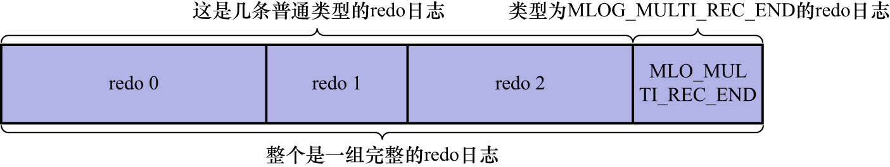

# 2. 需要保证原子性的操作生成多条`redo`日志

有些需要保证原子性的操作会生成多条`redo`日志.

比如向某个索引对应的B+树中进行1次悲观插入就会生成多条`redo`日志.

如何把这些`redo`日志划分到一个组内呢?InnoDB的设计者在该组中的最后1条`redo`日志后面加上1条特殊类型的`redo`日志,
该类型的`redo`日志名为`MLOG_MULTI_REC_END`.该类型的`redo`日志结构很简单,只有一个`type`字段(对应的十进制数字为31),
如下图示:

所以,某个需要保证原子性的操作所产生的一系列`redo`日志,必须以一条类型为`MLOG_MULTI_REC_END`的`redo`日志结尾.如下图示:

这样在系统因崩溃而重启后,进行恢复时:

- 只有当解析到类型为`MLOG_MULTI_REC_END`的`redo`日志时,才认为解析到了一组完整的`redo`日志,才会进行恢复
- 否则直接放弃前面解析到的`redo`日志
