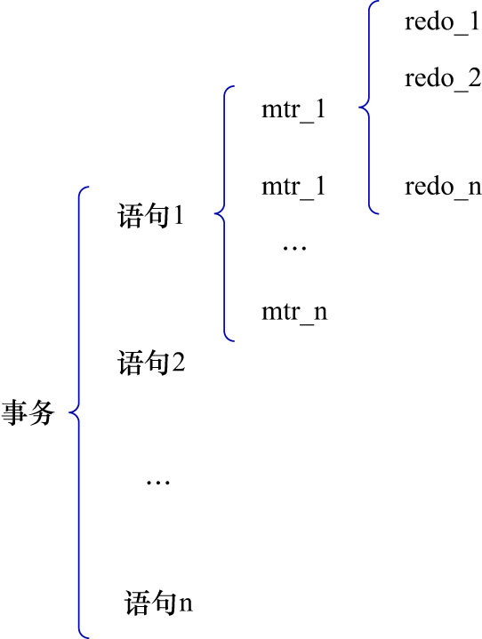

# 2. `Mini-Transaction`的概念

- `Mini-Transaction`(MTR): 是InnoDB为了保证对底层页面(Page)的修改具有原子性而设计的**最小事务单元**.

一个MTR的执行,要么所有修改都写入`Buffer Pool`中的页并生成`redo`日志,要么什么都不做.

设计目的: 保证单个MTR内部的修改是原子的,并且这些修改能通过该MTR产生的`redo`日志恢复到一致状态

一条SQL语句的执行过程往往比较复杂,涉及多个页面的访问和修改.在InnoDB的实现中,
每一次对某个页或**某一小组页**的**原子修改**,就会单独开启1个MTR(注意1个MTR是可以修改多个页的).
所以,**语句级别的操作被拆分成多个MTR**.

举几个典型的例子:

- 插入一条记录

    - 在叶子节点页找到插入位置,修改该页(产生一个MTR)
    - 若该页空间不足,则触发页分裂:
      - 分裂原页(原页被修改,产生1个MTR)
      - 创建新页并写入部分数据(产生1个MTR,但这个MTR要修改原页和新页,也就是1个MTR内修改多个页)
      - 修改父页的指针(产生1个MTR)(可能还会递归分裂到更高层)

- 更新一条记录

    - 若更新不会导致行迁移(比如只改短字段值),可能只涉及1个页(产生1个MTR)
    - 若更新导致行变长,则需要移到溢出页或触发页分裂(产生多个MTR)

- 删除一条记录
    
    - 在叶子节点打上delete标记(产生1个MTR)
    - 若删除导致页过空,则需要合并页(可能再触发多个MTR)

MTR和`redo`日志之间的关系:

再次强调:MTR是一个内存层面的最小事务单元(也可以说是原子操作单元),用来保证对若干页的修改要么全部成功,要么什么都不做.

MTR的生命周期:

1. `mtr_start()`: 开始记录
2. 在MTR内修改页(这里的页是指`Buffer Pool`中的页结构)
3. 每次修改页的同时,在MTR的`log buffer`(内存结构,不是`redo log buffer`)中生成1条`redo`记录
4. `mtr_commit()`: 把该MTR生成的所有`redo`记录打包,写入到全局的`redo log buffer`中
5. 后续由`checkpoint`/事务提交/后台线程刷盘到`redo log file`

在这个过程中:

- 执行MTR: 在内存中真实地修改`Buffer Pool`里的页,并把相应的`redo`日志片段记录在MTR的私有buffer里
  - 每次页操作,都会修改`Buffer Pool`中的页
  - 每次页操作,立刻生成对应的`redo`日志,放到MTR的本地buffer中
- `redo`日志: 只是对这些修改的一种"物理-逻辑"描述,方便以后崩溃恢复时重放

换句话说:

- 在MTR内部操作页时,发生真正的数据修改
- `redo`日志只是把修改记录下来,是MTR执行过程的副产物

**一个MTR在执行过程中会产生一组`redo`日志**,在进行崩溃恢复时,需要把这一组`redo`日志作为一个不可分割的整体来处理.

一个事务可以包含若干条语句,每一条语句会产生若干个MTR,每一个MTR的执行过程会产生若干条`redo`日志.如下图示:

简单理解: MTR是页级别的一种小型事务,它确保对若干页的修改要么全部成功,要么什么都不做.
(这里的小型是从原子性/作用范围/日志机制等层面说的).

- 原子性:
    - 普通事务保证的是逻辑操作的原子性(比如插入一行记录要么成功要么失败)
    - MTR保证的是页级别的物理修改的原子性(比如B+树分裂时,必须同时修改原页/新页/父页,否则页结构就损坏)
- 作用范围
  - 事务: 覆盖多个语句/多个表,生命周期可能很长
  - MTR: 只覆盖对若干个页的一次"短小的"原子访问,生命周期极短
- 日志机制
  - 事务用的是`undo + redo`,保证逻辑一致性和持久性
  - MTR用的是`redo`,保证崩溃恢复时能把页恢复到一致的状态

二者处在不同层次,但概念很类似.

假设: 现有一条`UPDATE`语句,它产生了3个MTR,分别为:

- MTR1
- MTR2
- MTR3

每个MTR在执行过程中又4产生了条redo日志,结构如下:

- MTR1

    - `redo`1-1
    - `redo`1-2
    - `redo`1-3
    - `MLOG_MULTI_REC_END`

- MTR2

    - `redo`2-1
    - `redo`2-2
    - `redo`2-3
    - `MLOG_MULTI_REC_END`

- MTR3

    - `redo`3-1
    - `redo`3-2
    - `redo`3-3
    - `MLOG_MULTI_REC_END`

在崩溃恢复时,是有可能出现:MTR1/MTR3恢复成功,MTR2恢复失败的(比如MTR2的`redo`日志不完整).此时:

- MTR1和MTR3的修改会体现在恢复后的数据页上
- MTR2的修改则完全丢弃,好像从来没发生过

即:MTR是恢复操作的最小事务单元,保证了**页级别的原子性**.但是跨MTR是不保证原子性的.

而`redo`日志是MTR执行过程中的副产物,`redo`日志的职责为:

- 系统崩溃后,每个页都能恢复到一致的状态
- 若1个MTR产生的`redo`日志不完整,则该MTR产生这一组的`redo`日志整组丢弃

即: `redo`日志只能保证**页内部不会撕裂**,无法保证跨MTR的原子性.

这里要再解释一下**页级别的原子性**这句话.还是以页分裂为例解释:页分裂这种操作,涉及到对原页/新页/父页的修改.
在恢复时,页分裂操作通常会拆成多个MTR来完成:

- `MTR1`: 准备新页并局部完成分裂
  - 分配并格式化新页(文件段/页头初始化等)
  - 从旧页搬移一部分记录到新页
  - 修正叶子层的左右兄弟指针
  - 维护两页的页目录与`PAGE_N_HEAP`/`PAGE_HEAP_TOP`/`PAGE_N_DIR_SLOTS`等
  - 提交`MTR`(此刻父页还没有任何修改,结构对外可被视为"尚未分裂")
- `MTR2`: 在父页插入分隔键/指针
  - 给父页插入新分隔键,挂上指向新页的`child`指针
  - 维护父页的目录/页头计数等(同样不为这些字段单独写`redo`日志,这个维护属于动作的派生结果)
  - 提交`MTR2`(至此分裂对外生效)
    - 若父页也满了,再触发新的"父页分裂序列"(`MTR3`/`MTR4`...),逐层向上

在这个过程中,`MTR1`就是在1个`MTR`内操作了多个页面的.也就是说:

- 在同一个`MTR`中,有多条带不同页号的`MLOG`记录,最后以`MLOG_MULTI_REC_END`作为该`MTR`的结束标记
- 恢复时要么把这一段全部重放,要么(若尾部不完整)一条都不重放

这里说的**页级别的原子性**,不是指单个页的原子性,而是指在同1个`MTR`的执行过程内,对多个页面的修改保证原子性.
