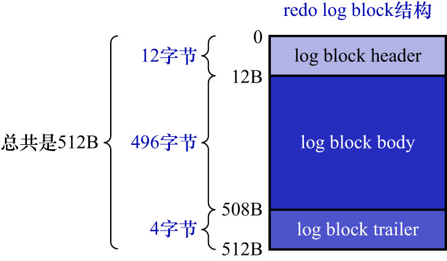
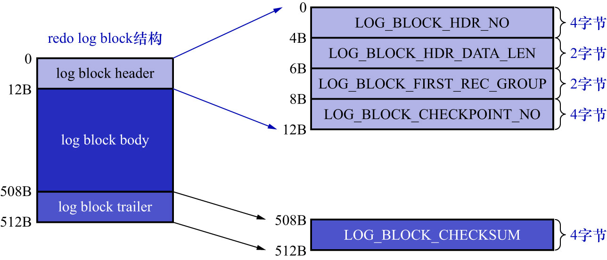

# 1. `redo log block`

为更好地管理`redo`日志,InnoDB的设计者将通过`MTR`生成的`redo`日志都放在了大小为512字节页中.为和前面讲过的表空间中的页做区别,
这里把用来存储`redo`日志的页称为`block`(可以认为`redo log block`是用于存储`redo`日志的页,但和页的大小与作用不同).
`redo log block`的结构如下图示:

真正的`redo`日志都是存储到占用496字节的`log block body`中,上图中的`log block header`和`log block trailer`存储的是一些管理信息,
如下图示:

`log block header`中:

- `LOG_BLOCK_HDR_NO`(4B): 每一个`block`都有一个大于0的唯一标号,该属性就表示该标号值
- `LOG_BLOCK_HDR_DATA_LEN`(2B): 表示`block`中已经使用了多少字节

    初始值为12,因为`log block body`从第12个字节处开始.随着向`block`中写入的`redo`日志越来也多,该属性值也跟着增长,
    若`log block body`已经被全部写满,则该属性的值被设置为512.

- `LOG_BLOCK_FIRST_REC_GROUP`(2B): 

    一条redo日志也可以称为一条`redo`日志记录(`redo log record`),一个`MTR`会生成多条`redo`日志记录,
    这个`MTR`生成的这些`redo`日志记录被称为一个`redo`日志记录组(`redo log record group`).
    `LOG_BLOCK_FIRST_REC_GROUP`表示该`block`中第1个MTR生成的`redo`日志记录组的偏移量.
    其实就是该`block`中第1个`MTR`生成的第1条`redo`日志的在该`block`中的相对位置.

    若1个`MTR`生成的redo日志横跨多个`block`,则最后1个`block`中的`LOG_BLOCK_FIRST_REC_GROUP`属性
    就表示该MTR对应的`redo`日志结束的地方,也就是下一个MTR生成的redo日志开始的地方.

    若一个`block`中没有任何新的`redo log record group`起点(即整个`block`都是上一个`block`的续写内容),
    则约定该字段的值被置为0.只有当本`block`内出现新的`MTR`起始日志组时,该字段的值才表示该日志组在块内的偏移量.

    若当前`block`是一个空块/未使用块,则该字段值为`0xFFFF`,该值是一个特殊标记,表示"该`block`中没有任何有效数据".

- `LOG_BLOCK_CHECKPOINT_NO`(4B): 表示checkpoint的序号.checkpoint是后续内容的重点,这里先不讲它的含义

`log block trailer`中:

- `LOG_BLOCK_CHECKSUM`(4B): 表示block的校验和,用于正确性校验,暂时不用关心它
