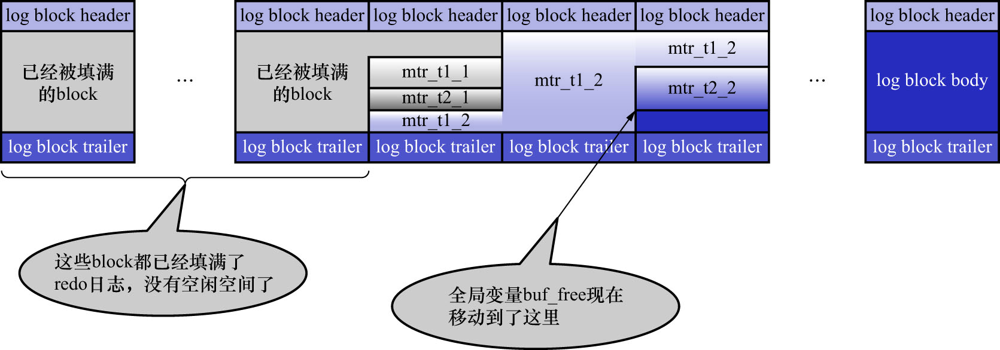

# 3. `redo`日志写入`log buffer`

向`log buffer`中写入`redo`日志的过程是顺序写入的,即:

- 先往前边的`block`中写
- 当该`block`的空闲空间用完之后再往下一个`block`中写

当想往`log buffer`中写入`redo`日志时,遇到的第1个问题就是:应该写在哪个`block`的哪个偏移量处.
全局变量`buf_free`用于指明后续写入的`redo`日志应该写入到`log buffer`中的哪个位置,如下图示:

前面说过,1个`MTR`执行过程中可能产生若干条`redo`日志(比如悲观插入的过程),这些`redo`日志是一个不可分割的组.
所以并不是每生成一条`redo`日志就将其插入到`log buffer`中,而是将每个`MTR`执行过程中产生的日志先暂存到一个地方(`MTR`的本地`buffer`),
当该`MTR`执行结束时,再将过程中产生的一组`redo`日志再全部复制到`log buffer`中.现在假设有名为`T1`/`T2`的2个事务,
每个事务都包含2个`MTR`,这几个`MTR`的命名如下:

- 事务`T1`的2个`MTR`分别称为:
  - `mtr_t1_1`
  - `mtr_t1_2`
- 事务`T2`的2个`MTR`分别称为:
  - `mtr_t2_1`
  - `mtr_t2_2`

每个`MTR`都会产生一组`redo`日志,如下图示:

不同的事务可能是并发执行的,所以`T1`/`T2`的`MTR`可能是交替执行的.每当1个`MTR`执行完成时,
该`MTR`生成的一组`redo`日志就需要被复制到`log buffer`中.也就是说不同事务的`MTR`可能是交替写入`log buffer`的.
如下图示(为了美观,把1个`MTR`中产生的所有`redo`日志当作一个整体):

从图中可以看出,不同的`MTR`产生的一组`redo`日志占用的存储空间可能不一样.有的`MTR`产生的`redo`日志量很少,比如`mtr_t1_1`/`mtr_t2_1`,
这些`redo`日志就被放到同一个block中存储;有的`MTR`产生的`redo`日志量非常大,比如`mtr_t1_2`产生的`redo`日志占用了3个`block`来存储.
