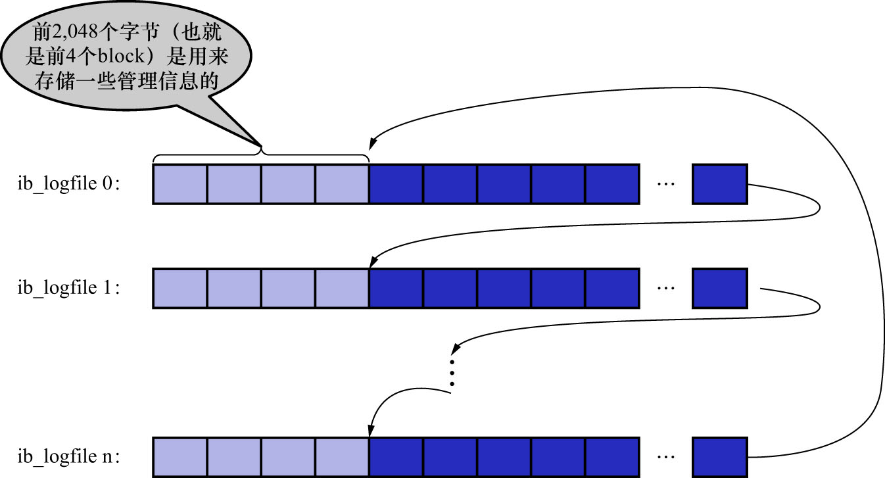
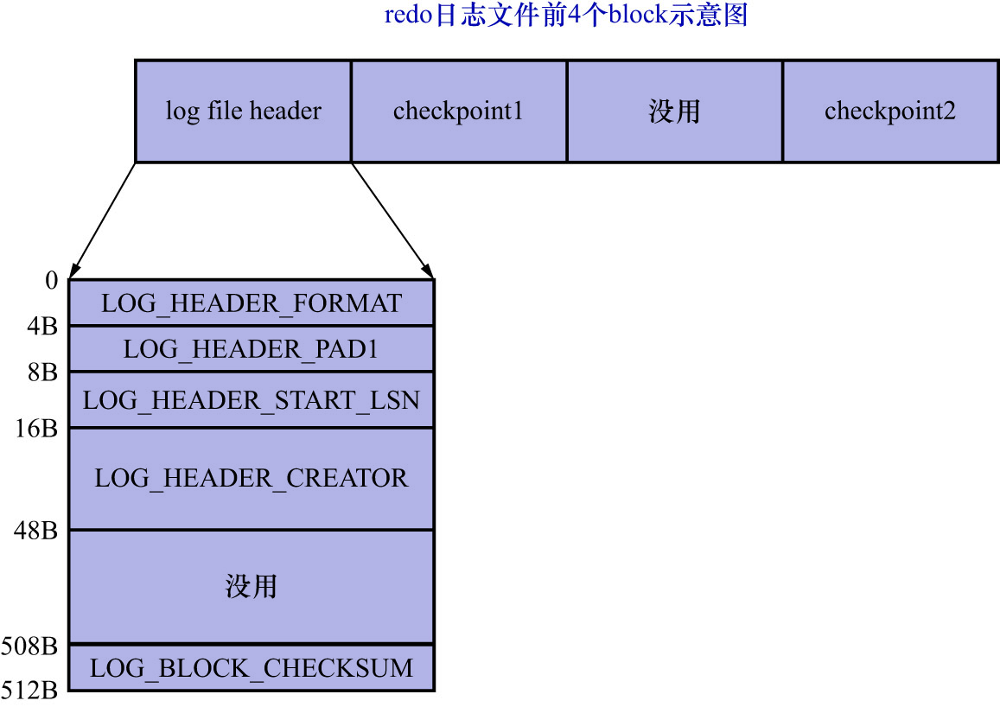
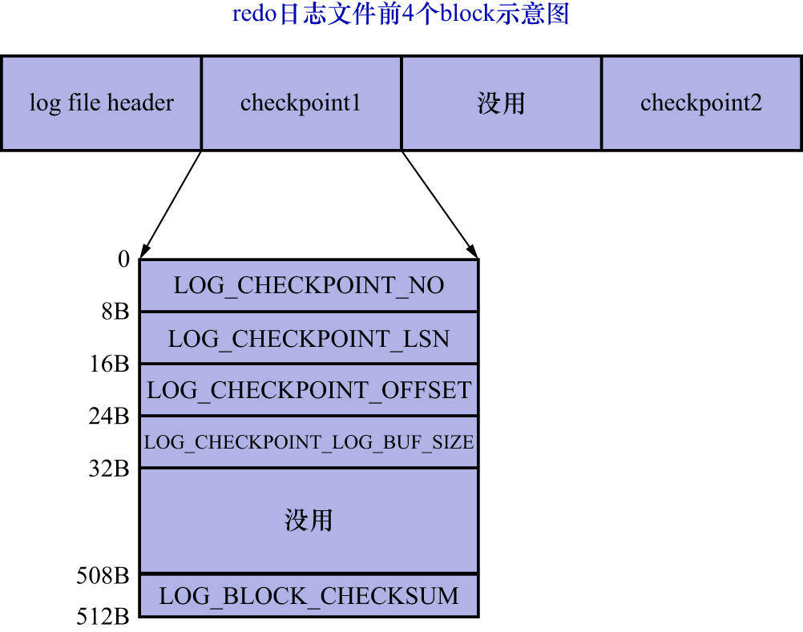

# 3. `redo`日志文件格式

前面说过,`log buffer`本质上是一片连续的内存空间,被划分成了若干个512字节大小的`block`.将`log buffer`中的`redo`日志
刷新到磁盘的本质:就是把`block`的镜像写入日志文件中.**所以`redo`日志文件其实也是由若干个512字节大小的`block`组成**.

`redo`日志文件组中的每个文件大小都一样,格式也一样,都是由2部分组成:

- 前4个`block`(也就是前2048个字节)用来存储一些管理信息
- 从第2048字节往后,用来存储`log buffer`中的`block`镜像

所以前面所说的**循环使用**redo日志文件,其实是从每个日志文件的第2048个字节开始算起的,如下图示:

[普通`block`的格式](https://github.com/rayallen20/howDoesMySQLWork/blob/main/%E7%AC%AC19%E7%AB%A0%20%E8%AF%B4%E8%BF%87%E7%9A%84%E8%AF%9D%E5%B0%B1%E4%B8%80%E5%AE%9A%E8%A6%81%E5%81%9A%E5%88%B0--redo%E6%97%A5%E5%BF%97/5.%20redo%E6%97%A5%E5%BF%97%E7%9A%84%E5%86%99%E5%85%A5%E8%BF%87%E7%A8%8B/1.%20redo%20log%20block.md)在之前就已经讲过了,
就是:

- `log block header`
- `log block body`
- `log block trailer`

这3个部分,这里就不重复了.这里的重点是:每个`redo`日志文件前2048个字节(也就是前4个特殊`block`)的格式,如下图示:

从图中可以看出,这4个`block`分别如下:

- `log file header`:描述该`redo`日志文件的一些整体属性,结构如下图示:

    
    
    各个属性的具体释义如下:
    
    |          属性名           | 长度(单位:字节) |                                                       描述                                                        |
    |:----------------------:|:---------:|:---------------------------------------------------------------------------------------------------------------:|
    |  `LOG_HEADER_FORMAT`   |     4     |                                        `redo`日志的版本,在 MySQL5.7.22中该值永远为1                                         |
    |   `LOG_HEADER_PAD1`    |     4     |                                                  用于字节填充用,无实际意义                                                  |
    | `LOG_HEADER_START_LSN` |     8     |                             标记本`redo`日志文件偏移量为2048字节处对应的`LSN`值(关于`LSN`后续会讲到,这里先忽略即可)                             |
    |  `LOG_HEADER_CREATOR`  |    32     | 一个字符串,标记本`redo`日志文件的创建者是谁.正常运行时该值为MySQL的版本号,比如:`MySQL 5.7.22`.使用`mysqlbackup`命令创建的`redo`日志文件的该值为`ibbackup`和创建时间 |
    |  `LOG_BLOCK_CHECKSUM`  |     4     |                                          本`block`的校验值,所有`block`都有,不用关心                                          |

- `checkpoint1`: 记录关于checkpoint的一些属性,结构如下图示:

    
    
    |              属性名              | 长度(单位:字节) |                      描述                       |
    |:-----------------------------:|:---------:|:---------------------------------------------:|
    |      `LOG_CHECKPOINT_NO`      |     8     |   服务器执行checkpoint的编号,每执行一次checkpoint,该值就加1    |
    |     `LOG_CHECKPOINT_LSN`      |     8     |   服务器在结束checkpoint时对应的LSN值,系统崩溃后恢复时,将从该值开始    |
    |    `LOG_CHECKPOINT_OFFSET`    |     8     | `LOG_CHECKPOINT_LSN`表示的LSN值,在`redo`日志文件组中的偏移量 |
    | `LOG_CHECKPOINT_LOG_BUF_SIZE` |     8     |     服务器在执行checkpoint操作时对应的`log buffer`的大小     |
    |     `LOG_BLOCK_CHECKSUM`      |     4     |         本`block`的校验值,所有`block`都有,不用关心         |
    
    注: **系统中checkpoint的相关信息只存储在`redo`日志文件组中的第1个日志文件中**,后面会讲到.

- 第3个`block`: 未使用,忽略
- `checkpoint2`: 结构和`checkpoint1`相同
