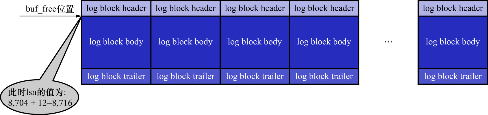
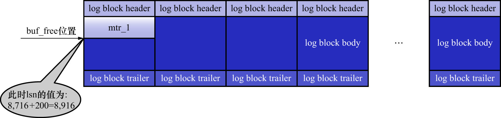
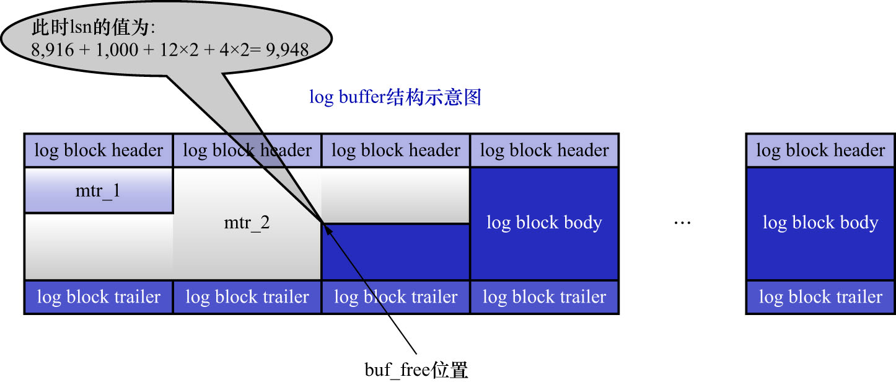

# 4. `log sequence number`的概念

自系统开始运行,就在不断地修改页面,也就意味着会不断地生成`redo`日志.`redo`日志的量在不断递增,就像人的年龄一样,
自打出生之日起就不断递增,永远不可能缩减了.InnoDB的设计者设计了一个名为lsn(log sequence number,日志序列号)的全局变量,
用于记录**当前总共已经写入的`redo`日志量**.不过,和人一出生的年龄是0岁不同,InnoDB的设计者**规定**初始的lsn值为8704(
也就是一条`redo`日志也没写入时,lsn的值就是8704).

注: lsn的初始值为8704是人为规定

在向`log buffer`中写入`redo`日志时不是一条一条写入的,而是以MTR生成的一组`redo`日志为单位写入的,而且实际上是把日志内容写在了
`log block body`处.但是在统计lsn的增长量时,是按照`实际写入的日志量 + 占用的log block header + 占用的log block trailer`
来计算的.来看一个例子.

系统第一次启动后,在初始化`log buffer`时,`buf_free`(用来标记下一条`redo`日志应该写入到`log buffer`的位置)就会指向第1个`block`的偏移量
为12字节(`log block header`的大小)的地方,那么lsn值也会跟着增加12,如下图示:

此时`lsn = 初始值 + 12 = 8704 + 12 = 8716`,也就是`lsn`的值为8716.

注: 可以认为`buf_free`是1个`block`内的相对位置(最小值12,最大值508);而lsn是整个`redo`日志的绝对位置(无上限的增长).

若某个`MTR`产生的一组`redo`日志占用的存储空间比较小,也就是待插入的`block`的剩余空闲空间能容纳该`MTR`提交的日志时:
`lsn增长量 = 该MTR生成的redo日志占用的字节数`,如下图示:

假设上图中`mtr_1`产生的`redo`日志量为200字节,此时`lsn = 8716 + 200 = 8916`,也就是`lsn`的值为8916.

若某个`MTR`产生的一组`redo`日志占用的存储空间比较大,待插入的`block`剩余空闲空间不足以容纳该`MTR`提交的日志时:
`lsn增长的量 = 该MTR生成的redo日志占用的字节数 + 额外占用的log block header的字节数 + 额外占用的log block trailer的字节数`,如下图示:

假设上图中`mtr_2`产生的`redo`日志量为1000字节,此时`lsn = 8916 + 1000 + 12 * 2 + 4 * 2 = 9948`,其中:

- 12字节是`log block header`的大小,`mtr_2`产生的`redo`日志占用了2个`log block header`(中间的`block`和右侧的`block`,即从左往右看第2个和第3个`block`),因此要乘以2
- 4字节是`log block trailer`的大小,`mtr_2`产生的`redo`日志占用了2个`log block trailer`(左侧的`block`和中间的`block`,即从左往右看第1个和第2个`block`),因此要乘以2

从前面的描述可以看:

- lsn值为8716时,对应`mtr_1`产生的`redo`日志
- lsn值为8916时,对应`mtr_2`产生的`redo`日志

即: **每一组由`MTR`生成的`redo`日志都有一个唯一的lsn值与其对应:LSN值越小,说明`redo`日志产生的越早**(类比到人的话,出生日期对应的时间戳越小,说明这个人出生的就越早).
