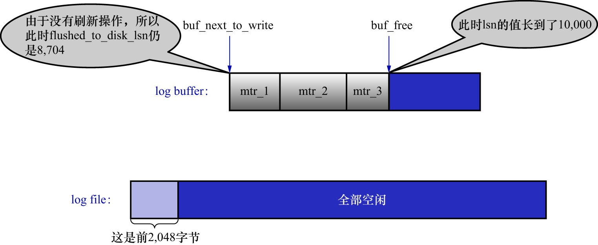
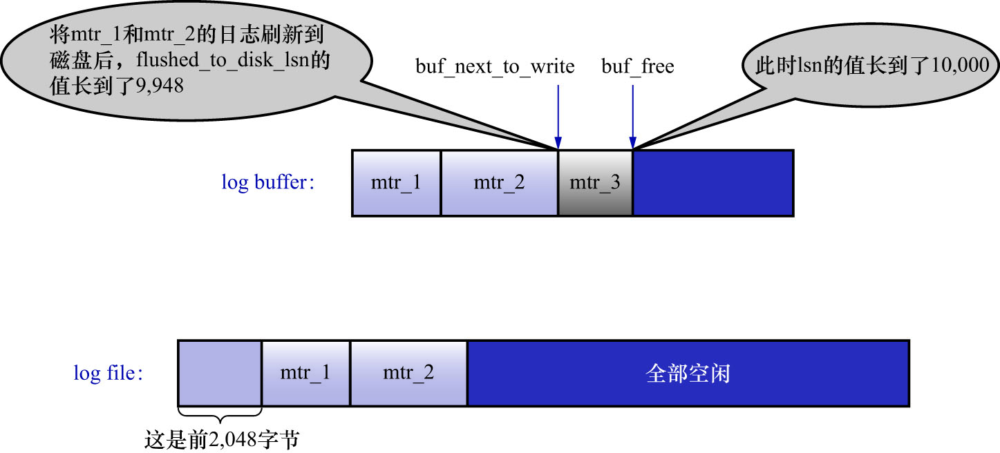

# 1. `flushed_to_disk_lsn`

`redo`日志是先写到`log buffer`中,之后才会被刷新到磁盘的`redo`日志文件中.所以InnoDB的设计者提出了一个名为`buf_next_to_write`的全局变量,
用来标记当前`log buffer`中已经有哪些日志被刷新到磁盘中了,如下图示:

注: 和`buf_free`与lsn相同,也可以认为`buf_next_to_write`是1个`block`内的相对位置(最小值12,最大值508);而`flushed_to_disk_lsn`是磁盘中的`redo`日志的绝对位置(无上限的增长).

前面说过,lsn表示当前系统中写入的`redo`日志量,这个日志量包括写到`log buffer`但还没有刷新到磁盘的`redo`日志.
相应地,InnoDB的设计者提出了一个表示刷新到磁盘中的`redo`日志量的全局变量,名为`flushed_to_disk_lsn`.
系统第一次启动时,该变量的值与初始的lsn值相同,都是8704.随着系统的运行,`redo`日志被不断写入`log buffer`,但是并不会立即刷新到磁盘,
lsn的值就与`flushed_to_disk_lsn`的值拉开了差距.下面演示一下:

系统在第一次启动后,向`log buffer`中写入了`mtr_1`/`mtr_2`/`mtr_3`这3个`MTR`产生的`redo`日志,假设这3个`MTR`
开始和结束时对应的lsn值分别如下:

- `mtr_1`: 开始时的lsn值为8716,结束时的lsn值为8916
- `mtr_2`: 开始时的lsn值为8916,结束时的lsn值为9948
- `mtr_3`: 开始时的lsn值为9948,结束时的lsn值为10000

此时的lsn已经增长到了10000,但是由于没有刷新操作,所以此时`flushed_to_disk_lsn`的值仍为8704,如下图示:

随后将`log buffer`中的`block`刷新到`redo`日志文件中.假设将`mtr_1`和`mtr_2`的日志刷新到磁盘,那么`flushed_to_disk_lsn`就
应该增长`mtr_1`和`mtr_2`写入的日志量,所以`flushed_to_disk_lsn`的值增长到了9948,如下图示:

综上所述,当有新的`redo`日志写入到`log buffer`时:

- 首先lsn的值会增长,但`flushed_to_disk_lsn`不变
- 随后随着不断有`log buffer`中的日志被刷新到磁盘上,`flushed_to_disk_lsn`的值也跟着增长
- 若两者的值相同,则说明`log buffer`中的所有`redo`日志都已刷新到磁盘中

注: 应用程序向磁盘写入文件时其实是先写到操作系统的缓冲区中去,若某个写入操作要等到操作系统确认已经写到磁盘时才返回,
则需要调用操作系统提供的`fsync()`函数.其实只有当系统执行了`fsync()`函数后,`flushed_to_disk_lsn`的值才会跟着增长.
当仅仅把`log buffer`中的日志写入到操作系统缓冲区却没有显式的刷新到磁盘时,是一个名为`write_lsn`的全局变量在增长.
为理解方便,这里在讲述时`flushed_to_disk_lsn`和`write_lsn`的概念混淆起来了.
