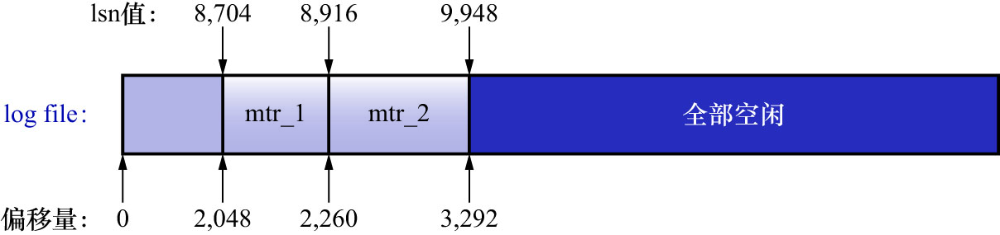

# 2. lsn值和`redo`日志文件偏移量的对应关系

lsn的值表示的是系统写入的`redo`日志量的一个总和.1个`MTR`中产生多少日志,lsn的值就增加多少(当然,
有时候要加上若干个`log block header`的大小和若干个`log block trailer`的大小).在`MTR`产生的`redo`日志写到磁盘中时,
很容易计算某个lsn值在`redo`日志文件组中的偏移量.如下图示:

初始时的lsn值为8704,对应`redo`日志文件组的偏移量为2048,之后每个`MTR`向磁盘中写入多少字节日志,lsn的值就增长多少.当然还要考虑多个`redo`日志
文件中前4个用于存储管理信息的`block`对计算某个lsn值在整个`redo`日志文件组中的偏移量的影响.

那么可以推断出:`某个lsn值在整个redo日志文件组中的偏移量 = 该lsn值 - 8704 + 2048 * n`,其中`n`为该lsn值跨越的`redo`日志文件个数,从1开始计数
