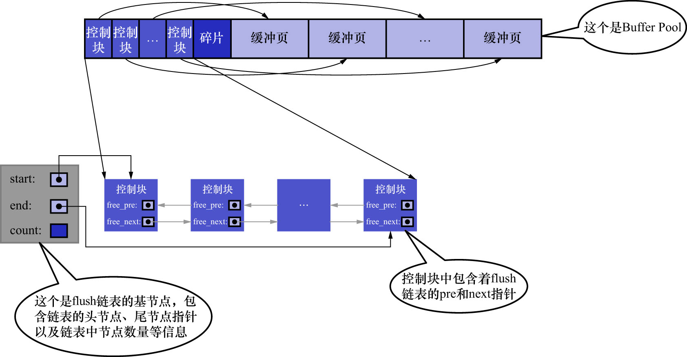
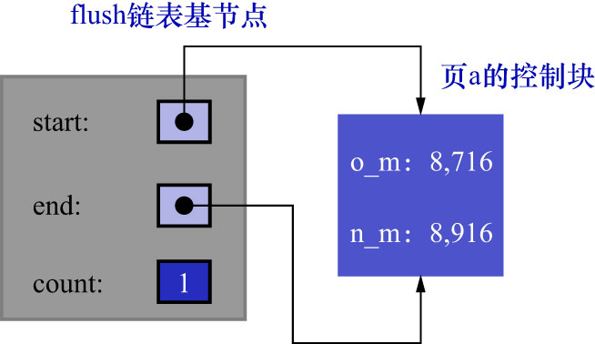
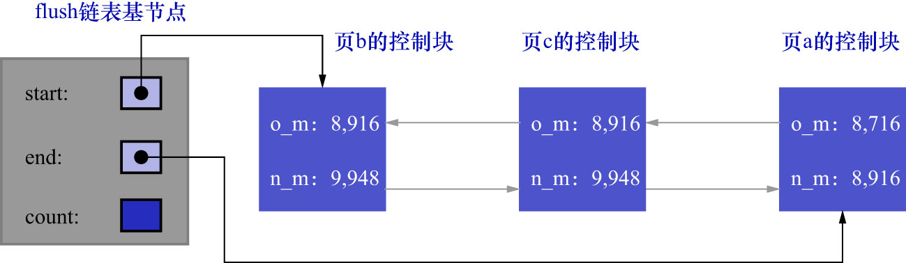
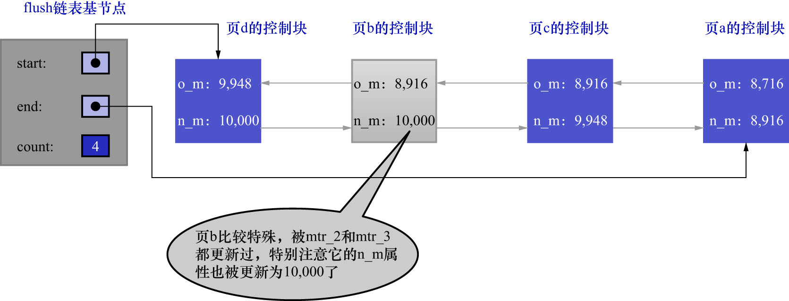

# 3. flush链表中的lsn

1个`MTR`表示1次对底层页面的原子访问(再次强调是1次原子访问,不是对1个页面的原子访问,因为要是只访问1个页面就不用考虑原子性了),
在访问过程中可能会产生一组不可分割的`redo`日志.在`MTR`结束时,会把这一组`redo`日志写入到`log buffer`中.除此之外,
在`MTR`结束时还有一件非常重要的事情要做:把在`MTR`执行过程中修改过的页面加入到`Buffer Pool`的[flush链表](https://github.com/rayallen20/howDoesMySQLWork/blob/f67756ef76cd4d4dcedeb4d7f782eb74d3a39bba/%E7%AC%AC17%E7%AB%A0%20%E8%B0%83%E8%8A%82%E7%A3%81%E7%9B%98%E5%92%8CCPU%E7%9A%84%E7%9F%9B%E7%9B%BE--InnoDB%E7%9A%84Buffer%20Pool/2.%20InnoDB%E7%9A%84Buffer%20Pool/5.%20flush%E9%93%BE%E8%A1%A8%E7%9A%84%E7%AE%A1%E7%90%86.md)中.
再来看一下flush链表:

- 第一次修改某个已经加载到`Buffer Pool`中的页面时,会把该页面对应的控制块插入到flush链表的头部
- 之后再修改该页面时,由于它已经在flush链表中,所以就不会再次插入了

也就是说,**flush链表中的脏页是按照页面的第一次修改时间进行排序的**:

- **第一次修改时间越晚的页面,在链表中越靠近头部**
- **第一次修改时间越早的页面,在链表中越靠近尾部**

在这个过程中,会在缓冲页对应的控制块中记录2个关于页面何时修改的属性:

- `oldest_modification`: 第一次修改`Buffer Pool`中的某个缓冲页时,将修改该页面的`MTR`开始时对应的lsn值写入该属性
  - 即: 该属性表示让该页面第一次成为脏页的`MTR`开始时对应的系统lsn值
- `newest_modification`: 每修改一次页面,都将修改该页面的`MTR`结束时对应的lsn值写入该属性
  - 即: 该属性表示页面最近一次修改后对应的系统lsn值

注意: 这里没有说`oldest_modification`是页面最远一次修改开始前对应的系统lsn值,是因为只有当该页面被`MTR`实际弄脏时,该字段才会被写入lsn值,
而不是在被弄脏之前先向该字段写入lsn值再开始弄脏该页面.也就是说一旦该字段被写入lsn值了,就意味着该页已经是脏页了,而不是该字段写入时该页仍为干净页.

继续刚才讲解`flushed_to_disk_lsn`的例子来看,这里再贴一下3个`MTR`开始和结束时对应的lsn值:

- `mtr_1`: 开始时的lsn值为8716,结束时的lsn值为8916
- `mtr_2`: 开始时的lsn值为8916,结束时的lsn值为9948
- `mtr_3`: 开始时的lsn值为9948,结束时的lsn值为10000

假设在`mtr_1`执行过程中修改了页a,那么在`mtr_1`执行结束时,会将页a对应的控制块加入到flush链表的头部.接着需要:

- 把`mtr_1`开始时对应的lsn(也就是8716)写入页a对应的控制块的`oldest_modification`属性中
- 把`mtr_1`结束时对应的lsn(也就是8916)写入页a对应的控制块的`newest_modification`属性中

如下图示(为美观起见,把`oldest_modification`缩写为`o_m`,把`newest_modification`缩写为`n_m`):

接着假设在`mtr_2`执行过程中又修改了页b和页c这2个页面,那么在`mtr_2`执行结束时,就会将页b和页c对应的控制块
都加入到flush链表的头部.接着需要:

- 把`mtr_2`开始时对应的lsn(也就是8916)写入页b和页c对应的控制块的`oldest_modification`属性中
- 把`mtr_2`结束时对应的lsn(也就是9948)写入页b和页c对应的控制块的`newest_modification`属性中

如下图示:

注: 图中的`count`值为3,原图没写.

从图中可以看出,**每次新插入到flush链表中的节点都放在了头部.也就是说在flush链表中,前面的脏页修改的时间比较晚,后面的脏页修改时间比较早**.

接着假设在`mtr_3`执行过程中修改了页b和页d,因为页b之前已经被修改过了,也就是说页b对应的控制块已经插入到了flush链表中,
所以在`mtr_3`执行结束时,只需要将页d对应的控制块加入到flush链表的头部即可.接着需要:

- 把`mtr_3`开始时对应的lsn(也就是9948)写入页d对应的控制块的`oldest_modification`属性中
- 把`mtr_3`结束时对应的lsn(也就是10000)写入页b和页d对应的控制块的`newest_modification`属性中
  - 由于页b在`mtr_3`执行过程中又发生了一次修改,所以需要把页b对应的控制块中`newest_modification`的值更新为10000

总结上面的内容:

- flush链表中的脏页按照第一次修改发生的时间顺序进行排序,也就是按照`oldest_modification`表示的lsn值进行排序
  - `oldest_modification`表示的lsn值越大,表示该页面第一次被修改的时间越晚,在flush链表中就越靠近头部
  - `oldest_modification`表示的lsn值越小,表示该页面第一次被修改的时间越早,在flush链表中就越靠近尾部
- 被多次更新的页面不会重复插入到flush链表中,但是会更新`newest_modification`属性的值
