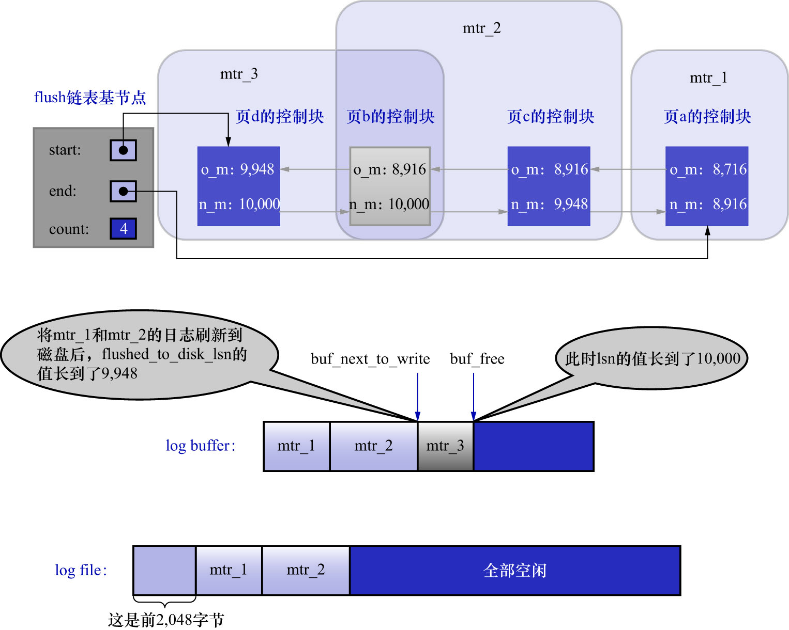
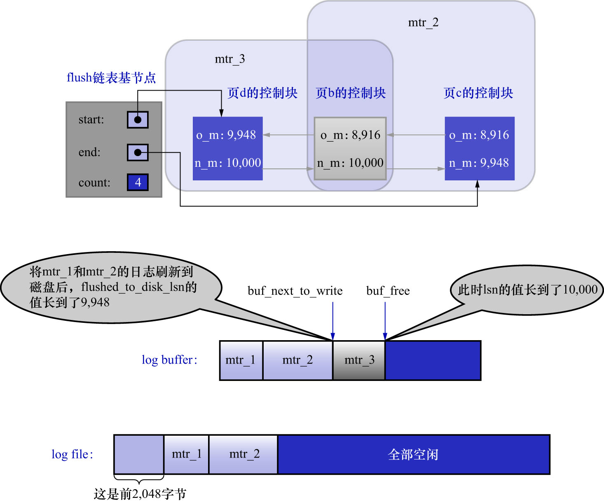
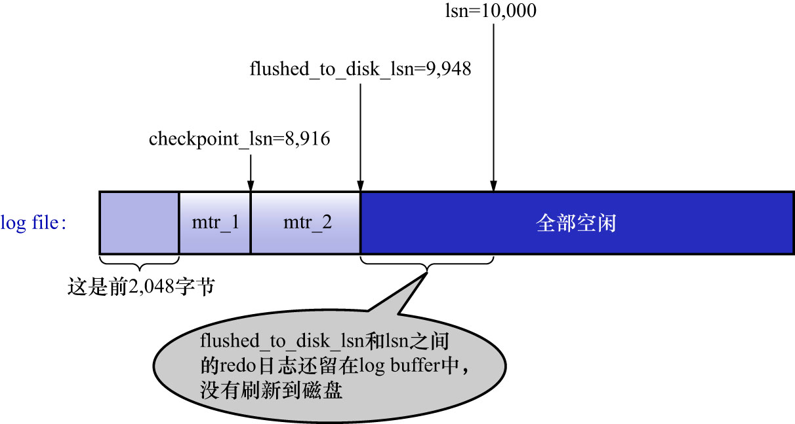

# 8. `checkpoint`

`redo`日志文件组容量是有限的,必须循环使用`redo`日志文件组中的文件,但是这会造成最后写入的`redo`日志与最开始写入的`redo`日志"追尾".
这时应该想到:redo日志只是为了在系统崩溃后恢复脏页用的,若`redo`日志对应的脏页已经刷新到磁盘中,那么即使现在系统崩溃,在重启后也不再需要
使用这些`redo`日志来恢复该页面了.所以这些`redo`日志也就没有存在的必要了,这些`redo`日志占用的磁盘空间就可以被后续的`redo`日志所重用.
即:**判断某些redo日志占用的磁盘空间是否可以覆盖的依据,就是这些redo日志对应的脏页是否已经刷新到了磁盘中**.
再看前边讲的例子:

如图所示,虽然`mtr_1`和`mtr_2`生成的`redo`日志都已经写到了磁盘中,但是它们修改的脏页仍然留在`Buffer Pool`中,所以它们生成的`redo`日志
在磁盘上的空间是不可以被覆盖的.之后随着系统的运行,若页a被刷新到了磁盘,则它对应的控制块就会从flush链表中移除.如下图示:

这样`mtr_1`生成的`redo`日志就没有用了,它们占用的磁盘空间就可以被覆盖掉了.全局变量`checkpoint_lsn`表示
当前系统中可以被覆盖的`redo`日志总量是多少,该变量的初始值也是8704.

比如,现在页a被刷新到了磁盘,`mtr_1`生成的`redo`日志就可以被覆盖了,所以此时可以进行1次增加`checkpoint_lsn`的操作,
这个过程称为执行1次`checkpoint`(注意这里的措辞是"可以"而不是"必须",下面讲解原因).

首先,需要区分"刷脏页"和"推进`checkpoint`"这2个操作:

- 刷脏页:

    当某个脏页被刷回磁盘时,仅就这一个页而言,小于该页的`oldest_modification`的`redo`日志已经体现在数据文件中了(说人话就是
    小于该页的`oldest_modification`的`redo`日志对应的脏页都已经被刷新到磁盘了).对这个页来说,它的`oldest_modification`对应的那段
    `redo`日志在崩溃恢复时可以被跳过了(因为该页已经被刷回磁盘了).

    但是,刷脏页操作刷的页,不一定就是所有脏页中`oldest_modification`值最小的页,因此刷脏页操作并不一定会推进`checkpoint`.

- `checkpoint`:

    是一个全局边界的承诺,表示**到某个lsn为止,所有页上的更改都已经落到了数据文件中**.InnoDB会**按需或周期性**地计算并写出这个边界,
    而不是每刷1次页就做1次checkpoint.

其次是刷新路径.之前在[刷新脏页到磁盘](https://github.com/rayallen20/howDoesMySQLWork/blob/f67756ef76cd4d4dcedeb4d7f782eb74d3a39bba/%E7%AC%AC17%E7%AB%A0%20%E8%B0%83%E8%8A%82%E7%A3%81%E7%9B%98%E5%92%8CCPU%E7%9A%84%E7%9F%9B%E7%9B%BE--InnoDB%E7%9A%84Buffer%20Pool/2.%20InnoDB%E7%9A%84Buffer%20Pool/8.%20%E5%88%B7%E6%96%B0%E8%84%8F%E9%A1%B5%E5%88%B0%E7%A3%81%E7%9B%98.md)这一节中讲到过,
后台有专门的线程负责每隔一段时间把脏页刷新到磁盘,这样可以不影响用户线程处理正常的请求.主要有2种刷新路径:`BUF_FLUSH_LRU`/`BUF_FLUSH_LIST`.

- `BUF_FLUSH_LRU`

    `BUF_FLUSH_LRU`的主要目标是腾出空闲缓冲页,选择来自LRU old区的页.在这些页中:
    
    - 若某个页是干净页,就直接回收
    - 若是脏页,则会被写回磁盘
    
    `BUF_FLUSH_LRU`的过程不是按最老修改lsn(`oldest_modification`)排序,因此通常对推进`checkpoint`的贡献很小.
    但如果恰好把当前"最老的脏页"也刷掉了,它同样可能抬高"所有脏页中的最小`oldest_modification`值",从而为`checkpoint`的推进创造条件.

- `BUF_FLUSH_LIST`

    `BUF_FLUSH_LIST`刷新的是"按最老修改lsn顺序的脏页",目的是推进`checkpoint`.但是,这里修改`checkpoint_lsn`的操作并不是直接在刷脏页后
    取当前flush链表中最后一个节点的`oldest_modification`值作为`checkpoint_lsn`,而是需要扫一段flush链表才能推进`checkpoint`.
    这里有2个原因:
    
    - 系统可能存在多个`Buffer Pool`实例,每个实例都有自己的flush链表,因此需要检查所有flush链表中最后一个节点的`oldest_modification`值
    - flush链表中的页面是宽松排序的,即:并发下插入顺序与严格的按`oldest_modification`递减顺序之间是允许有一定的"滞后"
    
    因此,需要扫一段flush链表才能推进`checkpoint`.

其实,"将脏页刷到磁盘中"的线程和"执行1次`checkpoint`的线程",不是同一个线程.

执行一次`checkpoint`可以分为2个步骤:

- 步骤1. 计算当前系统中可以被覆盖的`redo`日志对应的lsn值最大是多少

    `redo`日志可以被覆盖,就意味着它对应的脏页已经被刷新到了磁盘中.只要计算出当前系统中**最早修改的脏页对应的`oldest_modification`值**,
    那凡是系统中在lsn值小于该节点的`oldest_modification`值时产生的`redo`日志,都是可以被覆盖掉的.
    把该脏页的`oldest_modification`值赋给`checkpoint_lsn`即可.
    
    比如,当前系统中页a已经被刷新到磁盘,那么flush链表的尾节点就是页c,该节点就是当前系统中**最早修改的脏页**.
    页c的`oldest_modification`值为8916,把8916赋给`checkpoint_lsn`即可(也就是说若`redo`日志对应的lsn值小于8916,则该`redo`日志可以被覆盖掉)

    注: 这里只是简单举一个例子来说明这个步骤,但实际上是需要扫一段flush链表才能确定当前系统中最小的`oldest_modification`值的.

- 步骤2. 把`checkpoint_lsn`/`checkpoint_offset`/`checkpoint_no`写到`redo`日志文件的管理信息中

    - `checkpoint_no`: 该变量用于统计目前系统执行了多少次`checkpoint`,每执行一次`checkpoint`,该值就加1.
    - `checkpoint_offset`: `checkpoint_lsn`在`redo`日志文件组中对应的偏移量
      - 可以通过`checkpoint_lsn - 8704 + 2048 * n`计算出来,其中`n`为该lsn值跨越的`redo`日志文件个数,从1开始计数.

    把这3个值写到`redo`日志文件组的管理信息中即可.
    
    前文说过,每个`redo`日志文件都有2048字节的管理信息,但是上述**关于`checkpoint`的信息只会被写到日志文件组中的第1个日志文件的管理信息中**.
    InnoDB的设计者规定:

    - 若`checkpoint_no`的值是偶数,则写到`checkpoint1`中
    - 若`checkpoint_no`的值是奇数,则写到`checkpoint2`中

再次强调:**"将脏页刷新到磁盘中"和"执行1次`checkpoint`"是两回事**.从步骤2可以看出:每执行1次`checkpoint`,都要修改`redo`日志文件中的管理信息.
也就是说:**执行`checkpoint`操作是有代价的**.

记录完`checkpoint`的信息之后,`redo`日志文件组中各lsn值的关系如下图示:

注: 这里我认为从`flushed_to_disk_lsn`到`lsn`位置之间,应该是`mtr_3`,我估计是图里没画.
