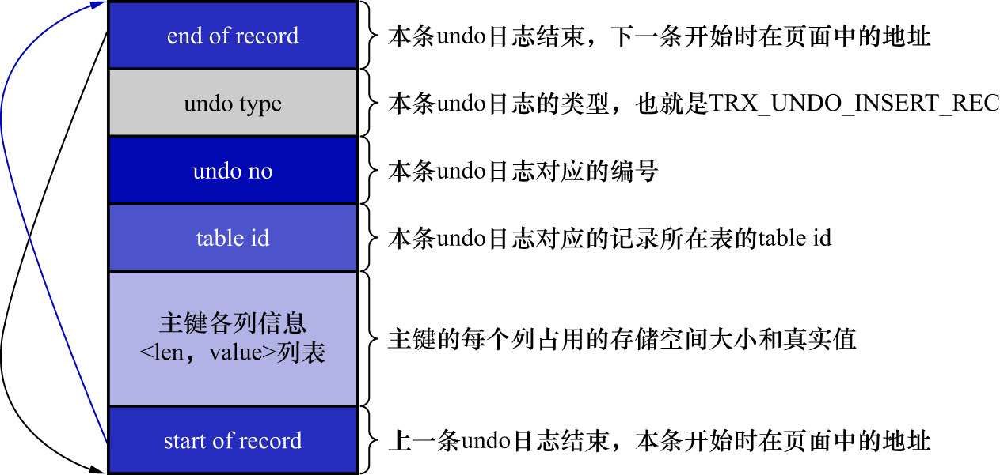
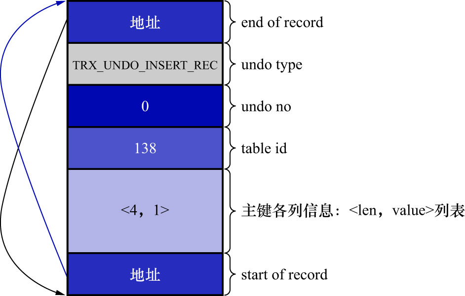
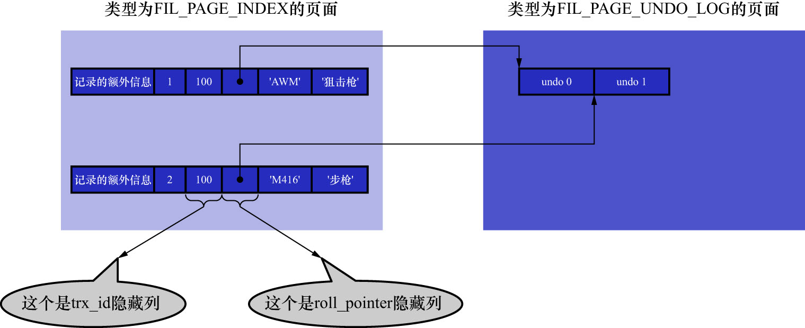

# 1. `INSERT`操作对应的`undo`日志

前面讲到过,当向表中插入一条记录时会有乐观插入和悲观插入的区分.但是不管怎么插入,最终导致的结果就是这条记录被放到了一个数据页中.
若需要回滚该插入操作,则把这条记录删除即可.也就是说,在写对应的`undo`日志时,只需要把这条记录的主键信息记录上即可.所以InnoDB的设计者
设计了一个类型为`TRX_UNDO_INSERT_REC`的`undo`日志,结构如下图示:



上图中有2点需要强调:

- `undo no`: 在一个事务中是从0开始递增的.也就是说,只要事务没提交,每生成1条`undo`日志,那么该事务中的`undo no`就增加1
- 若记录中的主键只包含1个列,则在类型为`TRX_UNDO_INSERT_REC`的`undo`日志中,只需要把该列占用的存储空间大小和真实值记录下来
  - 若记录中的主键包含多个列,则每个列占用的存储空间大小和对应的真实值都需要记录下来
  - 图中的`len`表示列占用的存储空间大小
  - 图中的`value`表示列的真实值

注: 关于`end of record`和`start of record`(也就是图中的2条线)

- 其实`end of record`就是一个指针,指向本条`undo`日志的**结尾**位置,也就是`start of record`结束的位置
- 其实`start of record`也是一个指针,指向本条`undo`日志的**开头**位置,也就是`end of record`开始的位置

注: 当向某个表中插入1条记录时,实际上需要向聚簇索引和所有的二级索引都插入1条记录.但是在记录这个插入操作对应的`undo`日志时,
只需要针对聚簇索引记录来记录1条`undo`日志即可.因为聚簇索引记录和二级索引记录是一一对应的,在回滚`INSERT`操作时,只需要知道
这条记录的主键信息,然后根据主键信息进行对应的删除操作即可.在执行删除操作时,会把聚簇索引和所有二级索引中相应的记录都删掉.
后面说到的`DELETE`操作和`UPDATE`操作也是针对聚簇索引记录的改动来记录`undo`日志的,之后就不强调了.

现在向`undo_demo`表中插入2条记录:

```sql
/* 显式开启一个事务,假设该事务的id为100 */
BEGIN;

/* 插入两条记录 */
INSERT INTO undo_demo(id, key1, col) VALUES (1, 'AWM', '狙击枪'), (2, 'M416', '步枪');
```

这里补充一下`undo`日志的产生与使用时机.假设该事务如下:

```sql
/* 显式开启一个事务,假设该事务的id为100 */
BEGIN;

/* 插入两条记录 */
INSERT INTO undo_demo(id, key1, col) VALUES (1, 'AWM', '狙击枪'), (2, 'M416', '步枪');

/* 回滚事务 */
ROLLBACK;
```

那么:

- 插入`id`值为1的那条数据时,产生1条类型为`TRX_UNDO_INSERT_REC`的`undo`日志,该条`undo`日志的`undo no`为0
  - 此时在`Buffer Pool`中,该索引页已经完成了针对该条数据的修改(这里的修改包括聚簇索引和二级索引)
- 插入`id`值为2的那条数据时,产生1条类型为`TRX_UNDO_INSERT_REC`的`undo`日志,该条`undo`日志的`undo no`为1 
  - 此时在`Buffer Pool`中,该索引页已经完成了针对该条数据的修改(这里的修改包括聚簇索引和二级索引) 
- 执行`ROLLBACK`语句时,执行这2条`undo`日志,撤销修改

因为记录的主键只包含1个`id`列,所以在对应的`undo`日志中只需要将待插入记录的`id`列占用的存储空间长度(`id`列的类型为`INT`,
`INT`类型占用的存储空间长度为4字节)和真实值记录下来.本例中插入了2条记录,所以会产生2条类型为`TRX_UNDO_INSERT_REC`的`undo`日志:

- 第1条`undo`日志的`undo no`为0,记录主键占用的存储空间长度为4,真实值为1.如下图示:

    
- 第2条`undo`日志的`undo no`为1,记录主键占用的存储空间长度为4,真实值为2.如下图示:
  - 与第1条`undo`日志对比,可以发现`undo no`和主键各列信息均不同

    

注: 和为节省`redo`日志占用的存储空间而使用的方法类似,InnoDB的设计者会对`undo`日志中的某些属性进行压缩处理,
最大限度地节省`undo`日志占用的存储空间,具体的压缩细节就不展开了.

而占用了7字节的`roll_pointer`隐藏列,实际上就是指向记录对应的`undo`日志的指针.比如,前面向`undo_demo`表中插入了2条记录,
就意味着向聚簇索引和二级索引`idx_key1`中分别插入了2条记录,不过只需要针对聚簇索引来记录`undo`日志即可.此时:

- 聚簇索引记录存放到类型为`FILE_PAGE_INDEX`的页面中(就是前面一直说的数据页)
- `undo`日志被存放到了类型为`FIL_PAGE_UNDO_LOG`的页面中

如下图示:



从图中也可以更直观的看出,`roll_pointer`本质上就是一个指针,指向记录对应的`undo`日志.`roll_pointer`的每一个字节具体的含义后面会讲到.
