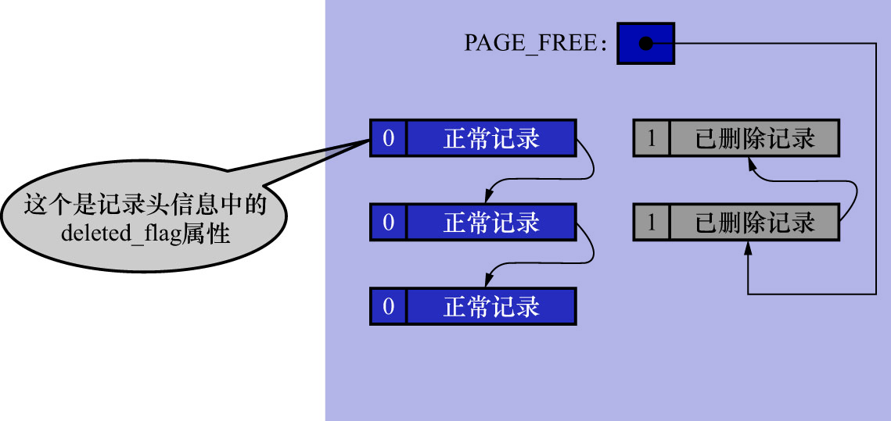
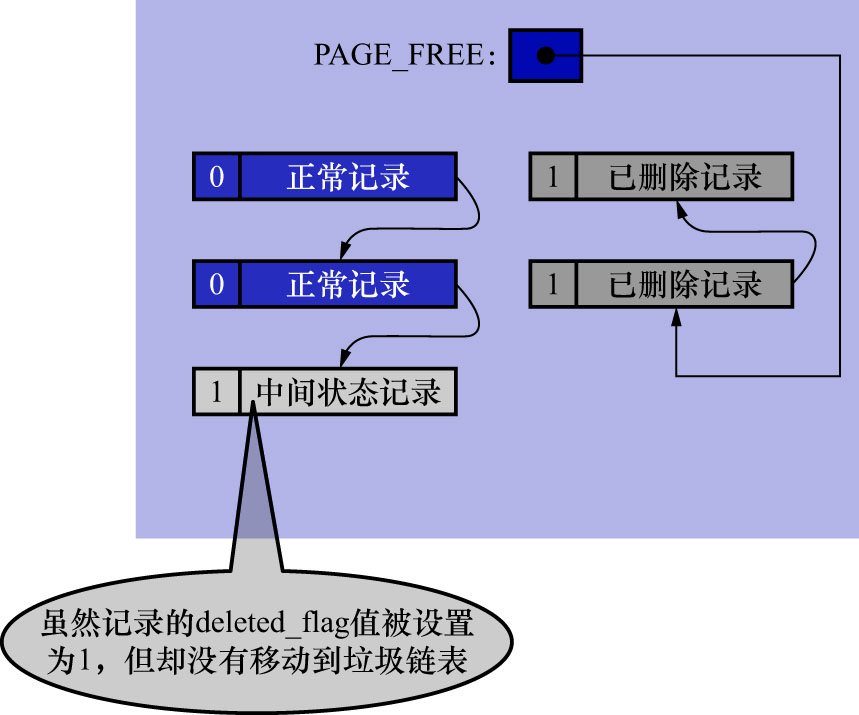
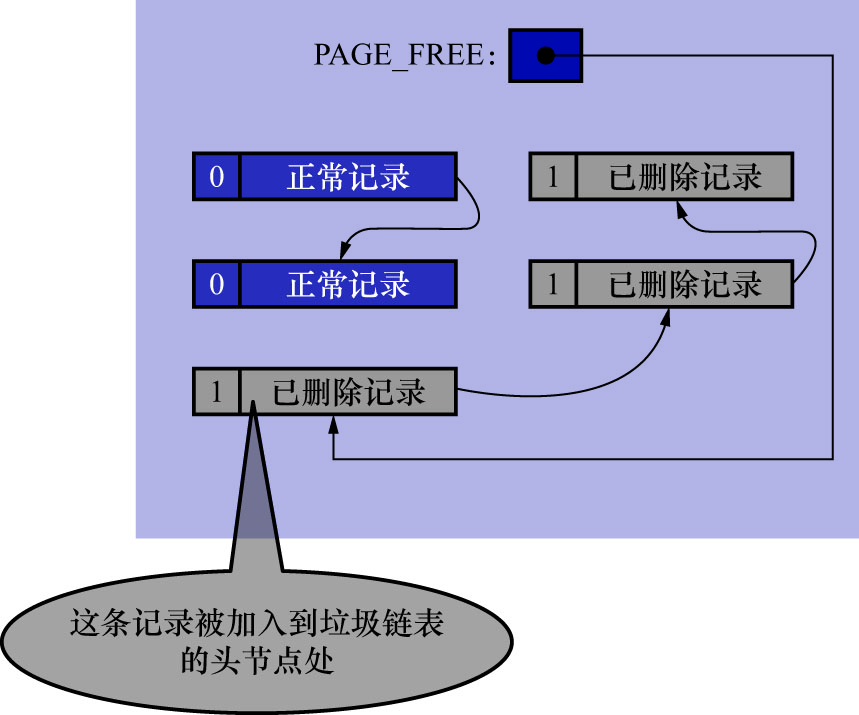

# 1. `DELETE`操作的两个阶段

插入到页面中的记录会根据记录头信息中的`next_record`属性组成一个单向链表,该链表被称为正常记录链表.前边在讲[数据页结构](https://github.com/rayallen20/howDoesMySQLWork/blob/main/%E7%AC%AC5%E7%AB%A0%20%E7%9B%9B%E6%94%BE%E8%AE%B0%E5%BD%95%E7%9A%84%E5%A4%A7%E7%9B%92%E5%AD%90--InnoDB%E6%95%B0%E6%8D%AE%E9%A1%B5%E7%BB%93%E6%9E%84/3.%20%E8%AE%B0%E5%BD%95%E5%9C%A8%E9%A1%B5%E4%B8%AD%E7%9A%84%E5%AD%98%E5%82%A8/1.%20%E8%AE%B0%E5%BD%95%E5%A4%B4%E4%BF%A1%E6%81%AF/6.%20next_record.md)时讲过,
被删除的记录也会根据记录头信息中的`next_record`属性组成一个链表,只不过该链表中的记录占用的存储空间可以被重新利用,所以该链表被称为垃圾链表.
[`Page Header`](https://github.com/rayallen20/howDoesMySQLWork/blob/main/%E7%AC%AC5%E7%AB%A0%20%E7%9B%9B%E6%94%BE%E8%AE%B0%E5%BD%95%E7%9A%84%E5%A4%A7%E7%9B%92%E5%AD%90--InnoDB%E6%95%B0%E6%8D%AE%E9%A1%B5%E7%BB%93%E6%9E%84/5.%20Page%20Header(%E9%A1%B5%E9%9D%A2%E5%A4%B4%E9%83%A8).md)部分有一个名为`PAGE_FREE`的属性,该属性指向由被删除记录组成的垃圾链表中的头节点.

为故事的顺利发展,这里先画一个图,假设此刻某个页面中的记录分布情况如下图示(这不是`undo_demo`表中的记录,只是随便举的一个例子):

为突出主题,在上图所示的简化版示意图中,只画了记录的`delete_flag`标志位.从图中可以看出:

- 正常记录链表中包含3条正常记录
- 垃圾链表中包含2条已删除记录

在垃圾链表中,这些记录占用的存储空间可以被重新利用.在页面的`Page Header`部分中,`PAGE_FREE`属性的值表示指向垃圾链表头节点的指针.
若现在准备使用`DELETE`语句把正常记录链表中的最后一条记录删除,则该删除过程需要经历2个阶段:

- 阶段1: `delete mark`阶段

  仅仅将记录的`delete_flag`标志位设置为1,其他的不做修改(其实会修改记录的`trx_id`/`roll_pointer`这些隐藏列的值).
  InnoDB的设计者把这个阶段称为`delete mark`.

  这个过程如下图示:

  

  可以看到,在正常记录链表中,最后一条记录的`delete_flag`值被设置为1,但是这条记录并没有被加入到垃圾链表中.
  也就是说,此时该条记录既不是正常记录,也不是已删除记录,而是一个处于中间状态的记录(既被标记为了垃圾数据,又没有被加入到垃圾链表中).
  在删除语句所在的事务提交之前,被删除的记录一直都处于这种中间状态.

  注: 之所以会有这种中间状态,是为了实现MVCC功能.

- 阶段2: `purge`阶段

  **当该删除语句所在的事务提交之后**,会有专门的线程来真正地把记录删除掉.这里说的"真正的删除",就是把该记录从正常记录链表中移除,
  并且加入到垃圾链表中.然后还要调整一些页面的其他信息,比如:

    - `PAGE_N_RECS`: 页面中的用户记录数量
    - `PAGE_LAST_INSERT`: 上次插入记录的位置
    - `PAGE_FREE`: 垃圾链表头节点的指针
    - `PAGE_GARBAGE`: 页面中可重用的字节数量(即:已删除记录占用的字节数)
    - 页目录的一些信息
    - 等

  InnoDB的设计者把这个阶段称为`purge`.

  在阶段2执行完后,这条记录就算是真正地被删除掉了.这条已删除记录占用的存储空间也就可以被重新利用了.如下图示:

  

  在这张图中还要注意一点:在将被删除记录加入到垃圾链表中时,实际上加入到链表的头节点处,也会跟着修改`PAGE_FREE`属性的值.

注:

前面的章节中,在讲数据页结构时讲过,页面的[`Page Header`部分](https://github.com/rayallen20/howDoesMySQLWork/blob/main/%E7%AC%AC5%E7%AB%A0%20%E7%9B%9B%E6%94%BE%E8%AE%B0%E5%BD%95%E7%9A%84%E5%A4%A7%E7%9B%92%E5%AD%90--InnoDB%E6%95%B0%E6%8D%AE%E9%A1%B5%E7%BB%93%E6%9E%84/5.%20Page%20Header(%E9%A1%B5%E9%9D%A2%E5%A4%B4%E9%83%A8).md)有一个名为`PAGE_GARBAGE`的属性.该属性记录着当前页面中
可重用存储空间占用的总字节数.每当有已删除记录被加入到垃圾链表后,都会把这个`PAGE_GARBAGE`属性的值加上已删除记录占用的存储空间大小.

`PAGE_FREE`指向垃圾链表的头节点,之后每当新插入记录时,首先判断`PAGE_FREE`指向的头节点代表的已删除记录占用的存储空间是否
足够容纳这条新插入的记录.

- 若不能容纳,则直接向页面中申请新的空间来存储这条记录
  - 是的,并不会尝试遍历整个垃圾链表并试图找到一个可以容纳新记录的节点
- 若可以容纳,则直接重用这条已删除记录的存储空间,并让`PAGE_FREE`指向垃圾链表中的下一条已删除记录

这里有一个问题: 若新插入的那条记录占用的存储空间,小于垃圾链表头节点对应的已删除记录占用的存储空间,则意味头节点对应的记录所占用的存储空间中,
有一部分空间用不到,这部分空间就就算是一个碎片空间.随着新记录越插越多,由此产生的碎片空间也可能越来越多.这些碎片空间是不是永远都无法被使用的?

其实也不是,这些碎片空间占用的存储空间大小会被统计到`PAGE_GARBAGE`属性中,这些碎片空间在整个页面快使用完之前,并不会被重新利用.
但是当页面快满时,若再插入一条新记录,此时页面中并不能分配一条完整记录的空间.这个场景下,会先检查`PAGE_GARBAGE表示的空间 + 剩余可用的空间`
是否可以容纳下这条记录.若可以,则InnoDB会尝试**重新组织**页内的记录.重新组织的过程为:

- 先开辟一个临时页面
- 把页面内的记录依次插入一遍
  - 因为依次插入时不会产生碎片
- 把临时页面的内容复制到本页面

这样就可以把那些碎片空间都解放出来(很显然,重新组织页面内的记录会比较耗费性能).