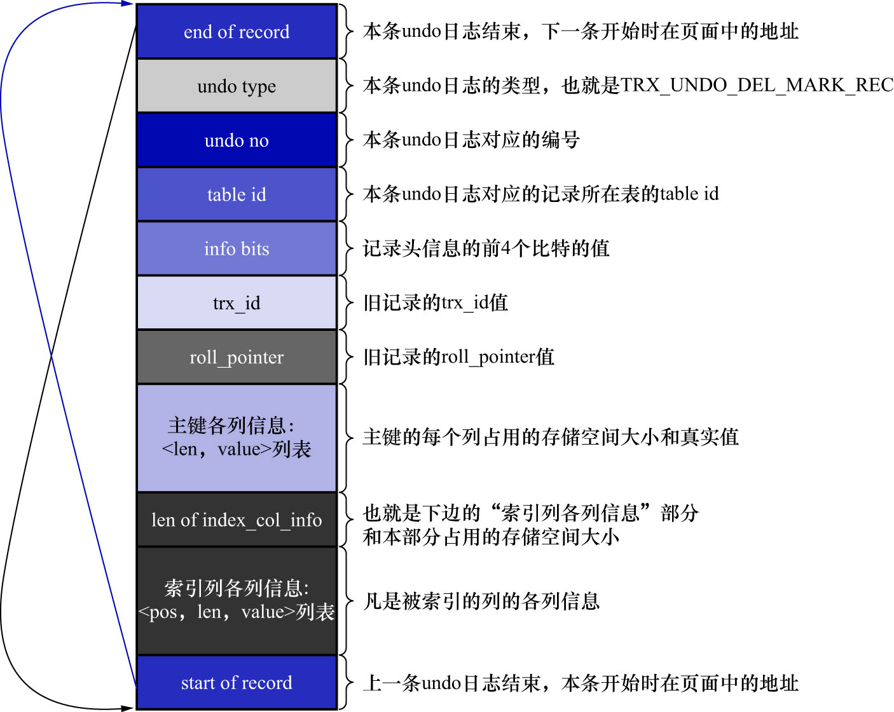
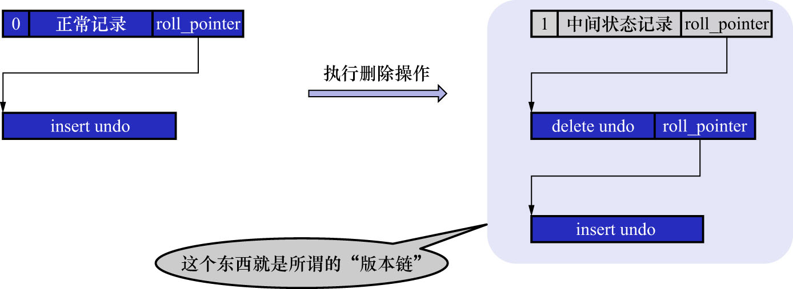
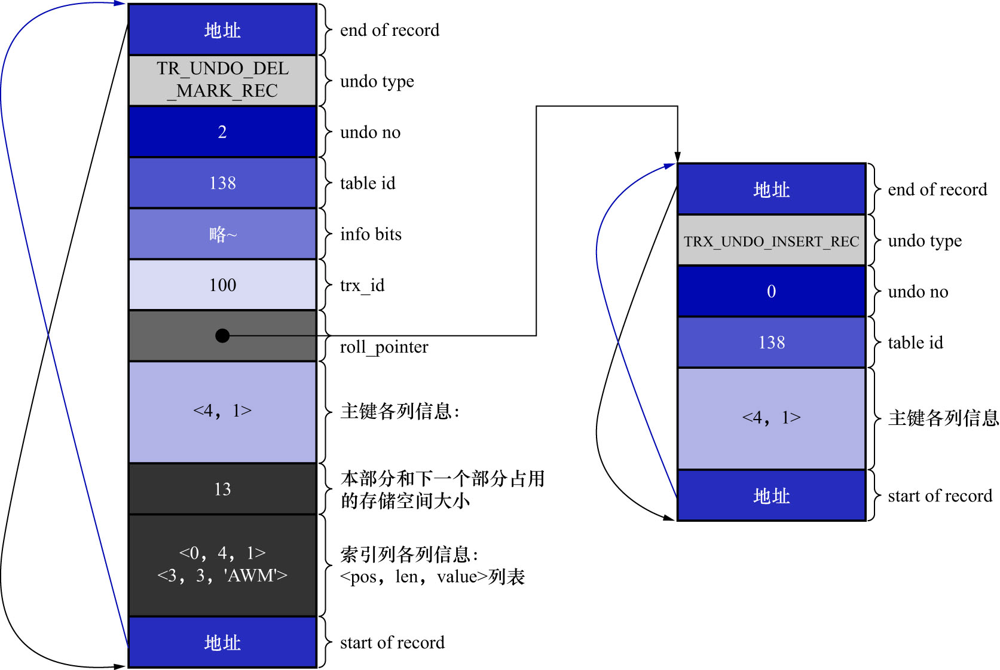
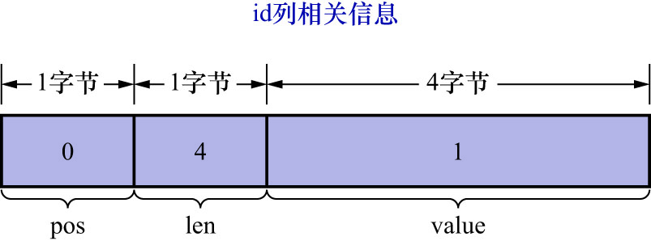
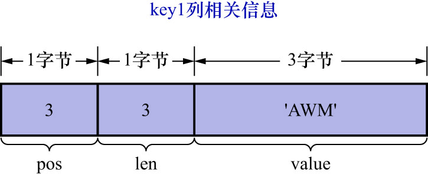

# 2. `DELETE`操作对应的`undo`日志的结构

从前面的描述中可以看出,在执行一条删除语句的过程中.只会经历阶段1,也就是`delete mark`阶段.而一旦事务提交,也就不需要再回滚这个事务了.
所以在设计`undo`日志时,只需要考虑对删除操作在阶段1所产生的影响进行回滚.InnoDB的设计者为此设计了一种名为`TRX_UNDO_DEL_MARK_REC`
类型的`undo`日志,结构如下图示:



注: 图中的"索引列各列信息"部分中,是包含主键信息的,也就是说只要被索引的列,都会出现在"索引列各列信息"部分中.

大部分属性的含义在之前讲类型为`TRX_UNDO_INSERT_REC`的`undo`日志时,已经介绍过了.这里只讲一些注意点:

- 在对一条记录进行`delete mark`操作前,需要把该记录的旧的`trx_id`和`roll_pointer`隐藏列的值都记到对应的`undo`日志中的`trx_id`和`roll_pointer`属性中

  这样做有个好处:可以通过`undo`日志的`roll_pointer`属性,找到上一次对该记录进行改动时产生的`undo`日志.比如,在一个事务中,
  先插入了一条记录,然后又执行对该记录的删除操作,这个过程如下图示:

  

  从图中可以看出,在执行完`delete mark`操作后:

    - 中间状态记录
    - `delete mark`操作产生的`undo`日志
    - `INSERT`操作产生的`undo`日志

  **串成了一个链表**.这个链表称为版本链,现在可能还看不出这个版本链的作用,后续讲完`UPDATE`操作对应的`undo`日志后,这个版本链就会体现出作用了.

- 与类型为`TRX_UNDO_INSERT_REC`的`undo`日志不同,类型为`TRX_UNDO_DEL_MARK_REC`的`undo`日志还多了一个"索引列各列信息"的内容

  也就是说,若某个列被包含在某个索引中,则该列的相关信息就需要被记录到这个"索引列各列信息"部分.这里说的"相关信息",包括:

    - `pos`: 表示该列在记录中的位置
    - `len`: 该列占用的存储空间大小
    - `value`: 该列的实际值

  所以"索引列各列信息"部分存储的内容其实上就是`<pos, len, value>`的一个列表.这部分信息主要是用在事务提交后使用,用于对对中间状态的记录
  进行真正的删除(即在阶段2,也就是`purge`阶段中使用的),具体如何使用现在可以忽略.

该介绍的就都介绍完了,现在继续在之前那个事务id为100的事务中,删除一条记录.比如把`id`为1的那条记录删除:

```sql
/* 显式开启一个事务,假设该事务的id为100 */
BEGIN;

/* 插入两条记录 */
INSERT INTO undo_demo(id, key1, col) VALUES (1, 'AWM', '狙击枪'), (2, 'M416', '步枪');

/* 删除一条记录 */
DELETE FROM undo_demo WHERE id = 1;
```

这个删除语句的`delete mark`操作对应的`undo`日志的结构如下图示:



对照该图,需要注意的有以下几点:

- 因为这条`undo`日志是事务id为100的事务中产生的第3条`undo`日志,所以它对应的`undo no`就是2
- 在对记录做`delete mark`操作时,记录的`trx_id`隐藏列的值是100(也就是说对该记录最近的一次修改就发生在本事务中),所以把100填入`undo`日志的`trx_id`属性中
  - 然后把记录的`roll_pointer`隐藏列的值取出来,填入`undo`日志的`roll_pointer`属性中
    - 这样就可以通过`roll_pointer`属性值找到上一次对该记录做改动时产生的`undo`日志
- 由于`undo_demo`表中有2个索引(聚簇索引/二级索引`idx_key1`),因此只要是包含在索引中的列,那么下列信息就需要存储到`undo`日志中的"索引列各列信息"部分中:
  - 该列在记录中的位置(`pos`)
  - 该列占用的存储空间大小(`len`)
  - 该列的实际值(`value`)

- 对于主键来说,它只包含1个`id`列,存储到`undo`日志中的"索引列各列信息"部分时,相关信息如下图示:

  

  - `pos`: `id`列是主键,也就是在记录的第一个列,它对应的`pos`值为0
    - `pos`使用1字节来存储
  - `len`: `id`列的类型为`INT`,占用4字节,所以`len`的值为4
    - `len`使用1字节来存储
  - `value`: 在被删除的记录中,`id`列的值为1,也就是`value`的值为1
    - `value`使用4字节来存储

  所以对于`id`列来说,最终存储到`undo`日志的"索引列各列信息"部分中,结果就是`<0, 4, 1>`,
  存储这些信息占用的存储空间大小为`1 + 1 + 4 = 6`个字节

- 对于`idx_key1`来说,它只包含1个`key1`列,存储到`undo`日志中的"索引列各列信息"部分时,相关信息如下图示:

  

  - `pos`: `key1`列排在`id`列/`trx_id`列/`roll_pointer`列之后,因此`key1`列对应的`pos`值为3
    - `pos`使用1字节来存储
  - `len`: `key1`列的类型为`VARCHAR(100)`,使用`utf8mb4`字符集,被删除的记录实际存储的内容是`'AWM'`,这些内容总共占用3个字节.也就是说`len`的值为3
    - `len`使用1字节来存储
  - `value`: 在被删除的记录中,`key1`列的值为`'AWM'`,也就是`value`的值为`'AWM'`
    - `value`使用3字节来存储

  所以对于`key1`列来说,最终存储到`undo`日志的"索引列各列信息"部分中,结果就是`<3, 3, 'AWM'>`,
  存储这些信息占用的存储空间大小为`1 + 1 + 3 = 5`个字节.

  即: 在"索引列各列信息"这个列表中:

  - `id`列相关信息占用6个字节
  - `key1`列相关信息占用5个字节

  所以"索引列各列信息"列表总共占用的存储空间大小为`6 + 5 = 11`个字节

- `len of index_col_info`: 该属性表示`"索引列各列信息" + 本部分(即len of index_col_info部分)`占用的存储空间大小
  - 该属性使用2字节来存储

综上所述:`len of index_col_info的值 = "索引列各列信息"列表占用的存储空间 + len of index_col_info占用的存储空间 = 11 + 2 = 13`.
于是把数字13就填到`len of index_col_info`属性中.