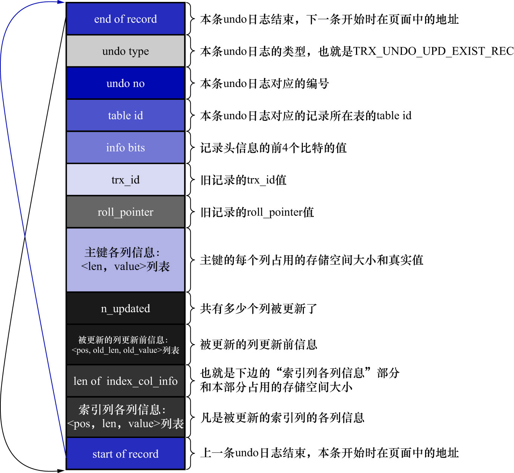
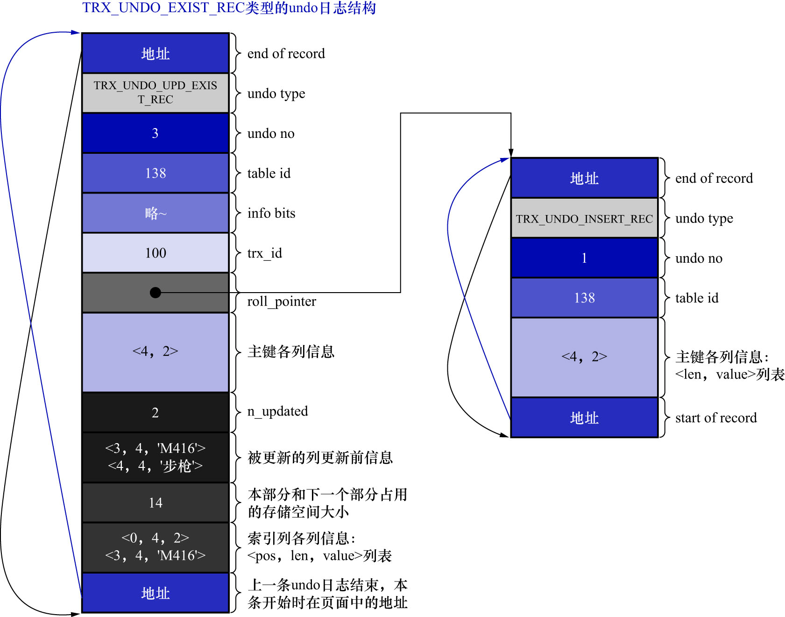

# 3. 类型为`TRX_UNDO_DEL_MARK_REC`的`undo`日志结构

针对`UPDATE`操作不更新主键的情况(包括前面说些就地更新和先删除旧记录再插入新记录),InnoDB的设计者设计了一种
类型为`TRX_UNDO_UPD_EXIST_REC`的`undo`日志,结构如下图示:



该类型的日志中,大部分属性和`TRX_UNDO_DEL_MARK_REC`类型的`undo`日志是类似的,有以下几点需要注意:

- `n_updated`属性: 表示本条`UPDATE`语句执行后,将有几个列被更新
- 被更新的列更新前信息: 该部分是一个列表,列表中的元素为`<pos, old_len, old_value>`.分别表示:
    - 被更新列在记录中的位置
    - 被更新列更新前,该列占用的存储空间大小
    - 被更新列更新前,该列的真实值
- 索引列各列信息: 若在`UPDATE`语句中更新的列包含索引列,则在`undo`日志中会添加该部分,否则在`undo`日志中没有该部分
  - 该列表记录的是索引列在更新前的信息
  - 只要涉及到有索引列被更新,则该列表中还要有主键信息

现在,继续在前面那个事务id为100的事务中,更新一条记录.比如,更新`id`为2的记录:

```sql
/* 显式开启一个事务,假设该事务的id为100 */
BEGIN;

/* 插入两条记录 */
INSERT INTO undo_demo(id, key1, col) VALUES (1, 'AWM', '狙击枪'), (2, 'M416', '步枪');

/* 删除一条记录 */
DELETE FROM undo_demo WHERE id = 1;

/* 更新一条记录 */
UPDATE undo_demo SET key1 = 'M249', col = '机枪' WHERE id = 2;
```

该`UPDATE`语句更新的列大小都没有改动,所以可以采用就地更新的方式来执行,在真正改动页面记录时,会先记录一条类型为
`TRX_UNDO_UPD_EXIST_REC`的`undo`日志,如下图示:



- 因为该条`undo`日志是事务id为100的事务中产生的第4条`undo`日志,所以它对应的`undo no`值为3
- 该条日志的`roll_pointer`指向`undo no`为1的那条`undo`日志,即:插入主键值为2的记录时产生的`undo`日志
  - 也就是说,该条日志的`roll_pointer`指向的是:上一次对该记录做改动时,产生的`undo`日志
- 由于本条`UPDATE`语句中更新了索引列`key1`的值,所以需要记录"索引列各列信息"部分.即:
  - 把主键和`key1`列更新前的信息填入

注: 这里解释一下填入主键信息的原因.因为二级索引`idx_key1`是由2个列构成的,而在产生`undo`日志时,也是要存储索引中的全部列在更新前的信息的,
因此需要写入主键列更新前的信息.