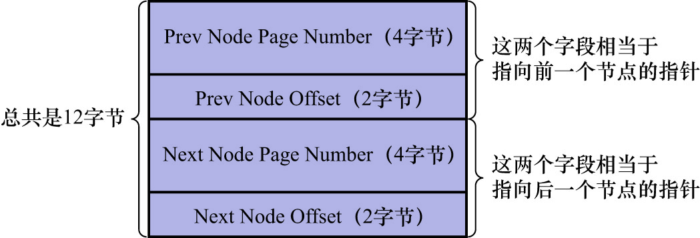
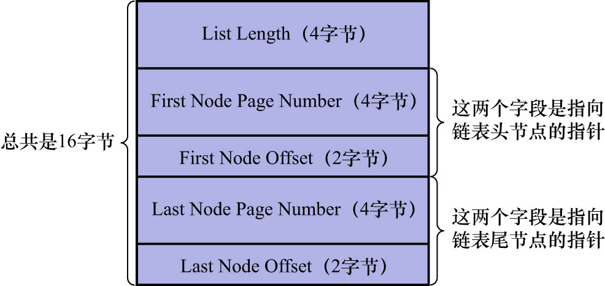
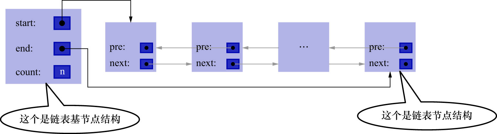

# 4. 通用链表结构

前面主要讲的是:

- 为什么需要`undo`日志
- `INSERT`/`DELETE`/`UPDATE`这些用来改动数据的语句都会产生何种类型的`undo`日志
- 不同类型的`undo`日志的具体格式是什么

后面讲的内容是关于这些`undo`日志会被具体写到什么地方,以及在写入过程中需要注意的问题.

在写入`undo`日志的过程中会用到多个链表,很多链表都有同样的节点结构,如下图示:

注: 其实该链表节点结构和[`XDES Entry`结构中的`List Node`](https://github.com/rayallen20/howDoesMySQLWork/blob/main/%E7%AC%AC9%E7%AB%A0%20%E5%AD%98%E6%94%BE%E9%A1%B5%E9%9D%A2%E7%9A%84%E5%A4%A7%E6%B1%A0%E5%AD%90--InnoDB%E7%9A%84%E8%A1%A8%E7%A9%BA%E9%97%B4/2.%20%E7%8B%AC%E7%AB%8B%E8%A1%A8%E7%A9%BA%E9%97%B4%E7%BB%93%E6%9E%84/3.%20%E5%8C%BA%E7%9A%84%E5%88%86%E7%B1%BB/0.%20%E6%A6%82%E8%BF%B0.md)是一样的,只是`XDES Entry`结构中的`List Node`用来连接的是`XDES Entry`节点,而这里的`List Node`用来连接的是做别的作用的节点.

在某个表空间内,可以通过`一个页的页号 + 在页内的偏移量`来唯一定位一个节点的位置.这2个信息组合在一起,就相当于指向该节点的指针。因此:

- `Pre Node Page Number`和`Pre Node Offset`的组合就是指向前一个节点的指针
- `Next Node Page Number`和`Next Node Offset`的组合就是指向后一个节点的指针

整个链表节点占用12字节的存储空间.

为更好地管理链表,InnoDB的设计者还提出了一个基节点的结构.该结构中存储了该链表的:

- 头节点
- 尾节点
- 链表长度信息

基节点的结构如下图示:

注: 其实该结构[链表基节点](https://github.com/rayallen20/howDoesMySQLWork/blob/main/%E7%AC%AC9%E7%AB%A0%20%E5%AD%98%E6%94%BE%E9%A1%B5%E9%9D%A2%E7%9A%84%E5%A4%A7%E6%B1%A0%E5%AD%90--InnoDB%E7%9A%84%E8%A1%A8%E7%A9%BA%E9%97%B4/2.%20%E7%8B%AC%E7%AB%8B%E8%A1%A8%E7%A9%BA%E9%97%B4%E7%BB%93%E6%9E%84/3.%20%E5%8C%BA%E7%9A%84%E5%88%86%E7%B1%BB/2.%20%E9%93%BE%E8%A1%A8%E5%9F%BA%E8%8A%82%E7%82%B9.md)的结构是一样的,只不过链表基节点结构记录的是一个segment中由extent组成的`FREE`/`NOT FULL`/`FULL`链表的信息,而这里的链表基节点用来记录的是别的链表的信息.

其中:

- `List Length`: 表示该链表一共有多少个节点
- `First Node Page Number`和`First Node Offset`的组合: 表示指向链表头节点的指针
- `Last Node Page Number`和`Last Node Offset`的组合: 表示指向链表尾节点的指针

整个链表基节点占用16字节的存储空间.

使用链表基节点和链表节点这2个结构组成的链表的如下图示:

注: 其实这些内容在[第9章 存放页面的大池子--InnoDB的表空间](https://github.com/rayallen20/howDoesMySQLWork/tree/main/%E7%AC%AC9%E7%AB%A0%20%E5%AD%98%E6%94%BE%E9%A1%B5%E9%9D%A2%E7%9A%84%E5%A4%A7%E6%B1%A0%E5%AD%90--InnoDB%E7%9A%84%E8%A1%A8%E7%A9%BA%E9%97%B4)中都讲过,这里只是复习一下.
