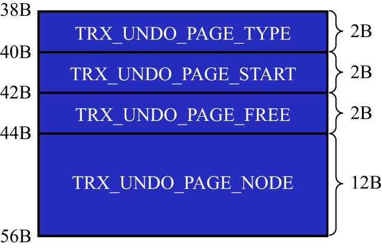

# 5. `FIL_PAGE_UNDO_LOG`页面

在第9章讲表空间时讲到过,表空间其实是由许多的页面构成的,页面默认大小为16KB.这些页面有不同的类型,例如:

- 类型为`FIL_PAGE_INDEX`的页面用于存储聚簇索引以及二级索引
- 类型为`FIL_PAGE_TYPE_FSP_HDR`的页面用于存储表空间头部信息
- 还有其他各种类型的页面

其中,有一种类型为`FIL_PAGE_UNDO_LOG`的页面是专门用来存储`undo`日志的.该类型页面的通用结构如下图示(以默认的16KB大小为例):

类型为`FIL_PAGE_UNDO_LOG`的页简称为`Undo`页面.

在上图中,`File Header`和`File Trailer`是各种页面都有的通用结构,这里就不赘述了.`Undo Page Header`是`Undo`页面特有的,
主要来看这部分的结构:

其中各个属性的含义如下:

- `TRX_UNDO_PAGE_TYPE`:本页面准备存储何种类型的`undo`日志

    前文介绍了多种类型的`undo`日志,它们可以被分为两个大类:
    
    - `TRX_UNDO_INSERT`(使用十进制1表示)
    
        类型为`TRX_UNDO_INSERT_REC`的`undo`日志属于该大类
        
        - 一般由`INSERT`语句产生
        - 当`UPDATE`语句中有更新主键的情况时,也会产生该类型的`undo`日志
        
        属于`TRX_UNDO_INSERT`大类的`undo`日志简称为`insert undo`日志.

    - `TRX_UNDO_UPDATE`(使用十进制2表示)
    
        除了类型为`TRX_UNDO_INSERT_REC`的`undo`日志,其他类型的`undo`日志都属于该大类,比如:
      
        - `TRX_UNDO_DEL_MARK_REC`
        - `TRX_UNDO_UPD_EXIST_REC`
        
        一般由`DELETE`/`UPDATE`语句产生的`undo`日志属于该大类.属于`TRX_UNDO_UPDATE`大类的`undo`日志简称为`update undo`日志.

    简单理解,就是插入类`undo`日志和删除/更新类`undo`日志.

    `TRX_UNDO_PAGE_TYPE`属性可选的值就是以上这2个,用来标记本页面用于存储哪个大类的`undo`日志.不同大类的`undo`日志不能混着存储,
    比如,一个`Undo`页面的`TRX_UNDO_PAGE_TYPE`属性值为`TRX_UNDO_INSERT`,则该页面就只能存储类型为`TRX_UNDO_INSERT_REC`的`undo`日志,
    其他类型的`undo`日志就不能放到该页面中了.

    注: 之所以把`undo`日志分成2个大类,是因为类型为`TRX_UNDO_INSERT_REC`的`undo`日志在事务提交后可以直接删除掉,而其他类型的`undo`日志
    还需要为`MVCC`服务,不能直接删除掉,所以对这二者的处理需要区别对待.

- `TRX_UNDO_PAGE_START`: 表示在当前页面中从哪个位置开始存储`undo`日志的
  - 或者说表示第1条1undo1日志在本页面中的起始偏移量
- `TRX_UNDO_PAGE_FREE`: 与上面的`TRX_UNDO_PAGE_START`对应,表示当前页面中存储的最后一条`undo`日志结束时的偏移量
  - 或者说从该位置开始,可以继续写入新的`undo`日志

    假设现在向页面中写入了3条`undo`日志,则`TRX_UNDO_PAGE_START`和`TRX_UNDO_PAGE_FREE`的示意图如下:
    
    
    
    当然,在最初1条`undo`日志也没写入的情况下,`TRX_UNDO_PAGE_START`和`TRX_UNDO_PAGE_FREE`的值是相同的.

- `TRX_UNDO_PAGE_NODE`: 表示一个链表节点结构(就是[这里](https://github.com/rayallen20/howDoesMySQLWork/blob/main/%E7%AC%AC20%E7%AB%A0%20%E5%90%8E%E6%82%94%E4%BA%86%E6%80%8E%E4%B9%88%E5%8A%9E--undo%E6%97%A5%E5%BF%97/4.%20%E9%80%9A%E7%94%A8%E9%93%BE%E8%A1%A8%E7%BB%93%E6%9E%84.md)讲到的那个类似`List Node`的链表节点结构)
