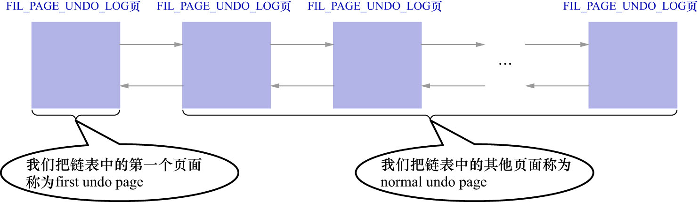
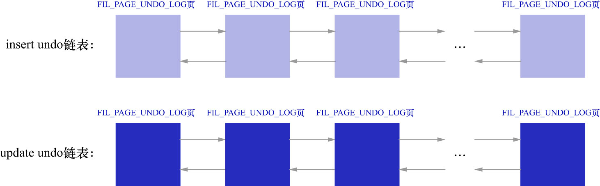
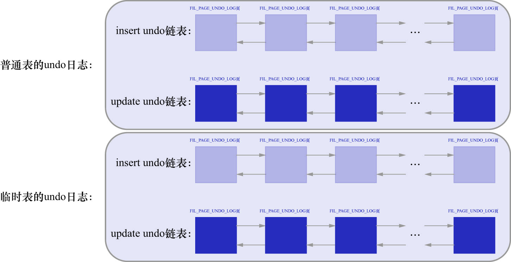

# 1. 单个事务中的`Undo`页面链表

因为1个事务可能包含多个语句,且1个语句可能对若干条记录进行改动,在对每条记录进行改动前(再次强调,这里指的是聚簇索引记录),
都需要记录1条或2条的`undo`日志.所以在1个事务执行过程中可能产生很多`undo`日志,这些日志可能在一个页面中放不下,需要放到多个页面中.
这些页面就通过刚刚说的`Undo Page Header`中的`TRX_UNDO_PAGE_NODE`属性连成了链表,如下图示:

在该图中:

- 链表中的第一个`Undo`页面(也就是链表的头结点)称为`first undo page`
- 其余的`Undo`页面称为`normal undo page`

这是因为在`first undo page`中除了包含`Undo Page Header`之外,还会记录其他的一些管理信息,后面会讲到.

在1个事务执行过程中,可能混着执行`INSERT`/`DELETE`/`UPDATE`语句,这也就意味着:**在1个事务执行过程中,会产生不同类型的`undo`日志**.
但是前面也讲到过,同一个`Undo`页面:

- 要么只存储`TRX_UNDO_INSERT`大类的`undo`日志
- 要么只存储`TRX_UNDO_UPDATE`大类的`undo`日志

不能混着存储.所以在1个事务执行过程中,就可能需要2个`Undo`页面的链表:

- 一个称为`insert undo`链表
- 另一个称为`update undo`链表

如下图示:

另外,InnoDB的设计者规定: 在对普通表和临时表的记录改动时产生的`undo`日志,要分别记录(后续会解释为什么这么设计).
所以在1个事务中,最多有4个以`Undo`页面为节点组成的链表:

当然,并不是在事务一开始时,就会为该事务分配这4个链表,具体分配策略如下:

- 刚刚开启事务时,1个`Undo`页面链表也不分配
- 当事务执行过程中,向普通表中插入记录或执行更新记录主键的操作之后,就会为其分配一个普通表的`insert undo`链表
- 当事务执行过程中,删除或者更新了普通表中的记录之后,就会为其分配一个普通表的`update undo`链表
- 当事务执行过程中,向临时表中插入记录或执行更新记录主键的操作之后,就会为其分配一个临时表的`insert undo`链表
- 当事务执行过程中,删除或者更新了临时表中的记录之后,就会为其分配一个临时表的`update undo`链表

总结规律即为: **按需分配,需要时再分配,不需要则不分配**
