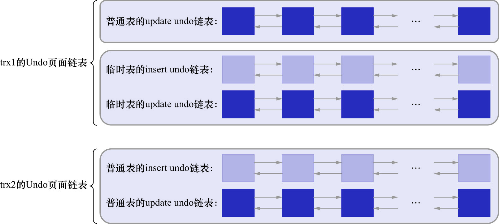

# 2. 多个事务中的`Undo`页面链表

为尽可能提高`undo日志`的写入效率,**不同事务执行过程中产生的`undo`日志需要写入到不同的`Undo`页面链表中**(这意味着各个事务之间不会"争抢"`Undo`页面链表).

比如,现有事务id分别为1和2的两个事务,分别称为`trx1`和`trx2`.假设在这2个事务执行过程中:

- `trx1`对普通表做了`DELETE`操作,对临时表做了`INSERT`和`UPDATE`操作

    则InnoDB会为`trx1`分配3个链表,分别是:

    - 针对普通表的`update undo`链表
    - 针对临时表的`insert undo`链表
    - 针对临时表的`update undo`链表

- `trx2`对普通表做了`INSERT`/`UPDATE`和`DELETE`操作,没有对临时表做改动

    则InnoDB会为`trx2`分配2个链表,分别是:

    - 针对普通表的`insert undo`链表
    - 针对普通表的`update undo`链表

综上所述,在`trx1`和`trx2`执行过程中,InnoDB共需为这2个事务分配5个`Undo`页面链表,如下图示:

**若有更多的事务,则意味着可能会产生更多的`Undo`页面链表**.
