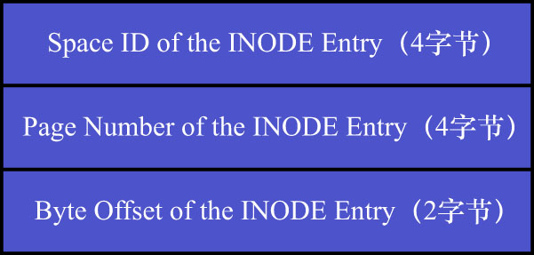

# 1. 段的概念

简单来讲,segment是个逻辑上的概念,本质上是由若干个零散页面和若干个完整的extent组成的(fragment extent中有32个属于某个segment的页面时,才会分配完整的extent给该segment).

1个B+树索引被划分成两个segment:

- 叶子节点segment
- 非叶子节点segment

这样一来:

- 叶子节点被尽可能地存放到一起
- 非叶子节点被尽可能地存放到一起

每一个segment对应1个[`INODE Entry`结构](https://github.com/rayallen20/howDoesMySQLWork/blob/main/%E7%AC%AC9%E7%AB%A0%20%E5%AD%98%E6%94%BE%E9%A1%B5%E9%9D%A2%E7%9A%84%E5%A4%A7%E6%B1%A0%E5%AD%90--InnoDB%E7%9A%84%E8%A1%A8%E7%A9%BA%E9%97%B4/2.%20%E7%8B%AC%E7%AB%8B%E8%A1%A8%E7%A9%BA%E9%97%B4%E7%BB%93%E6%9E%84/4.%20%E6%AE%B5%E7%9A%84%E7%BB%93%E6%9E%84.md),该`INODE Entry`结构描述了对应的段的各种信息:

- 段的ID(`Segment ID`)
- 在`NOT_FULL`链表中已使用的页面数量(`NOT_FULL_N_USED`)
- 段内的各种链表基节点(`List Base Node For FREE List`/`List Base Node For NOT_FULL List`/`List Base Node For FULL List`)
- 零散页面的页号有哪些(`Fragment Array Entry`)
- 等信息

前面也讲过,为了定位一个`INODE Entry`,InnoDB的设计者又设计了一个名为[`Segment Header`](https://github.com/rayallen20/howDoesMySQLWork/blob/main/%E7%AC%AC9%E7%AB%A0%20%E5%AD%98%E6%94%BE%E9%A1%B5%E9%9D%A2%E7%9A%84%E5%A4%A7%E6%B1%A0%E5%AD%90--InnoDB%E7%9A%84%E8%A1%A8%E7%A9%BA%E9%97%B4/2.%20%E7%8B%AC%E7%AB%8B%E8%A1%A8%E7%A9%BA%E9%97%B4%E7%BB%93%E6%9E%84/6.%20Segment%20Header%E7%BB%93%E6%9E%84%E7%9A%84%E8%BF%90%E7%94%A8.md)的结构(该结构在`INDEX`类型的页的`Page Header`部分中,`PAGE_BTR_SEG_LEAF`属性和`PAGE_BTR_SEG_TOP`属性均为`Segment Header`结构).
如下图示:

`Segment Header`占用10字节,各属性的含义如下:

- `Space ID of the INODE Entry`: `INODE Entry`结构所在的表空间ID
- `Page Number of the INODE Entry`: `INODE Entry`结构所在的页面页号(这里的页面指的是`INODE`类型的页,用于存储`INODE Entry`结构)
- `Byte Offset of the INODE Entry`: `INODE Entry`结构在该页面中的偏移量

确定了表空间ID/页号/页内偏移量,就可以唯一定位1个`INODE Entry`的地址了.也就是说,`Segment Header`结构是为了定位`INODE Entry`结构而设计的.

注: 本小节就是纯复习
