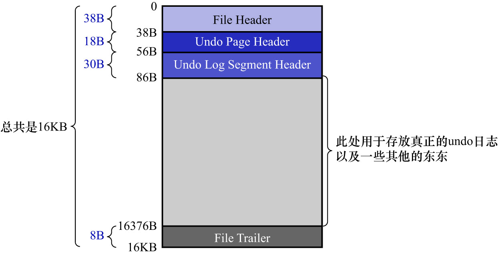
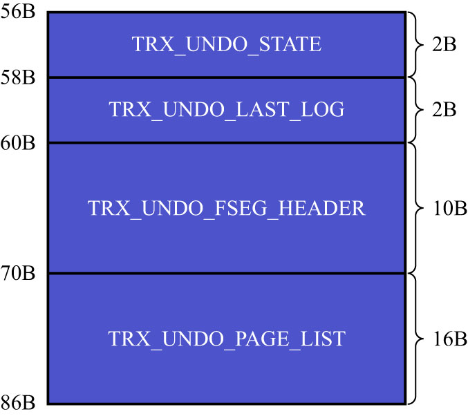

# 2. `Undo Log Segment Header`

InnoDB的设计者规定:每1个`Undo`页面链表都对应着1个segment,称为`Undo Log Segment`.即:链表中的页面都是从该segment中申请的,
所以InnoDB的设计者在`Undo`页面链表的第1个页面(即`first undo page`)中设计了一个名为`Undo Log Segment Header`的部分,
该部分中包含了该链表对应的segment的`Segment Header`信息,以及其他的一些关于该segment的信息.所以`Undo`页面链表的第一个页面如下图示:

可以看到,`Undo`链表的第1个页面比普通页面多了个`Undo Log Segment Header`,其结构如下图示:

其中各属性的含义如下:

- `TRX_UNDO_STATE`: 本`Undo`页面链表处在何种状态.可能的状态有以下4种:
  - `TRX_UNDO_ACTIVE`: 活跃状态.即:一个活跃的事务正在向该`Undo`页面链表中写入`undo`日志
  - `TRX_UNDO_CACHED`: 被缓存的状态.处于该状态的`Undo`页面链表等待之后被其他事务重用
  - `TRX_UNDO_TO_FREE`: 等待被释放的状态.对于`insert undo`链表来说,若在它对应的事务提交之后,该链表不能被重用,则会处于该状态
  - `TRX_UNDO_TO_PURGE`: 等待被`purge`的状态.对于`update undo`链表来说,若在它对应的事务提交之后,该链表不能被重用,则会处于该状态
  - `TRX_UNDO_PREPARED`: 处于该状态的`Undo`页面链表,用于存储处于`PREPARE`阶段的事务产生的`undo`日志

注: `Undo`页面链表何时会被重用,如何重用,在之后会讲到.事务的`PREPARE`阶段是在分布式事务中才出现的,本书中不会介绍更多关于分布式事务的事情,
此处忽略该状态即可.

- `TRX_UNDO_LAST_LOG`: 本`Undo`页面链表中,最后1个`Undo Log Header`的位置

    注: `Undo Log Header`在之后会讲到.

- `TRX_UNDO_FSEG_HEADER`: 本`Undo`页面链表对应的segment的[`Segment Header`](https://github.com/rayallen20/howDoesMySQLWork/blob/main/%E7%AC%AC20%E7%AB%A0%20%E5%90%8E%E6%82%94%E4%BA%86%E6%80%8E%E4%B9%88%E5%8A%9E--undo%E6%97%A5%E5%BF%97/7.%20Undo%E6%97%A5%E5%BF%97%E7%9A%84%E5%85%B7%E4%BD%93%E5%86%99%E5%85%A5%E8%BF%87%E7%A8%8B/1.%20%E6%AE%B5%E7%9A%84%E6%A6%82%E5%BF%B5.md)信息
  - 就是前面讲到的那个10字节结构,通过该信息可以找到该segment对应的`INODE Entry`
- `TRX_UNDO_PAGE_LIST`: `Undo`页面链表的基节点

    前面在讲[`Undo`页面的`Undo Page Header`部分](https://github.com/rayallen20/howDoesMySQLWork/blob/main/%E7%AC%AC20%E7%AB%A0%20%E5%90%8E%E6%82%94%E4%BA%86%E6%80%8E%E4%B9%88%E5%8A%9E--undo%E6%97%A5%E5%BF%97/5.%20FIL_PAGE_UNDO_LOG%E9%A1%B5%E9%9D%A2.md)时讲到过,该部分中有一个12字节大小的`TRX_UNDO_PAGE_NODE`属性,该属性代表一个`List Node`结构.
    每一个`Undo`页面都包含`Undo Page Header`结构,这些页面就可以通过该属性连成一个链表.`TRX_UNDO_PAGE_LIST`属性表示该`Undo`页面链表的基节点(就是[这里](https://github.com/rayallen20/howDoesMySQLWork/blob/main/%E7%AC%AC20%E7%AB%A0%20%E5%90%8E%E6%82%94%E4%BA%86%E6%80%8E%E4%B9%88%E5%8A%9E--undo%E6%97%A5%E5%BF%97/4.%20%E9%80%9A%E7%94%A8%E9%93%BE%E8%A1%A8%E7%BB%93%E6%9E%84.md)讲到的链表基节点结构).
    当然这个基节点只存在于`Undo`页面链表的第1个页面,也就是`first undo page`中.(所以该字段的大小为)
