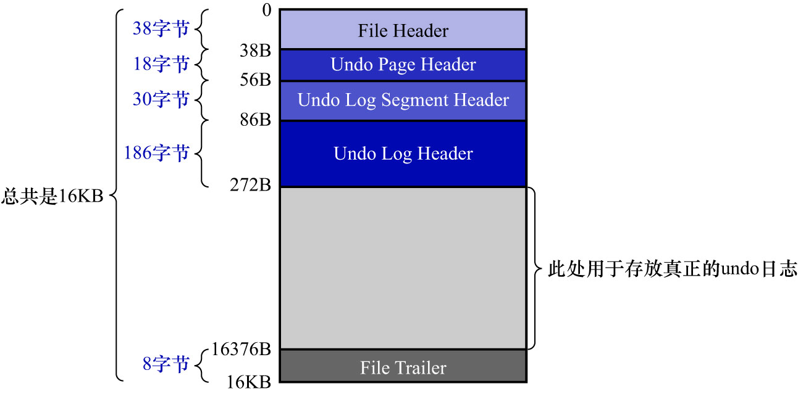
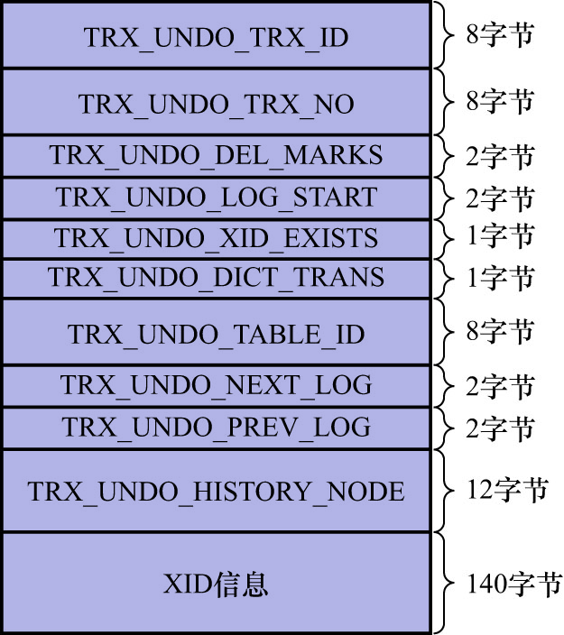

# 3. `Undo Log Header`

1个事务在向`Undo`页面中写入`undo`日志时,采用的方式是十分简单粗暴的,就是直接往里"堆",写完一条紧接着写另一条,
各条`undo`日志之间是紧密相连的.写完1个`Undo`页面后,再从segment中申请1个新页面,然后把该页面插入到`Undo`页面链表中.
继续向该新申请的页面中写`undo`日志.

InnoDB的设计者认为: **同一个事务向1个`Undo`页面链表中写入的`undo`日志算是一个组**.比如前面讲解的:

- 因为`trx1`会分配3个`Undo`页面链表,也就会写入3个组的`undo`日志
- 因为`trx2`会分配2个`Undo`页面链表,也就会写入2个组的`undo`日志

**在每写入1组`undo`日志时,都会在该组`undo`日志前,先记录一下关于该组的一些属性**.InnoDB的设计者把存储这些属性的地方
称为`Undo Log Header`.所以`Undo`页面链表的第1个页面在真正写入`undo`日志前,都会被填充:

- [`Undo Page Header`](https://github.com/rayallen20/howDoesMySQLWork/blob/main/%E7%AC%AC20%E7%AB%A0%20%E5%90%8E%E6%82%94%E4%BA%86%E6%80%8E%E4%B9%88%E5%8A%9E--undo%E6%97%A5%E5%BF%97/5.%20FIL_PAGE_UNDO_LOG%E9%A1%B5%E9%9D%A2.md)(当前`Undo`页面的信息)
- [`Undo Log Segment Header`](https://github.com/rayallen20/howDoesMySQLWork/blob/main/%E7%AC%AC20%E7%AB%A0%20%E5%90%8E%E6%82%94%E4%BA%86%E6%80%8E%E4%B9%88%E5%8A%9E--undo%E6%97%A5%E5%BF%97/7.%20Undo%E6%97%A5%E5%BF%97%E7%9A%84%E5%85%B7%E4%BD%93%E5%86%99%E5%85%A5%E8%BF%87%E7%A8%8B/2.%20Undo%20Log%20Segment%20Header.md)(`Undo`页面链表对应的segment信息,包括`Segment Header`/基节点等其他信息)
- `Undo Log Header`(当前`undo`日志组的信息)

这3个部分,如下图示:

`Undo Log Header`的结构如下图所示:

各属性的含义如下:

- `TRX_UNDO_TRX_ID`(8字节): 生成本组`undo`日志的事务id
- `TRX_UNDO_TRX_NO`(8字节): 事务提交后生成的一个序号,此序号用于标记事务的提交顺序
  - 若事务先提交,则其写入的`Undo Log Header`中的`TRX_UNDO_TRX_NO`值较小
  - 若事务后提交,则其写入的`Undo Log Header`中的`TRX_UNDO_TRX_NO`值较大
- `TRX_UNDO_DEL_MARKS`(2字节): 标记本组`undo`日志中,是否包含由`delete mark`操作产生的`undo`日志
- `TRX_UNDO_LOG_START`(2字节): 表示本组`undo`日志中,第1条`undo`日志在页面中的偏移量
- `TRX_UNDO_XID_EXISTS`(1字节): 本组`undo`日志是否包含XID信息
  - 本书不会展开讲述XID的更多内容,故可略过
- `TRX_UNDO_DICT_TRANS`(1字节): 标记本组`undo`日志是否由DDL语句产生的
- `TRX_UNDO_TABLE_ID`(8字节): 若`TRX_UNDO_DICT_TRANS`为真,则该属性表示DDL语句操作的表的`table id`
- `TRX_UNDO_NEXT_LOG`(2字节): 下一组`undo`日志在页面中开始的偏移量
- `TRX_UNDO_PREV_LOG`(2字节): 上一组`undo`日志在页面中开始的偏移量
  - 注: 一般来说,1个`Undo`页面链表只存储1个事务执行过程中产生的1组`undo`日志
  - 但是在某些情况下,可能会在1个事务提交之后,后续开启的事务有重复利用该`Undo`页面链表
  - 这就会出现: 1个`Undo`页面中可能存放多组`undo`日志的情况
  - `TRX_UNDO_NEXT_LOG`和`TRX_UNDO_PREV_LOG`就是用来标记下一组和上一组`undo`日志在页面中的偏移量的
  - 关于何种场景下会重用`Undo`页面链表,如何重用该链表后续会讲到,此处理解`TRX_UNDO_NEXT_LOG`和`TRX_UNDO_PREV_LOG`这2个属性的含义即可
- `TRX_UNDO_HISTORY_NODE`(12字节): 12字节的[链表节点](https://github.com/rayallen20/howDoesMySQLWork/blob/main/%E7%AC%AC20%E7%AB%A0%20%E5%90%8E%E6%82%94%E4%BA%86%E6%80%8E%E4%B9%88%E5%8A%9E--undo%E6%97%A5%E5%BF%97/4.%20%E9%80%9A%E7%94%A8%E9%93%BE%E8%A1%A8%E7%BB%93%E6%9E%84.md)结构,表示1个名为History链表中的节点
  - 关于History链表后面会讲到,这里先不用管
