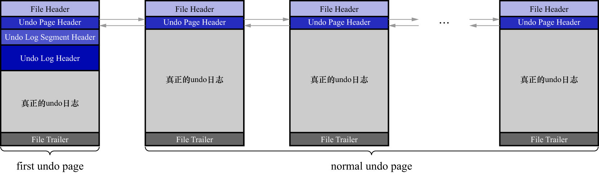

# 4. 小结

对于没有被重用的`Undo`页面链表来说:

- 链表的第1个页面(即:`first undo page`),在真正写入`undo`日志前,会填充:

  - [`Undo Page Header`](https://github.com/rayallen20/howDoesMySQLWork/blob/main/%E7%AC%AC20%E7%AB%A0%20%E5%90%8E%E6%82%94%E4%BA%86%E6%80%8E%E4%B9%88%E5%8A%9E--undo%E6%97%A5%E5%BF%97/5.%20FIL_PAGE_UNDO_LOG%E9%A1%B5%E9%9D%A2.md)
  - [`Undo Log Segment Header`](https://github.com/rayallen20/howDoesMySQLWork/blob/main/%E7%AC%AC20%E7%AB%A0%20%E5%90%8E%E6%82%94%E4%BA%86%E6%80%8E%E4%B9%88%E5%8A%9E--undo%E6%97%A5%E5%BF%97/7.%20Undo%E6%97%A5%E5%BF%97%E7%9A%84%E5%85%B7%E4%BD%93%E5%86%99%E5%85%A5%E8%BF%87%E7%A8%8B/2.%20Undo%20Log%20Segment%20Header.md)
  - [`Undo Log Header`]()

  这3个部分,之后才开始正式写入`undo`日志.

- 对于其他页面(即:`normal undo page`)来说

    在真正写入`undo`日志前,只会填充[`Undo Page Header`](https://github.com/rayallen20/howDoesMySQLWork/blob/main/%E7%AC%AC20%E7%AB%A0%20%E5%90%8E%E6%82%94%E4%BA%86%E6%80%8E%E4%B9%88%E5%8A%9E--undo%E6%97%A5%E5%BF%97/5.%20FIL_PAGE_UNDO_LOG%E9%A1%B5%E9%9D%A2.md).

- [链表基节点](https://github.com/rayallen20/howDoesMySQLWork/blob/main/%E7%AC%AC20%E7%AB%A0%20%E5%90%8E%E6%82%94%E4%BA%86%E6%80%8E%E4%B9%88%E5%8A%9E--undo%E6%97%A5%E5%BF%97/4.%20%E9%80%9A%E7%94%A8%E9%93%BE%E8%A1%A8%E7%BB%93%E6%9E%84.md)存放到`first undo page`的[`Undo Log Segment Header`](https://github.com/rayallen20/howDoesMySQLWork/blob/main/%E7%AC%AC20%E7%AB%A0%20%E5%90%8E%E6%82%94%E4%BA%86%E6%80%8E%E4%B9%88%E5%8A%9E--undo%E6%97%A5%E5%BF%97/7.%20Undo%E6%97%A5%E5%BF%97%E7%9A%84%E5%85%B7%E4%BD%93%E5%86%99%E5%85%A5%E8%BF%87%E7%A8%8B/2.%20Undo%20Log%20Segment%20Header.md)部分中
- [链表节点](https://github.com/rayallen20/howDoesMySQLWork/blob/main/%E7%AC%AC20%E7%AB%A0%20%E5%90%8E%E6%82%94%E4%BA%86%E6%80%8E%E4%B9%88%E5%8A%9E--undo%E6%97%A5%E5%BF%97/4.%20%E9%80%9A%E7%94%A8%E9%93%BE%E8%A1%A8%E7%BB%93%E6%9E%84.md)信息存放到每一个`Undo`页面的[`Undo Page Header`](https://github.com/rayallen20/howDoesMySQLWork/blob/main/%E7%AC%AC20%E7%AB%A0%20%E5%90%8E%E6%82%94%E4%BA%86%E6%80%8E%E4%B9%88%E5%8A%9E--undo%E6%97%A5%E5%BF%97/5.%20FIL_PAGE_UNDO_LOG%E9%A1%B5%E9%9D%A2.md)部分中

Undo页面链表的示意图如下:

