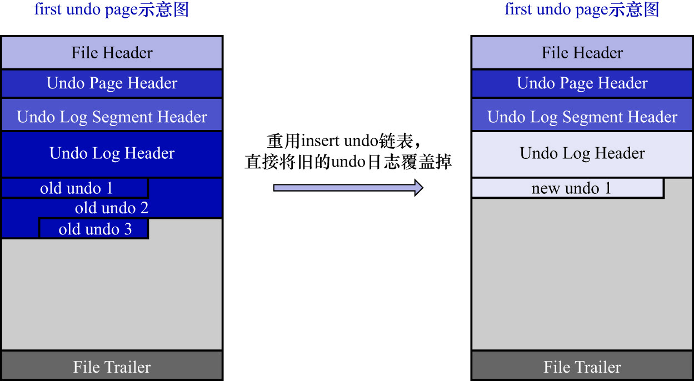
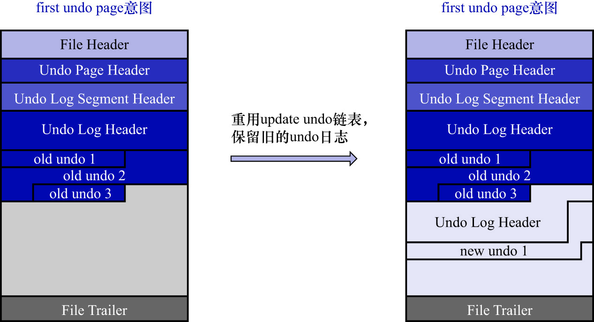

# 8. 重用`Undo`页面

在讲[多个事务中的`Undo`页面链表](https://github.com/rayallen20/howDoesMySQLWork/blob/main/%E7%AC%AC20%E7%AB%A0%20%E5%90%8E%E6%82%94%E4%BA%86%E6%80%8E%E4%B9%88%E5%8A%9E--undo%E6%97%A5%E5%BF%97/6.%20Undo%E9%A1%B5%E9%9D%A2%E9%93%BE%E8%A1%A8/2.%20%E5%A4%9A%E4%B8%AA%E4%BA%8B%E5%8A%A1%E4%B8%AD%E7%9A%84Undo%E9%A1%B5%E9%9D%A2%E9%93%BE%E8%A1%A8.md)这一小节时讲到过,为提高并发执行的多个事务写入`undo`日志的性能,InnoDB的设计者决定:为每个事务单独分配相应的`Undo`页面链表(最多可能单独分配4个链表).
但是这也造成了一些问题,比如:大部分事务在执行过程中,可能只修改了1条或几条记录,针对某个`Undo`页面链表只产生了非常少的`undo`日志,
这些`undo`日志可能只占用一点点存储空间.每开启1个事务就新创建1个`Undo`页面链表(虽然该链表中只有一个页面),1个`Undo`页面链表只用来存储
这么一点`undo`日志的方式,是否有些浪费?

确实是有些浪费.于是InnoDB的设计者决定:**在事务提交后在某些情况下,重用该事务的`Undo`页面链表**.1个`Undo`页面链表,若可以被重用,
则该`Undo`链表需要符合以下2个条件:

- **该链表中只包含1个`Undo`页面**

    若一个事务执行过程中产生了非常多的`undo`日志,则该事务在执行过程中可能申请非常多的页面加入到`Undo`页面链表中.
    在该事务提交后,若将整个`Undo`链表中的页面都重用,那就意味着:**即使新的事务并没有向该`Undo`页面链表中写入很多`undo`日志,
    该链表依然还要维护非常多的页面**.那些用不到的页面也不能被别的事务所使用(因为事务执行过程中产生的`update undo`日志,即使事务提交后,依然会存在,不能立即释放),
    这样就造成了另一种浪费(偏向于计算资源上的浪费).所以InnoDB的设计者规定:**只有在`Undo`页面链表中仅包含1个`Undo`页面的前提下,该链表才有可能被下一个事务所重用**.

- **该`Undo`页面`已经使用的空间 < 整个页面空间的3/4`**

    若该`Undo`页面已经使用了本页中绝大部分的存储空间,则即使重用该`Undo`页面,意义也不是很大(**因为该`Undo`页面已经存不下太多`undo`日志了**).

前面讲到过,按照存储的`undo`日志所属的大类,`Undo`页面链表可以被分为:

- `insert undo`链表
- `update undo`链表 

这两种(其实就是在讲[`FIL_PAGE_UNDO_LOG`页面](https://github.com/rayallen20/howDoesMySQLWork/blob/main/%E7%AC%AC20%E7%AB%A0%20%E5%90%8E%E6%82%94%E4%BA%86%E6%80%8E%E4%B9%88%E5%8A%9E--undo%E6%97%A5%E5%BF%97/5.%20FIL_PAGE_UNDO_LOG%E9%A1%B5%E9%9D%A2.md)时讲到的`TRX_UNDO_PAGE_TYPE`字段的可选值).这两种链表在被重用时,策略也是不同的:

- `insert undo`链表

    `insert undo`链表中只存储类型为`TRX_UNDO_INSERT_REC`的`undo`日志.该类型的`undo`日志在事务提交之后就没用了,可以被清除掉.
    所以在某个事务提交后,重用该事务的`insert undo`链表(该链表中仅有1个页面)时,**可以直接把之前的事务写入的1组`undo`日志覆盖掉,
    从头开始写入新事务的1组`undo`日志即可**.如下图示:
    
    
    
    假设有一个事务使用的`insert undo`链表情况如上图示.在该事务提交时,仅向该`insert undo`链表中插入了3条`undo`日志.该`insert undo`链表
    仅申请了1个`Undo`页面.若此时`已使用的空间 < 整个页面大小的3/4`,则下一个事务就可以重用该`insert undo`链表(该链表中仅有1个页面).
    假设此时有一个新事务重用了该`insert undo`链表,则可以直接把旧的一组`undo日志`覆盖掉,写入一组新的`undo`日志.
    
    注: 在重用`Undo`页面链表并写入新的一组`undo`日志时,不仅会写入新的[`Undo Log Header`](https://github.com/rayallen20/howDoesMySQLWork/blob/main/%E7%AC%AC20%E7%AB%A0%20%E5%90%8E%E6%82%94%E4%BA%86%E6%80%8E%E4%B9%88%E5%8A%9E--undo%E6%97%A5%E5%BF%97/7.%20Undo%E6%97%A5%E5%BF%97%E7%9A%84%E5%85%B7%E4%BD%93%E5%86%99%E5%85%A5%E8%BF%87%E7%A8%8B/3.%20Undo%20Log%20Header.md),还会适当调整:
    
    - [`Undo Page Header`](https://github.com/rayallen20/howDoesMySQLWork/blob/main/%E7%AC%AC20%E7%AB%A0%20%E5%90%8E%E6%82%94%E4%BA%86%E6%80%8E%E4%B9%88%E5%8A%9E--undo%E6%97%A5%E5%BF%97/5.%20FIL_PAGE_UNDO_LOG%E9%A1%B5%E9%9D%A2.md)
    - [`Undo Log Segment Header`](https://github.com/rayallen20/howDoesMySQLWork/blob/main/%E7%AC%AC20%E7%AB%A0%20%E5%90%8E%E6%82%94%E4%BA%86%E6%80%8E%E4%B9%88%E5%8A%9E--undo%E6%97%A5%E5%BF%97/7.%20Undo%E6%97%A5%E5%BF%97%E7%9A%84%E5%85%B7%E4%BD%93%E5%86%99%E5%85%A5%E8%BF%87%E7%A8%8B/2.%20Undo%20Log%20Segment%20Header.md)
    - [`Undo Log Header`](https://github.com/rayallen20/howDoesMySQLWork/blob/main/%E7%AC%AC20%E7%AB%A0%20%E5%90%8E%E6%82%94%E4%BA%86%E6%80%8E%E4%B9%88%E5%8A%9E--undo%E6%97%A5%E5%BF%97/7.%20Undo%E6%97%A5%E5%BF%97%E7%9A%84%E5%85%B7%E4%BD%93%E5%86%99%E5%85%A5%E8%BF%87%E7%A8%8B/3.%20Undo%20Log%20Header.md)
    
    中的一些属性.比如:
    
    - [`Undo Page Header`](https://github.com/rayallen20/howDoesMySQLWork/blob/main/%E7%AC%AC20%E7%AB%A0%20%E5%90%8E%E6%82%94%E4%BA%86%E6%80%8E%E4%B9%88%E5%8A%9E--undo%E6%97%A5%E5%BF%97/5.%20FIL_PAGE_UNDO_LOG%E9%A1%B5%E9%9D%A2.md)中的:
      - `TRX_UNDO_PAGE_START`
      - `TRX_UNDO_PAGE_FREE`
      - 等等等等
    
    这里就不具体展开了.

- `update undo`链表

    在一个事务提交后,该事务使用的`update undo`链表中的`undo`日志不能立即删除掉(这些日志用于MVCC,后面会讲到).若之后的事务想
    重用该`update undo`链表,就不能覆盖之前事务写入的`undo`日志.这样就相当于:**在同一个`Undo`页面中写入了多组的`undo`日志**.
    如下图示:
    
    
